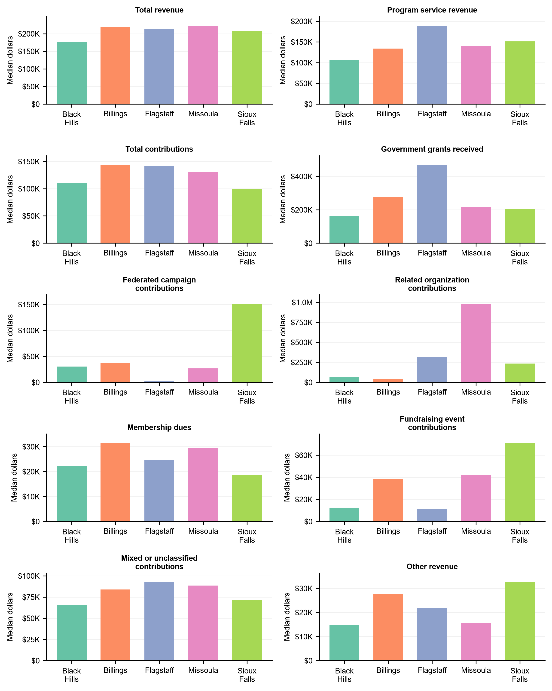
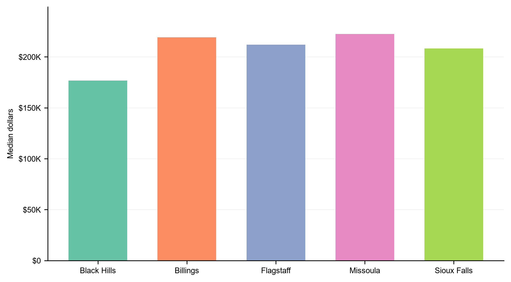
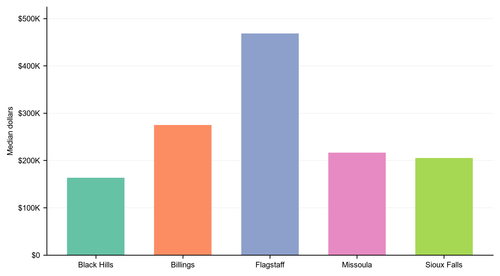
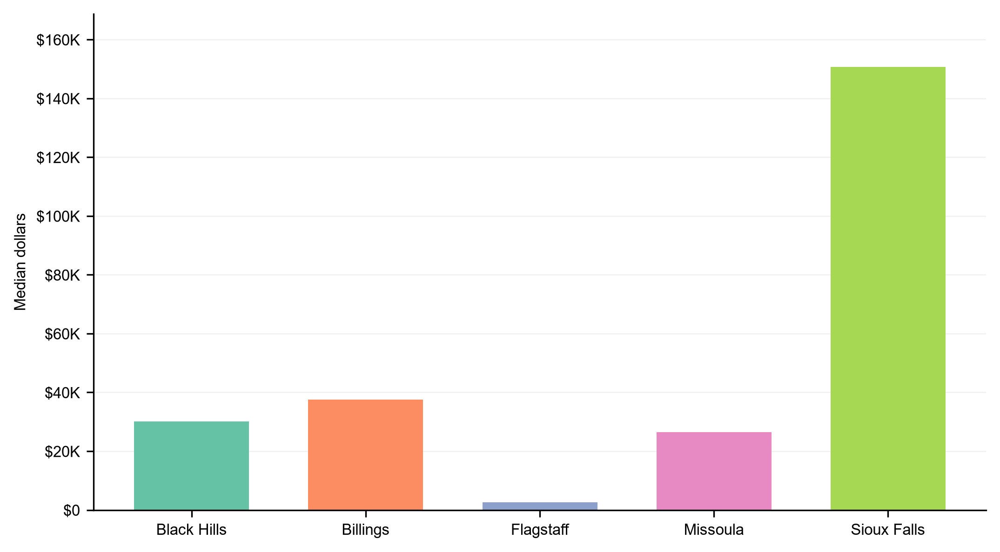
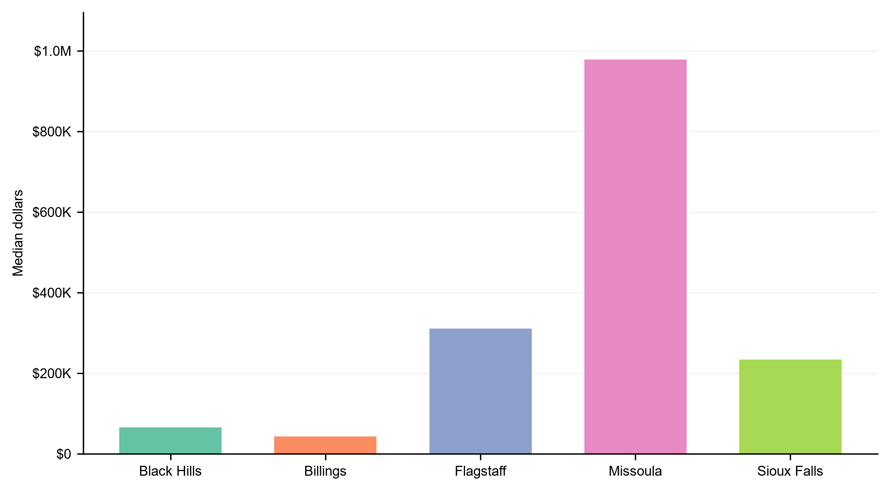
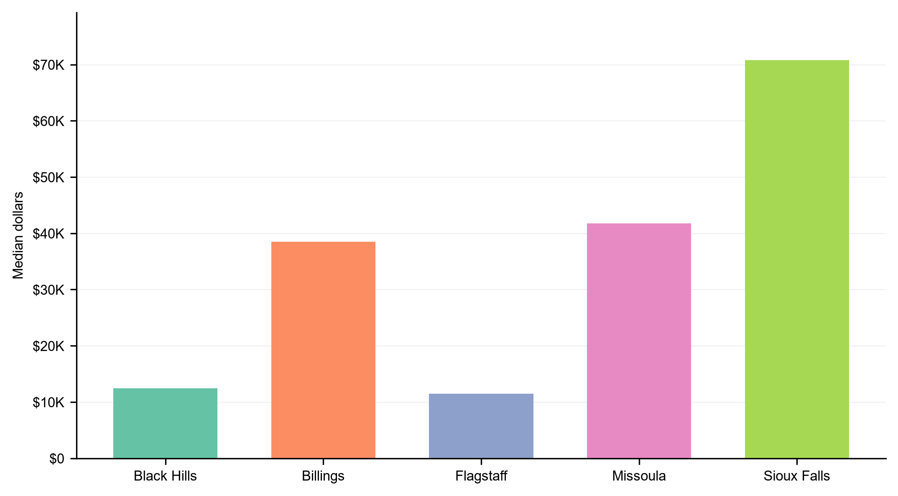
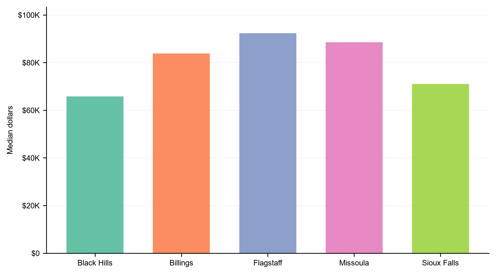

# Q9 2022 Client Presentation: Revenue Sources

> **Presentation artifact status reviewed 2026-07-23:** this source accompanies the retained 2022 presentation; no analysis or deck regeneration occurred during the documentation review.

## Slide 1: Dataset and revenue source variables

### Dataset

This presentation uses the GivingTuesday Form 990-family analysis file for the Black Hills and benchmark-region nonprofit comparison.

- Tax year: 2022 only.
- Forms included: Form 990 (1,085 rows), Form 990-EZ (563 rows), and Form 990-PF (151 rows).
- Analysis universe: 1,799 organization-year records representing 1,797 unique EINs after requiring positive total revenue.
- Exclusions: hospitals, universities, and political organizations are excluded for client-peer comparability; excluded rows in the full selected-year frame: 25.
- Statistical tests compare organization-level 2022 raw dollar values, not regional aggregate totals or stacked-bar percentages.

### Variable definitions

The analysis partitions revenue into earned program revenue, contribution-source categories, mixed/unclassified contributions, and other revenue. The detailed contribution-source categories are clean only for Form 990 filers.

| Variable | Meaning |
| --- | --- |
| Total revenue | All reported revenue for the organization in tax year 2022. |
| Program service revenue | Mission-related earned revenue from program services; available for Form 990 and 990-EZ, while Form 990-PF lacks the same comparable field. Blank supported lines are treated as zero. |
| Total contributions | Total reported contributions, gifts, grants, and similar amounts across the 990-family forms. Blank supported lines are treated as zero. |
| Government grants received | Form 990 Part VIII Line 1e government grants; 990-EZ/PF are excluded for this subcomponent because they do not expose it cleanly. |
| Federated campaign contributions | Form 990 Part VIII Line 1a federated campaign support, such as United Way-style campaign allocations. |
| Related organization contributions | Form 990 Part VIII Line 1d contributions from related organizations or affiliates. |
| Membership dues | Form 990 Part VIII Line 1b membership dues; an individual-adjacent proxy, not pure individual giving. |
| Fundraising event contributions | Form 990 Part VIII Line 1c fundraising event contributions; individual-adjacent, not pure individual giving. |
| Mixed / unclassified contributions | Form 990 Line 1f plus all 990-EZ/PF contribution totals that cannot be decomposed into source subcategories. |
| Other revenue | Other revenue, calculated as total revenue minus program revenue and the detailed contribution-source components. |

990-EZ and 990-PF do not expose the same contribution-source subcomponents as Form 990. For detailed subcomponent tests and median charts, those rows are excluded for the unavailable source rather than treated as zero. Their contribution totals are routed to mixed / unclassified contributions for the all-form revenue partition. Foundation grants cannot be cleanly isolated in this file.

## Slide 2: 2022 revenue sources — overview (same metric as statistical slides)

This chart uses the **same definition as Slides 3–12**: each bar shows the **median dollar amount among organizations in that region that report a positive value** for that source (zeros excluded). The X-axis groups are regions; colors are revenue sources.

- **Purpose:** Orientation — see all sources and regions on one page before the source-by-source pairwise slides.
- **Aligned with tests:** Slides 3–12 show the same positive-only medians with Black Hills vs each benchmark; permutation p-values are on the following slides' bullets and tables.
- **Value labels:** Each bar is labeled with the median dollar value.
- **Not stacked:** Medians for different sources are not added together (each source has its own reporter pool).
- **Archived stacked views:** Aggregate dollar totals, aggregate shares, and **stacked positive-only medians** (normalized mix and raw sum of medians) are in `python/analysis/revenue_sources_black_hills/results/client_notebook_assets/`. Stacked medians use the same positive-reporter definition but each segment is a **different org subset**, so normalized stacks show a relative profile only — not a budget that adds up.

### How to read the charts and tests

**Zero-excluded framing.** Every revenue and contribution source slide below restricts the median and the permutation test to organizations that report a **positive** amount for that source. This trades the population-level prevalence story (how many organizations engage with the source at all) for the conditional dollar story (when an organization does engage, how big is the check). Reporting rates, reporter counts, and IQR are stored in `client_2022_pairwise_presentation_summary.csv` if needed.

**Headline test.** Pairwise tests use a **two-sided permutation test on the median dollar difference** between Black Hills positive reporters and each benchmark region's positive reporters (10,000 reshuffles, seed 321). The median gap is shown with a **95% percentile bootstrap CI** on the source slides below.

**How to read the charts.** Each region is a single bar whose height equals the median dollar amount reported by organizations in that region — restricted to positive reporters, as described above. The chart shows region names only; slide bullets on the following pages report the median gap, 95% CI, and permutation p-value for each Black Hills vs benchmark comparison.

**What changes vs an all-population test.** For sources where Black Hills has the *highest* reporting rate but a *lower* dollar amount among reporters (government grants, federated campaigns), the direction of difference flips between the two framings. Both views can be true at once: more Black Hills organizations participate, but each participating organization brings in fewer dollars from that source. Use both numbers when telling the full story to the board.

## Slide 3: Total revenue

Pairwise comparison of conditional medians for organizations with a positive value for this source (zeros excluded). Headline test: two-sided permutation on the median difference.

- Black Hills vs Billings: Black Hills lower among reporters; not significant; Black Hills median = $176,760; Billings median = $219,228; median gap = -$42,468 (95% CI -$125,394 to +$33,850); p = 0.269.
- Black Hills vs Flagstaff: Black Hills lower among reporters; not significant; Black Hills median = $176,760; Flagstaff median = $212,002; median gap = -$35,242 (95% CI -$149,323 to +$35,127); p = 0.366.
- Black Hills vs Sioux Falls: Black Hills lower among reporters; not significant; Black Hills median = $176,760; Sioux Falls median = $208,149; median gap = -$31,390 (95% CI -$84,901 to +$26,666); p = 0.246.
- Black Hills vs Missoula: Black Hills lower among reporters; not significant; Black Hills median = $176,760; Missoula median = $222,401; median gap = -$45,642 (95% CI -$126,653 to +$32,158); p = 0.242.

## Slide 4: Program service revenue

Pairwise comparison of conditional medians for organizations with a positive value for this source (zeros excluded). Headline test: two-sided permutation on the median difference.

- Black Hills vs Billings: Black Hills lower among reporters; not significant; Black Hills median = $106,346; Billings median = $134,079; median gap = -$27,733 (95% CI -$96,511 to +$25,161); p = 0.292.
- Black Hills vs Flagstaff: Black Hills lower among reporters; significant; Black Hills median = $106,346; Flagstaff median = $188,968; median gap = -$82,622 (95% CI -$188,223 to +$1,513); p = 0.038.
- Black Hills vs Sioux Falls: Black Hills lower among reporters; not significant; Black Hills median = $106,346; Sioux Falls median = $151,055; median gap = -$44,709 (95% CI -$114,440 to +$6,707); p = 0.089.
- Black Hills vs Missoula: Black Hills lower among reporters; not significant; Black Hills median = $106,346; Missoula median = $140,091; median gap = -$33,745 (95% CI -$91,143 to +$18,223); p = 0.175.

## Slide 5: Total contributions

Pairwise comparison of conditional medians for organizations with a positive value for this source (zeros excluded). Headline test: two-sided permutation on the median difference.

- Black Hills vs Billings: Black Hills lower among reporters; not significant; Black Hills median = $110,308; Billings median = $143,479; median gap = -$33,171 (95% CI -$85,280 to +$16,324); p = 0.161.
- Black Hills vs Flagstaff: Black Hills lower among reporters; not significant; Black Hills median = $110,308; Flagstaff median = $141,210; median gap = -$30,902 (95% CI -$95,512 to +$14,239); p = 0.224.
- Black Hills vs Sioux Falls: Black Hills higher among reporters; not significant; Black Hills median = $110,308; Sioux Falls median = $100,000; median gap = +$10,308 (95% CI -$20,952 to +$41,476); p = 0.448.
- Black Hills vs Missoula: Black Hills lower among reporters; not significant; Black Hills median = $110,308; Missoula median = $129,864; median gap = -$19,556 (95% CI -$95,775 to +$26,776); p = 0.309.

## Slide 6: Government grants received

Pairwise comparison of conditional medians for organizations with a positive value for this source (zeros excluded). Headline test: two-sided permutation on the median difference.

- Black Hills vs Billings: Black Hills lower among reporters; significant; Black Hills median = $163,367; Billings median = $274,793; median gap = -$111,426 (95% CI -$345,341 to +$7,163); p = 0.043.
- Black Hills vs Flagstaff: Black Hills lower among reporters; significant; Black Hills median = $163,367; Flagstaff median = $468,152; median gap = -$304,785 (95% CI -$817,302 to -$131,168); p = 0.003.
- Black Hills vs Sioux Falls: Black Hills lower among reporters; not significant; Black Hills median = $163,367; Sioux Falls median = $204,951; median gap = -$41,584 (95% CI -$156,414 to +$89,266); p = 0.507.
- Black Hills vs Missoula: Black Hills lower among reporters; not significant; Black Hills median = $163,367; Missoula median = $216,446; median gap = -$53,078 (95% CI -$292,032 to +$26,850); p = 0.197.

## Slide 7: Federated campaign contributions

Pairwise comparison of conditional medians for organizations with a positive value for this source (zeros excluded). Headline test: two-sided permutation on the median difference.

- Black Hills vs Billings: Black Hills lower among reporters; not significant; Black Hills median = $30,096; Billings median = $37,500; median gap = -$7,404 (95% CI -$41,337 to +$36,319); p = 0.688.
- Black Hills vs Flagstaff: Black Hills higher among reporters; not significant; Black Hills median = $30,096; Flagstaff median = $2,561; median gap = +$27,535 (95% CI -$50,214 to +$38,331); p = 0.179.
- Black Hills vs Sioux Falls: Black Hills lower among reporters; significant; Black Hills median = $30,096; Sioux Falls median = $150,655; median gap = -$120,559 (95% CI -$251,704 to -$58,041); p = 0.005.
- Black Hills vs Missoula: Black Hills higher among reporters; not significant; Black Hills median = $30,096; Missoula median = $26,475; median gap = +$3,621 (95% CI -$374,904 to +$29,973); p = 0.819.

## Slide 8: Related organization contributions

Pairwise comparison of conditional medians for organizations with a positive value for this source (zeros excluded). Headline test: two-sided permutation on the median difference.

- Black Hills vs Billings: Black Hills higher among reporters; not significant; Black Hills median = $65,109; Billings median = $43,000; median gap = +$22,109 (95% CI -$205,000 to +$1,417,018); p = 0.627.
- Black Hills vs Flagstaff: Black Hills lower among reporters; not significant; Black Hills median = $65,109; Flagstaff median = $310,812; median gap = -$245,703 (95% CI -$573,240 to +$1,112,196); p = 0.126.
- Black Hills vs Sioux Falls: Black Hills lower among reporters; not significant; Black Hills median = $65,109; Sioux Falls median = $233,400; median gap = -$168,291 (95% CI -$1,493,390 to +$1,137,398); p = 0.203.
- Black Hills vs Missoula: Black Hills lower among reporters; not significant; Black Hills median = $65,109; Missoula median = $977,600; median gap = -$912,491 (95% CI -$3,371,000 to +$150,595); p = 0.173.

## Slide 9: Membership dues

Pairwise comparison of conditional medians for organizations with a positive value for this source (zeros excluded). Headline test: two-sided permutation on the median difference.

- Black Hills vs Billings: Black Hills lower among reporters; not significant; Black Hills median = $22,250; Billings median = $31,344; median gap = -$9,093 (95% CI -$51,928 to +$10,338); p = 0.342.
- Black Hills vs Flagstaff: Black Hills lower among reporters; not significant; Black Hills median = $22,250; Flagstaff median = $24,606; median gap = -$2,355 (95% CI -$167,924 to +$21,272); p = 0.832.
- Black Hills vs Sioux Falls: Black Hills higher among reporters; not significant; Black Hills median = $22,250; Sioux Falls median = $18,651; median gap = +$3,600 (95% CI -$54,010 to +$23,295); p = 0.540.
- Black Hills vs Missoula: Black Hills lower among reporters; not significant; Black Hills median = $22,250; Missoula median = $29,529; median gap = -$7,278 (95% CI -$20,952 to +$13,858); p = 0.601.

## Slide 10: Fundraising event contributions

Pairwise comparison of conditional medians for organizations with a positive value for this source (zeros excluded). Headline test: two-sided permutation on the median difference.

- Black Hills vs Billings: Black Hills lower among reporters; significant; Black Hills median = $12,427; Billings median = $38,516; median gap = -$26,088 (95% CI -$64,852 to -$6,639); p = 0.009.
- Black Hills vs Flagstaff: Black Hills higher among reporters; not significant; Black Hills median = $12,427; Flagstaff median = $11,480; median gap = +$947 (95% CI -$9,712 to +$13,322); p = 0.849.
- Black Hills vs Sioux Falls: Black Hills lower among reporters; significant; Black Hills median = $12,427; Sioux Falls median = $70,761; median gap = -$58,334 (95% CI -$80,561 to -$31,388); p < 0.001.
- Black Hills vs Missoula: Black Hills lower among reporters; significant; Black Hills median = $12,427; Missoula median = $41,756; median gap = -$29,329 (95% CI -$72,681 to +$1,335); p = 0.010.

## Slide 11: Mixed / unclassified contributions

Pairwise comparison of conditional medians for organizations with a positive value for this source (zeros excluded). Headline test: two-sided permutation on the median difference.

- Black Hills vs Billings: Black Hills lower among reporters; not significant; Black Hills median = $65,792; Billings median = $83,785; median gap = -$17,992 (95% CI -$49,754 to +$8,827); p = 0.157.
- Black Hills vs Flagstaff: Black Hills lower among reporters; significant; Black Hills median = $65,792; Flagstaff median = $92,278; median gap = -$26,486 (95% CI -$50,596 to -$2,907); p = 0.033.
- Black Hills vs Sioux Falls: Black Hills lower among reporters; not significant; Black Hills median = $65,792; Sioux Falls median = $71,005; median gap = -$5,212 (95% CI -$29,255 to +$15,095); p = 0.619.
- Black Hills vs Missoula: Black Hills lower among reporters; not significant; Black Hills median = $65,792; Missoula median = $88,552; median gap = -$22,760 (95% CI -$58,330 to +$11,256); p = 0.099.

## Slide 12: Other revenue

Pairwise comparison of conditional medians for organizations with a positive value for this source (zeros excluded). Headline test: two-sided permutation on the median difference.

- Black Hills vs Billings: Black Hills lower among reporters; significant; Black Hills median = $14,805; Billings median = $27,630; median gap = -$12,825 (95% CI -$22,923 to -$1,324); p = 0.010.
- Black Hills vs Flagstaff: Black Hills lower among reporters; not significant; Black Hills median = $14,805; Flagstaff median = $21,811; median gap = -$7,006 (95% CI -$27,475 to +$6,558); p = 0.292.
- Black Hills vs Sioux Falls: Black Hills lower among reporters; significant; Black Hills median = $14,805; Sioux Falls median = $32,467; median gap = -$17,662 (95% CI -$25,196 to -$6,938); p = 0.001.
- Black Hills vs Missoula: Black Hills lower among reporters; not significant; Black Hills median = $14,805; Missoula median = $15,612; median gap = -$807 (95% CI -$8,600 to +$7,563); p = 0.697.

## Slide 13: Sensitivity — including hospitals, universities, and political organizations

Slides 3–12 use the **primary** analysis universe, which excludes **25** organization-year records flagged as hospitals, universities, or political organizations (25 unique EINs in 2022) for client-peer comparability. This slide reruns the same positive-reporter permutation-on-median pairwise tests on the **full** 2022 universe with those organizations included.

### Excluded organization counts by region (2022 full universe before exclusion)

| Region | Full-universe rows | Excluded special-org rows | Hospitals | Universities | Political |
| --- | ---: | ---: | ---: | ---: | ---: |
| Black Hills | 423 | 1 | 0 | 1 | 0 |
| Billings | 337 | 5 | 4 | 1 | 0 |
| Flagstaff | 198 | 1 | 1 | 0 | 0 |
| Sioux Falls | 581 | 16 | 9 | 7 | 0 |
| Missoula | 285 | 2 | 1 | 0 | 1 |

### Headline comparison (40 pairwise tests: 10 sources × 4 benchmarks)

- **Significant at p < 0.05 when excluding special orgs (primary deck):** 10
- **Significant at p < 0.05 when including special orgs:** 10
- **Direction changes:** 0
- **Significance-status changes:** 0

- **No pairwise comparison flipped median direction** between the two universes; where both versions are comparable, Black Hills vs benchmark stays on the same side of the median.

- **No pairwise comparison crossed the p < 0.05 threshold** when special organizations were added back.

- **All 10 comparisons significant in the primary deck remain significant** when hospitals, universities, and political organizations are included.

### How to use this slide

- Treat the primary slides as the client-facing conclusion; this slide shows that the exclusion choice does not overturn that story.
- Most excluded organizations are in **Sioux Falls** (16 of 25 rows), so Sioux Falls–related p-values shift more than other regions even when significance does not change.
- The full comparison table is in `client_2022_special_org_sensitivity_comparison.csv`.

## Slide 14: Full answer — Is there a difference in revenue sources between Black Hills and benchmark regions?

### Short answer

**Yes — for tax year 2022, Black Hills differs from at least one benchmark region on several revenue sources**, but the difference is **not uniform across all sources or all benchmarks**. This deck tests one source at a time using organization-level dollars among organizations that **report a positive amount** for that source (zeros excluded). Statistical significance comes from a **permutation test on the median difference** between Black Hills and each benchmark region's positive reporters, with a 95% bootstrap confidence interval reported alongside; pairwise results appear on Slides 3–12 and in the table below.

### What this presentation tested

- **Question:** Do Black Hills nonprofits differ from Billings, Flagstaff, Sioux Falls, and Missoula in how they draw revenue from each source?
- **Year:** 2022 only (see `docs/analysis/revenue_sources/q9_analysis.md` for the full multi-year analysis and additional statistical framings).
- **Unit:** Organization-level reported dollars per source, not regional aggregate totals or stacked-bar percentages.
- **Comparison:** Black Hills vs each benchmark region separately (four pairwise tests per source).
- **Statistic:** Permutation test on the median difference among organizations with a **positive** value for that source (10,000 reshuffles); 95% percentile bootstrap CI on the same median gap (10,000 resamples). Slide bullets report medians for those reporters only.
- **Significance rule:** p < 0.05 on the pairwise permutation test.

### Statistically significant pairwise differences (permutation p < 0.05, among positive reporters)

| Revenue source | Benchmark region | Direction | Black Hills median | Benchmark median | Median gap (95% CI) | Permutation p |
| --- | --- | --- | ---: | ---: | ---: | ---: |
| Federated campaign contributions | Sioux Falls | Black Hills lower among reporters | $30,096 | $150,655 | -$120,559 (95% CI -$251,704 to -$58,041) | 0.005 |
| Fundraising event contributions | Billings | Black Hills lower among reporters | $12,427 | $38,516 | -$26,088 (95% CI -$64,852 to -$6,639) | 0.009 |
| Fundraising event contributions | Missoula | Black Hills lower among reporters | $12,427 | $41,756 | -$29,329 (95% CI -$72,681 to +$1,335) | 0.010 |
| Fundraising event contributions | Sioux Falls | Black Hills lower among reporters | $12,427 | $70,761 | -$58,334 (95% CI -$80,561 to -$31,388) | < 0.001 |
| Government grants received | Billings | Black Hills lower among reporters | $163,367 | $274,793 | -$111,426 (95% CI -$345,341 to +$7,163) | 0.043 |
| Government grants received | Flagstaff | Black Hills lower among reporters | $163,367 | $468,152 | -$304,785 (95% CI -$817,302 to -$131,168) | 0.003 |
| Mixed / unclassified contributions | Flagstaff | Black Hills lower among reporters | $65,792 | $92,278 | -$26,486 (95% CI -$50,596 to -$2,907) | 0.033 |
| Other revenue | Billings | Black Hills lower among reporters | $14,805 | $27,630 | -$12,825 (95% CI -$22,923 to -$1,324) | 0.010 |
| Other revenue | Sioux Falls | Black Hills lower among reporters | $14,805 | $32,467 | -$17,662 (95% CI -$25,196 to -$6,938) | 0.001 |
| Program service revenue | Flagstaff | Black Hills lower among reporters | $106,346 | $188,968 | -$82,622 (95% CI -$188,223 to +$1,513) | 0.038 |

### No significant pairwise difference detected (permutation p ≥ 0.05, among positive reporters)

For these sources, none of the four Black Hills vs benchmark comparisons reached p < 0.05 under the conditional median permutation test:

- **Total revenue:** vs Billings, Flagstaff, Sioux Falls, Missoula
- **Program service revenue:** vs Billings, Sioux Falls, Missoula
- **Total contributions:** vs Billings, Flagstaff, Sioux Falls, Missoula
- **Government grants received:** vs Sioux Falls, Missoula
- **Federated campaign contributions:** vs Billings, Flagstaff, Missoula
- **Related organization contributions:** vs Billings, Flagstaff, Sioux Falls, Missoula
- **Membership dues:** vs Billings, Flagstaff, Sioux Falls, Missoula
- **Fundraising event contributions:** vs Flagstaff
- **Mixed / unclassified contributions:** vs Billings, Sioux Falls, Missoula
- **Other revenue:** vs Flagstaff, Missoula

### How to state the conclusion to the board

1. **Revenue-source patterns are not the same everywhere.** Several 2022 pairwise comparisons show statistically significant differences in dollar amounts among organizations that actually use a given source.
2. **Black Hills is often lower among reporters, not universally higher.** Where this deck finds significance, the usual pattern is a **lower median among Black Hills reporters** than in the benchmark region being compared (for example program service revenue vs Flagstaff, government grants vs Flagstaff, fundraising events vs Billings and Sioux Falls, other revenue vs Billings and Sioux Falls).
3. **Participation and dollars can tell different stories.** Black Hills sometimes has **more organizations reporting** a source (higher nonzero rate) while still showing a **lower median among reporters** on that same source. See `client_2022_pairwise_presentation_summary.csv` for reporting rates; do not describe a significant median gap as proof of higher participation without checking the rate.
4. **This deck does not replace the full Q9 report.** The broader analysis in `docs/analysis/revenue_sources/q9_analysis.md` covers additional tax years and alternative statistical framings. Use this presentation for 2022 pairwise, conditional-dollar comparisons.

### One-sentence takeaway

> **Yes — in 2022, Black Hills differs from benchmark regions on multiple revenue sources (10 significant pairwise comparisons at permutation p < 0.05 on the median dollar gap among positive reporters), especially where median dollars among reporters are lower than in Billings, Flagstaff, or Sioux Falls; the pattern is source-specific and should be read together with reporting rates and the full 2022–2024 Q9 analysis.**
