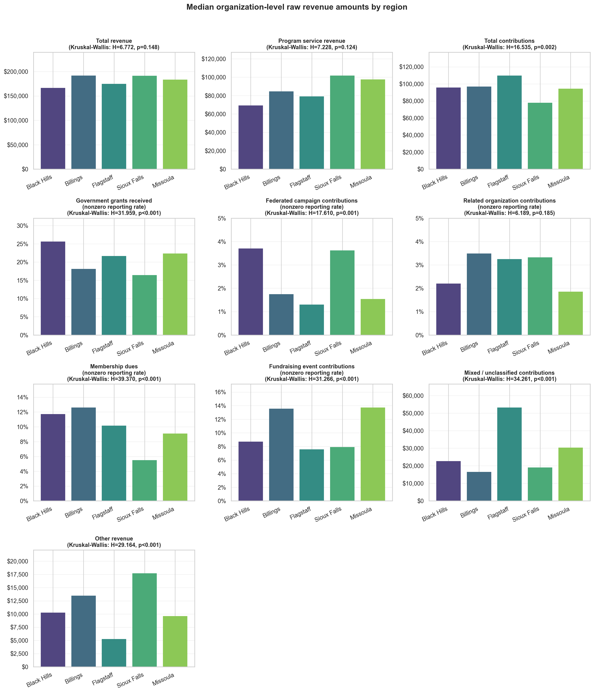
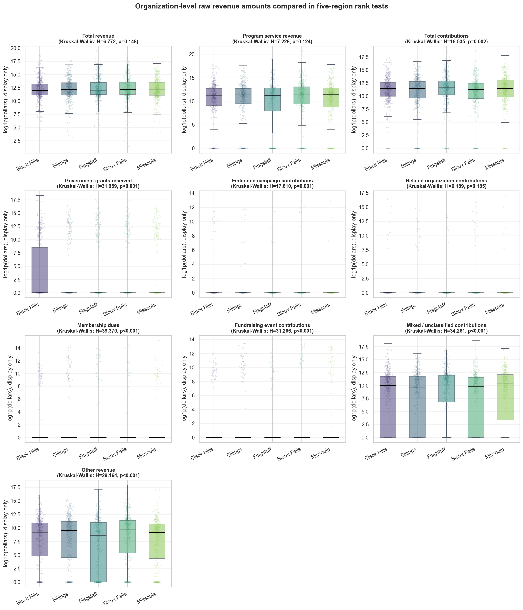
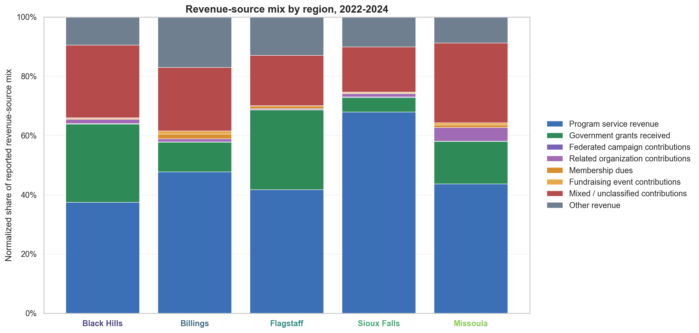

# Q9: Is there a difference in the revenue sources between Black Hills and benchmark regions?

> **Analysis artifact status reviewed 2026-07-23:** this summary reports the retained analysis results; no data rerun occurred during the documentation review.

For organizations filing **Form 990, Form 990-EZ, or Form 990-PF**.

Filtered data excludes hospitals, universities, and political organizations because the client is not one of those organization types.

Regions compared:

- Black Hills
- Billings
- Flagstaff
- Sioux Falls
- Missoula

Years included:

- 2022
- 2023
- 2024

## Revenue-source categories

The analysis now uses a more detailed revenue-source split:

- Earned program revenue
- Government grants
- Federated campaign contributions
- Related organization contributions
- Membership dues
- Fundraising event contributions
- Mixed / unclassified contributions
- Other revenue

These categories capture revenue properly because:

```text
Total revenue =
  earned program revenue
  + government grants
  + federated campaign contributions
  + related organization contributions
  + membership dues
  + fundraising event contributions
  + mixed / unclassified contributions
  + other revenue
```

Contribution components also reconcile exactly:

```text
Total contributions =
  government grants
  + federated campaign contributions
  + related organization contributions
  + membership dues
  + fundraising event contributions
  + mixed / unclassified contributions
```

## Method

Revenue variables are highly skewed. A small number of organizations have very large revenue amounts, while many organizations have much smaller amounts.

Because the data does not meet the normality assumption, the analysis uses **Kruskal-Wallis** instead of ANOVA for the five-region comparison.

The primary statistical tests compare **organization-level raw dollar amounts**, not percentages of each organization's total revenue.

This matters because revenue-source percentages are compositional. If each organization's revenue-source shares add to 1, then the shares are not independent of each other.

For the direct Black Hills comparison, Black Hills is compared against the pooled benchmark regions using **Mann-Whitney U**.

The analysis also includes a permutation mean-difference test as a robustness check.

## Raw-dollar comparison by region



The chart above shows the median organization-level raw dollar amount for each revenue source by region.

Several contribution subcategories are zero-heavy. For categories where the median is $0 in every region, the chart shows the percent of organizations reporting a nonzero amount instead.

Five-region Kruskal-Wallis results:

| Revenue source | Result |
| --- | --- |
| Total revenue | Not statistically significant |
| Program service revenue | Not statistically significant |
| Total contributions | Statistically significant |
| Government grants | Statistically significant |
| Federated campaign contributions | Statistically significant |
| Related organization contributions | Not statistically significant |
| Membership dues | Statistically significant |
| Fundraising event contributions | Statistically significant |
| Mixed / unclassified contributions | Statistically significant |

There are statistically significant differences across the five regions for several contribution-related sources.

There is not a statistically significant five-region difference for total revenue, program service revenue, or related organization contributions.

## Revenue distributions



Revenue can be very large for a small number of organizations, so the visualization uses a log scale to make the distributions easier to compare.

The log scale is only for visualization. The primary Kruskal-Wallis tests are run on the raw dollar values.

The distributions show why medians, nonzero rates, and rank-based tests are more appropriate than means and ANOVA for this question.

## Black Hills vs benchmark regions

For the direct Black Hills vs pooled benchmark comparison, **government grants** remains the clearest difference.

The direct Black Hills vs benchmark results are:

| Revenue source | Black Hills vs pooled benchmark |
| --- | --- |
| Total revenue | Mann-Whitney U only at p < 0.05; permutation test not significant; treat cautiously |
| Program service revenue | Not statistically significant |
| Total contributions | Not statistically significant |
| Government grants | Statistically significant by Mann-Whitney U |
| Federated campaign contributions | Mann-Whitney U only at p < 0.05; treat cautiously |
| Related organization contributions | Not statistically significant |
| Membership dues | Statistically significant by Mann-Whitney U; mean-difference result is weaker |
| Fundraising event contributions | Statistically significant by permutation mean difference, with Black Hills lower |
| Mixed / unclassified contributions | Not statistically significant |

The government-grants result should not be interpreted as "Black Hills has a higher average grant dollar amount."

Because grant dollars are highly skewed and many organizations report $0, the safer interpretation is:

> Black Hills organizations are more likely to report government grants, or tend to rank higher on government-grant dollars, than organizations in the pooled benchmark regions.

## Descriptive revenue-source mix



The stacked bar chart shows aggregate revenue-source mix by region.

This chart is descriptive. It sums dollars within each region and converts those totals into percentages.

It is useful for showing how the overall regional revenue mix looks, but it is not the basis of the primary statistical test.

The statistical tests compare organization-level raw dollar values.

## Contribution-source caveat

The Form 990-family data cannot cleanly split all contributions into individual gifts, foundation grants, donor-advised funds, corporate gifts, and bequests.

Government grants, federated campaigns, related organization contributions, membership dues, and fundraising event contributions are separately available for Form 990 filers.

Other contribution dollars are less clean:

- Form 990 Line 1f mixes individual gifts, foundation grants, donor-advised fund distributions, corporate gifts, bequests, and other contributions.
- Form 990-EZ and Form 990-PF do not report the same detailed contribution subcomponents.
- Therefore, those dollars remain in mixed / unclassified contributions.

## Conclusion

Yes, there is evidence that revenue sources differ between Black Hills and the benchmark regions.

Across the five regions, the strongest differences are in:

- Government grants
- Membership dues
- Fundraising event contributions
- Mixed / unclassified contributions
- Other revenue
- Federated campaign contributions
- Total contributions

For Black Hills specifically, the clearest difference is **government grants**.

Black Hills does not show a clear direct difference from the pooled benchmark regions in program service revenue, total contributions, related organization contributions, or mixed / unclassified contributions.

The most defensible client-facing conclusion is:

> Revenue-source patterns differ across the five-region benchmark set. For Black Hills specifically, the clearest difference is that Black Hills organizations are more likely to report government grants. The more detailed contribution categories add useful context, but they should be interpreted carefully because several are zero-heavy and some donor types remain mixed/unclassified.
