# Philanthropic characteristics of the Black Hills Area and comparison to selected benchmark regions

Prepared by Statistics Without Borders for the Black Hills Area Community Foundation

# Executive summary

(Need to write it at the end based on conclusions)

# Introduction

## Study background and objectives

The study objective is to describe, through publicly available quantitative data, the philanthropic landscape of the Black Hills region. The Black Hills region is compared to a set of benchmark regions selected to have similar demographic and qualitative characteristics, with the intention of identifying similarities and differences that may inform the strategy of Black Hills Area non-profit institutions.

The Black Hills area of South Dakota is made up of 7 counties in Western South Dakota (Butte, Meade, Lawrence, Pennington, Custer, Oglala Lakota, and Fall River Counties) and a small portion of Eastern Wyoming. This is a largely rural region with a strong tourism industry as well as agriculture, ranching, mining and is the home of Ellsworth Air Force Base. These characteristics were considered when selecting the benchmark regions for comparison, with a goal of identifying benchmark areas with broadly similar demographic, economic, historical, and cultural characteristics.

The philanthropic landscape of the Black Hills region is believed to be driven by its rural character and its tourism-driven economy. This study summarizes demographic characteristics, donor characteristics, and non-profit organization statistics in comparison with benchmark regions, with the intention of identifying similarities, differences, and relationships with philanthropic behavior.  The analysis covers the period after the COVID-19 epidemic of 2020- 2021, which represented a significant disturbance in economic activity.

## Limitations

General limitations of the study are described here, while limitations specific to individual data sources are described in later sections. This study was restricted to analysis of publicly available data from open-access internet resources rather than being collected specifically to support the desired analyses. Most of the data are self-reported in the context of tax filings and no audits or other accuracy checking were performed. The desire to focus on the post-covid period meant that some datasets had as few as one year’s worth of available data. Multiple years were analyzed where available, as indicated.

Several categories of philanthropic activity are known to be absent from these data due to falling outside the requirements for IRS reporting. For example, crowd-sourced donations such as GoFundMe, and informal donations to family or community members, do not appear in the data sources employed in the report.  Donations of any type that are paid by tax filers who don’t itemize deductions are not present in the analysis of donor characteristics. Non-itemizing filers constitute a large majority of taxpayers in the Black Hills and benchmark regions, so this is an especially noteworthy limitation. Similarly, non-profit organizations who are exempt from IRS reporting due to their size or function (ie, certain religious organizations) are not present in the organization-centered datasets and may make up a large proportion of non-profit organizations.

Correlations between demographic characteristics, donor behavior, and other variables may be identified, but causal relationships cannot be inferred.

# Data sources

### American Community Survey (ACS)

The American Community Survey (ACS) is an ongoing U.S. Census Bureau program that surveys approximately 3.5 million households annually to provide up-to-date information on social, economic, housing, and demographic characteristics. For this report, ACS data provide county-level information on household income, employment, and civilian and armed forces composition from 2022 to 2024.

The use of ACS data in this report is twofold. First, ACS data provide the economic and demographic information needed to assess whether, and to what extent, the Black Hills region is comparable to other regions, thereby supporting data-driven benchmark region selection. Second, ACS data contribute to the analysis of factors that may explain differences in the nonprofit organizational landscape between the Black Hills region and the benchmark regions.

One limitation of ACS data is that only housing units with long-term residents are eligible for inclusion. The ACS uses the concept of “current residence” to determine who should be counted within sampled housing units. Specifically, individuals who live at an address for less than two months in a year are not included in the survey. As a result, in regions with a high proportion of vacation homes, seasonal residents in those homes are not captured in ACS estimates.

The ACS appendix provides additional details on data provenance, extraction, and processing, as well as descriptions of the specific data elements extracted.

### IRS Statistics of Income (SOI)

The IRS Statistics of Income (SOI) Individual Income Tax dataset provides the baseline economic and socioeconomic framework for the benchmark regions. Sourced from aggregated individual administrative tax returns, this dataset delivers county-level insights into household income structures, stratified across distinct Adjusted Gross Income (AGI) brackets. For the purposes of this report, the IRS SOI data is paired directly with the 2013 Rural-Urban Continuum Codes (RUCC) to classify the rurality of the 18 target counties, allowing researchers to evaluate how localized income patterns correlate with a region&#x27;s urban or rural profile.

A critical step in preparing this data involves rigorous geographic normalization. To establish a reliable link key across disparate datasets, federal five-digit FIPS codes were generated for all records. This process included executing vital historical corrections—specifically recoding the legacy FIPS assignment for Shannon County, SD, to its modern designation as Oglala Lakota County to ensure seamless cross-referencing with contemporary census data.

The main strength of the IRS SOI dataset is its unparalleled accuracy regarding localized income distribution; because it is anchored to mandatory tax filings, it provides a highly reliable fiscal snapshot of a community. Nonetheless, the dataset has clear legal and structural limitations. To comply with federal privacy laws and prevent the disclosure of individual identities, the IRS masks data cells where the filing population is extremely small (fewer than 10 returns). In the raw material, these suppressed fields are marked as zero; the processing logic for this report converts these instances to missing values (NaN) to avoid skewing regional financial averages with artificial zeroes. Finally, because the data is aggregated by pre-defined income stubs, it represents a structured look at tax-filing units rather than a fluid tracking of individual wealth or non-filing populations.

The IRS SOI appendix provides additional details on the AGI brackets, the specific FIPS alignment procedures, and the complete data cleaning methodology.

### IRS Exempt Organizations Business Master File (IRS EO BMF)

The IRS Exempt Organizations Business Master File (IRS EO BMF) is a public IRS registry of tax-exempt organizations. Years included: 2022 through 2024 files for organizations located in the Black Hills and benchmark-region counties.

The file is useful for identifying organizations, locations, exemption types, ruling dates, and broad classification fields. In this report it supports counts of non-profit organizations, geography checks, and classification details that are not always complete in the GivingTuesday files.

The IRS EO BMF is a registry file, not a detailed financial filing file. It does not include the full revenue, expense, contribution, grant, or asset detail used in the detailed revenue-source tables.

The IRS EO BMF appendix provides additional details on source files, fields, and processing steps.

### GivingTuesday 990 DataMart

The GivingTuesday 990 DataMart is the main source used for non-profit financial information in this report. It is based on public IRS filings submitted by tax-exempt organizations, including Form 990, Form 990-EZ, and Form 990-PF. Years included: selected GivingTuesday files for tax years 2022 through 2024. The detailed revenue-source tables use tax year 2022.

The IRS form type matters because different organizations file different versions of the Form 990 family. Form 990 is the full annual return for larger non-profit organizations and provides the most detail. Form 990-EZ is a shorter return used by some smaller organizations and includes less detail. Form 990-PF is used by private foundations. Form 990-N, also called the e-Postcard, is generally used by very small organizations with gross receipts of $50,000 or less. Form 990-N contains only limited information, so those organizations are not included in the detailed GivingTuesday financial tables used here.

The project uses the GivingTuesday Basic Fields files for Form 990, Form 990-EZ, and Form 990-PF, limited to organizations located in the Black Hills and benchmark-region counties. When GivingTuesday did not include all classification details needed to group organizations consistently, the project supplemented those details with the National Center for Charitable Statistics (NCCS) Business Master File (BMF) and the IRS EO BMF.

The main strength of the GivingTuesday source is that it provides more financial detail than registry-only sources. This makes it useful for describing organization size, revenue sources, and overall financial composition. However, it should not be read as a complete count of every non-profit or every charitable activity in a region.

The source also has limits because the IRS forms do not all ask for the same level of detail. Organizations filing the full Form 990 report more detail about specific revenue sources than organizations filing Form 990-EZ or Form 990-PF. Very small organizations that file only Form 990-N, organizations not required to file public Form 990-family returns, houses of worship and some related organizations, and informal giving are not fully represented.

For this reason, the report uses GivingTuesday as a practical view of reported non-profit finances on IRS filings. It does not capture all generosity in the region, and it should be interpreted alongside local knowledge and the registry sources described above.

The appendices provide additional detail on the source files and fields used.

### National Center for Charitable Statistics (NCCS) Business Master File (BMF)

The National Center for Charitable Statistics (NCCS) Business Master File (BMF) is a registry-style non-profit dataset maintained by the Urban Institute using IRS exempt-organization records. Years included: 2022 through 2024 NCCS BMF files for organizations in the Black Hills and benchmark regions.

The NCCS BMF is useful for organization classification, including National Taxonomy of Exempt Entities (NTEE) activity codes, and for checking organization counts and geography over time.

Like the IRS EO BMF, the NCCS BMF is not the main source for detailed revenue-source fields. It does not provide the full Form 990 line detail needed to compare contributions, government grants, membership dues, fundraising events, and other revenue sources.

The NCCS BMF appendix provides additional details on source files, fields, and processing steps.

### Bureau of Labor Statistics Non-profit Research Dataset

The Bureau of Labor Statistics (BLS) provides specialized research data on U.S. non-profit employment, wages, and establishments, with a primary focus on 501(c)(3) organizations. The dataset used in this report contains 2022 data. BLS data provide an overview of how employment and wages in the nonprofit sector compare with the broader private sector across multiple geographic levels, including counties, metropolitan statistical areas, and states.

There are several limitations to the BLS data. First, only 2022 data are available, which prevents examination of changes in the nonprofit sector over time. Second, for privacy reasons, BLS suppresses county-level estimates in areas with a small number of private establishments. As a result, county-level data are unavailable for five counties across the Black Hills region and the benchmark regions. Third, only organizations classified as 501(c)(3) are included in the dataset, which limits the extent to which findings can be generalized to nonprofit organizations with other tax-exempt classifications.

The BLS appendix provides additional details on data provenance, extraction, and processing, including the specific counties excluded from the analysis and definitions of the variables used.

### USAspending Federal Awards Data

The USAspending dataset serves as the primary source for evaluating federal financial footprint across the benchmark regions, capturing both direct federal contracts and financial assistance, such as grants, loans, and direct payments. Based on raw prime award and subaward records, this data tracks how federal dollars flow into the study areas, structured around the primary place of performance rather than the recipient&#x27;s headquarters. This ensures that the financial activity is accurately credited to the local economy where the work actually occurred.

To make this data analysis-ready, disparate contract and assistance database schemas were consolidated into a single framework. The processing logic normalizes financial metrics by converting obligated and outlayed amounts into standard numeric figures and handles missing values uniformly as zero-dollar activity. Additionally, all core timeline metrics, such as action and start dates, are standardized to allow for accurate chronological tracking. For reporting consistency, the dataset is strictly filtered to a geography comprising five core benchmark regions: Sioux Falls (SD/MN), Billings (MT), Flagstaff (AZ), Missoula (MT), and the Black Hills (SD).

The primary strength of the USAspending source is its comprehensive tracking of public funds and its ability to link prime awards to localized subawards, offering a granular view of federal investment. However, users should note certain limitations. Because federal reporting systems rely on agency self-reporting, there can be administrative lags between when an award is legally obligated and when it appears in the public record. Furthermore, while geographic mapping targets the primary place of performance, multi-region projects or large-scale programmatic grants occasionally reflect a centralized county location, meaning minor local distributions may be underrepresented.

The appendices provide additional technical details regarding specific data provenance, the underlying column mapping between assistance and contract schemas, and the processing pipeline.

# Selection and demographic analysis of benchmark regions

## Benchmark region selection

The primary objective of the benchmark region selection process was to assess the set of regions that had been pre-identified by the client, for reasonable comparability, and to verify that they resemble the Black Hills in key structural characteristics. These characteristics include population size, economic composition, rural–urban balance, and income levels. More specifically, the selection aimed to:

verify comparability in population scale, targeting regions with populations broadly within the range of approximately 75,000 to 155,000 at the county level.

match rural and urban composition, using census definitions to evaluate the proportion of urban versus rural areas.

capture similar economic structures, and align demographic and socioeconomic indicators, such as age distribution, employment patterns, and income levels.

Overall, the goal was to verify that the set of benchmark regions suggested by the client provide meaningful context for comparison by reflecting similar underlying economic and demographic conditions.

The eventually selected benchmark regions, Sioux Falls, which is made up of 5 counties (Minnehaha, Lincoln, McCook, Turner, and Rock), Billings, which is made up of 3 counties (Carbon, Stillwater, Yellowstone), Flagstaff, which has 1 county (Coconino), and Missoula, which is made up of 2 counties (Mineral, Missoula), offer a balanced comparison set. Together, these regions establish a robust foundation for analyzing how the Black Hills compares to peer regions.

## Relevant details about data sources

The demographic analysis of the Black Hills and benchmark regions relied on data from the American Community Survey (ACS), which provides annually updated estimates based on survey samples rather than complete population counts. For this study, the latest ACS 5-year estimates were used due to their full geographic coverage and higher reliability for smaller and rural regions. These estimates aggregate data over a five-year period, producing a single, stable value for each variable.

While this improves statistical reliability, it also means that the data represent average conditions over time rather than for specific years, limiting the ability to capture short-term changes or trends.

Additionally, because ACS outputs are pre-aggregated estimates, each region is represented by a single value per variable, which restricts the use of inferential statistical testing. As a result, the demographic comparison across benchmark regions is interpreted using descriptive analysis and visual comparison, focusing on relative magnitudes and patterns rather than statistically significant differences. This approach ensures that comparisons remain meaningful while acknowledging the limitations inherent in the data structure.

## Results of benchmark regions analyses

This section presents a comparative analysis of the demographic characteristics of the Black Hills region in relation to the selected benchmark regions. Analyses were carried out across key structural characteristics, including population size, labor market dynamics, occupational composition, and household income.

Population Size and Structure

The Black Hills region has a smaller total population compared to the Sioux Falls region but has a higher total population than the other three benchmark regions (Figure 3-1).

Figure 3-1: Total Population of Black Hills with Benchmark Regions

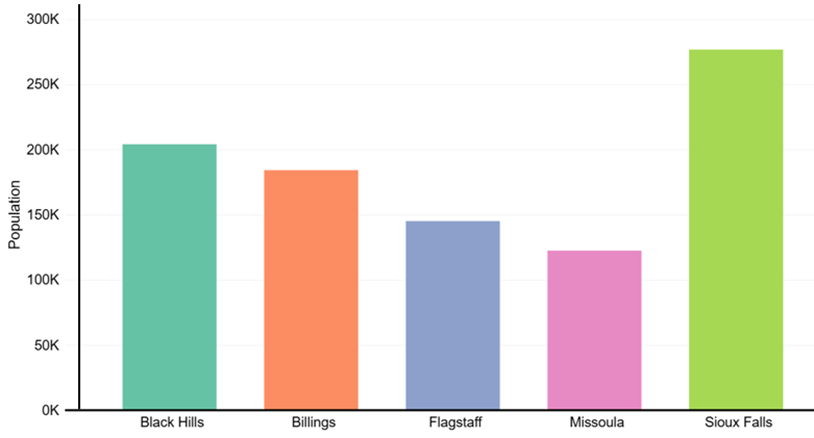

Table 3-1: Total Population of Black Hills with Benchmark Regions

| Black Hills | Billings | Flagstaff | Missoula | Sioux Falls |
| --- | --- | --- | --- | --- |
| 211,608 | 189,255 | 144,508 | 125,631 | 298,181 |

However, the population aged 16 and above in the Black Hills region shows a substantial proportion of the total population falling within the working age category, which is consistent with the patterns observed in the benchmark regions (Figure 3-2).

Figure 3-2: Population (Aged 16+ Years) of Black Hills with Benchmark Regions

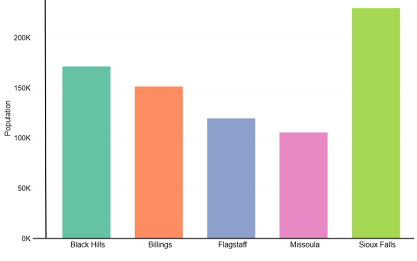

Table 3-2: Population (Aged 16+ Years) of Black Hills with Benchmark Regions

| Black Hills | Billings | Flagstaff | Missoula | Sioux Falls |
| --- | --- | --- | --- | --- |
| 171,524 | 151,540 | 119,681 | 105,682 | 229,767 |

Labor Market Characteristics

Considering the population aged 16 and above, a larger fraction of them is in the labor force, across all the regions, while the smaller fraction is categorized as not in labor force (Figure 3-3). The labor force category is also classified into Civilian labor force, which takes the majority, and the Military labor force which takes only a very small, negligible share. The labor force consists of individuals aged 16 and above that are either employed or actively seeking employment.

Figure 3-3: Population (Aged 16+ Years) that are in labor force and those not in labor   force, in Black Hills and Benchmark Regions

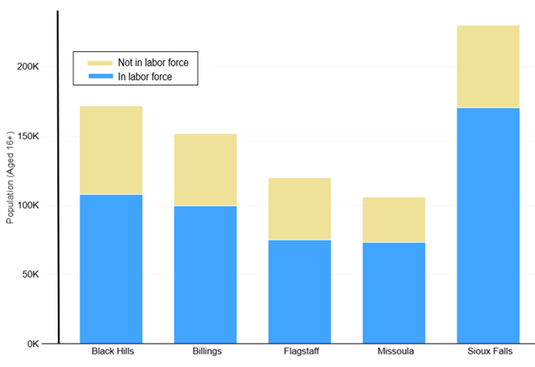

Table 3-3: Population (Aged 16+ Years) that are in labor force and those not in labor force (along with their proportions), in Black Hills and Benchmark Regions

| Group | Black Hills | Billings | Flagstaff | Missoula | Sioux Falls |
| --- | --- | --- | --- | --- | --- |
| Not in labor force | 63,960 | 52,264 | 49,949 | 32,756 | 59,616 |
| In labor force | 107,564  (63%) | 99,276  (66%) | 74,732  (62%) | 72,926  (69%) | 170,151  (74%) |

Within the civilian labor force, employment levels are consistently high across both the Black Hills and benchmark regions, with unemployment levels representing a relatively small proportion (Figure 3-4).

Overall, the Black Hills region demonstrates labor market participation patterns that are broadly comparable to the benchmark regions, indicating similar levels of workforce engagement, despite differences in population size.

Figure 3-4: Population (Aged 16+ Years in civilian labor force) that are employed and those not employed, in Black Hills and Benchmark Regions

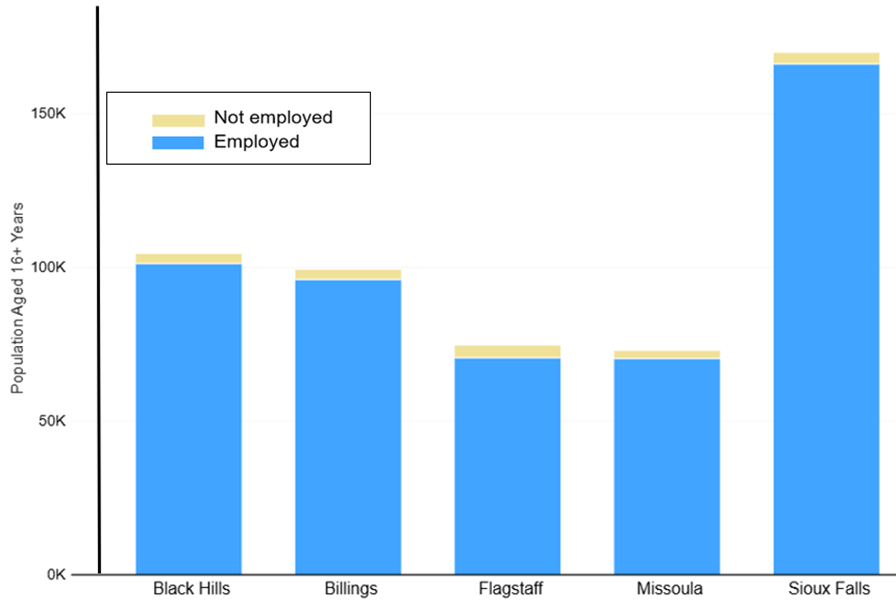

Table 3-4: Population (Aged 16+ Years in civilian labor force) that are employed and those not employed, in Black Hills and Benchmark Regions

| Group | Black Hills | Billings | Flagstaff | Missoula | Sioux Falls |
| --- | --- | --- | --- | --- | --- |
| Not employed | 3,358 | 3,397 | 4,210 | 2,713 | 3,833 |
| Employed | 100,999 | 95,800 | 70,346 | 70,108 | 165,920 |

Occupational Structure

The occupational distribution highlights how employment is spread across major sectors. In the Black Hills and benchmark regions, employment is distributed across five major sectors which are: Natural resources, construction, and maintenance; Production, transportation, and material moving; Service occupations; Sales and office occupations; and Management, business, science, and arts occupations.

The occupational distribution in the Black Hills and benchmark regions reflect notable representation in all five sectors. Although, compared to benchmark regions (Figure 3-5), the Black Hills shows a slightly higher concentration in the natural resources, construction and maintenance occupations, with a slightly lower proportion of employment in the management, business, science, and arts occupations, while the benchmark regions tend to have a slightly larger proportion of employment in management, business, science, and arts occupations.

However, the general overview demonstrates comparable occupational distribution patterns across all regions.

Figure 3-5: Occupational distribution of civilian employed (Aged 16+ Years) in Black Hills    compared with Benchmark Regions

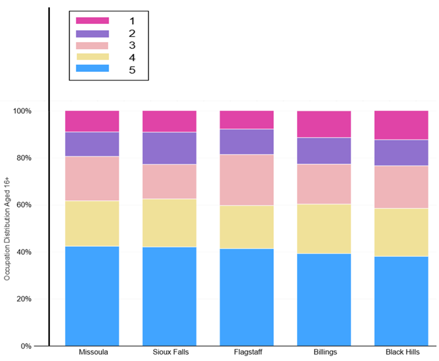

Table 3-5: Population (Aged 16+ Years) that are in labor force and those not in labor force, in Black Hills and Benchmark Regions

| Group | Black Hills | Billings | Flagstaff | Missoula | Sioux Falls |
| --- | --- | --- | --- | --- | --- |
| Natural resources, construction &amp; maintenance (1) | 12.4% | 11.4% | 7.9% | 9.1% | 9.2% |
| Production, transportation, and material moving (2) | 11.1% | 11.3% | 10.8% | 10.4% | 13.7% |
| Service occupations (3) | 18.1% | 17.0% | 21.7% | 18.9% | 14.7% |
| Sales and office occupations (4) | 20.4% | 21.0% | 18.3% | 19.3% | 20.4% |
| Management, business, science, &amp; arts occupations (5) | 38.0% | 39.2% | 41.3% | 42.3% | 42.0% |

Household Income Characteristics

The visualization of total households (Figure 3-6) indicates that the Black Hills has fewer households than Sioux Falls but higher than the other benchmark regions, which is consistent with the population size visualization (Figure 3-1).

Figure 3-6: Total number of households with income and earnings, in Black Hills with Benchmark Regions

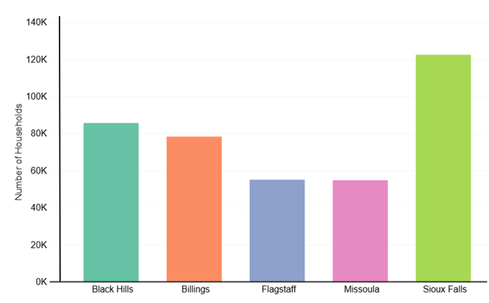

Table 3-6: Total number of households with income and earnings, in Black Hills with Benchmark Regions

| Black Hills | Billings | Flagstaff | Missoula | Sioux Falls |
| --- | --- | --- | --- | --- |
| 85,704 | 78,371 | 55,118 | 54,829 | 122,517 |

A notable feature is the presence of households with retirement income, which constitutes an important segment of the population (Figure 3-7). The Black Hills shows a measurable share of households receiving retirement income, suggesting the presence of an older or retired population segment.

Figure 3-7: Proportions of households with retirement income in Black Hills and Benchmark Regions

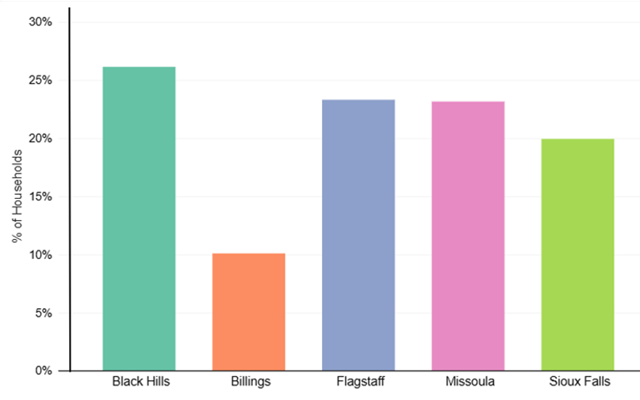

Table 3-7: Total number of households with retirement income in Black Hills with Benchmark Regions, along with their proportions in total households

| Black Hills | Billings | Flagstaff | Missoula | Sioux Falls |
| --- | --- | --- | --- | --- |
| 22,404  (26.14%) | 19,115  (10.10%) | 12,851  (23.32%) | 12,699  (23.16%) | 24,434  (19.94%) |

Income Distribution

Household income distribution is divided into three categories: low (&lt;$50,000), middle ($50,000–$149,000), and high ($150,000+) income. Although the Black Hills region tends to reflect a slightly lower share in the high-income category, the general household income distribution overview demonstrates comparable income distribution patterns across all regions (Figure 3-8).

Figure 3-8: Households income distribution (%) in Black Hills compared with Benchmark Regions.

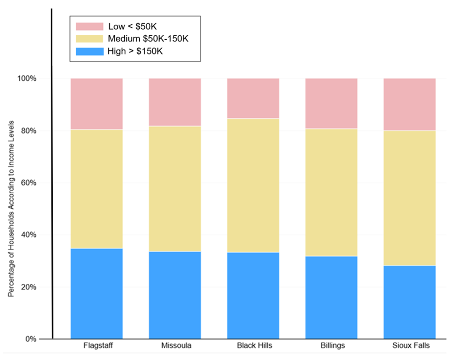

Table 3-8: Households income distribution (%) in Black Hills compared with Benchmark Regions.

| Group | Black Hills | Billings | Flagstaff | Missoula | Sioux Falls |
| --- | --- | --- | --- | --- | --- |
| Low &lt; $50K | 33.2% | 31.7% | 34.7% | 33.5% | 28.1% |
| Medium $50K - 150K | 51.3% | 48.9% | 45.6% | 48.1% | 51.8% |
| High &gt;$150K | 15.5% | 19.4% | 19.7% | 18.4% | 20.1% |

Average Household Income

Average household income in the Black Hills, adjusted for inflation, provides a key indicator of overall economic well-being. While the Black Hills region demonstrates stable income levels, benchmark regions report slightly higher average household incomes (Figure 3-9). This disparity may suggest a comparatively smaller pool of high-capacity donors in the Black Hills region.

Figure 3-9: Average Household Income (In 2024 Inflation-Adjusted Dollars) of Black Hills with Benchmark Regions

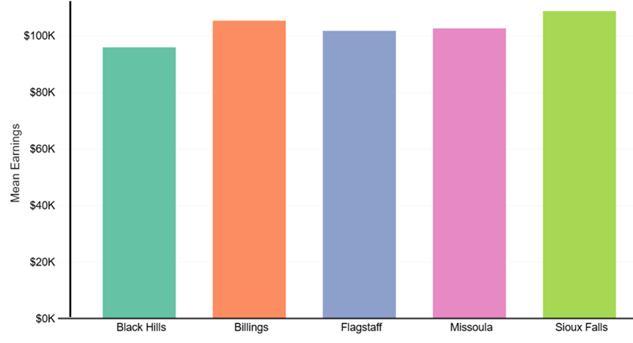

Table 3-9: Average Household Income (In 2024 Inflation-Adjusted Dollars) of Black Hills with Benchmark Regions

| Black Hills | Billings | Flagstaff | Missoula | Sioux Falls |
| --- | --- | --- | --- | --- |
| $96,026 | $105,450 | $101,845 | $102,724 | $108,829 |

Overall, the Black Hills region demonstrates patterns that are broadly comparable to the benchmark regions in key structural characteristics that were considered, reflecting similar underlying economic and demographic conditions.

# Characterization of donation activity

This section describes tax-reported donor behavior in the Black Hills region relative to the four benchmark regions, with attention to how charitable giving varies across regions once differences in income are taken into account. The analysis draws on county-level tax data and characterizes reported giving patterns.

## Relevant details about data sources

The analysis in this section uses the Internal Revenue Service Statistics of Income (SOI) 2022 County Data. Regions are defined by aggregating the counties that make up each area. All dollar values in the source file are reported in thousands, and the figures shown here have been converted to whole dollars.

Returns are grouped into three income bands based on adjusted gross income: low (under $50,000), middle ($50,000 to $100,000), and high ($100,000 or more). Two features of the data shape how the results should be read. First, charitable contributions appear in tax data only for filers who itemize their deductions, so giving by non-itemizers is not observable. Because non-itemizers are a large majority of filers in these regions, observed giving will understate total giving. Second, the data are totals at the county-level and do not identify individual donors, so they cannot distinguish one-time from recurring gifts, account for household size, or describe the relationship between donors and the organizations they support. At the same time, within these limits the data support a sound comparison of itemizer giving behavior across the Black Hills and the benchmark regions, since they measure a narrow but consistently defined subgroup across areas.

## Results of donation activity analysis

### Donor participation

Donor participation is measured as the share of tax returns that report charitable contributions out of all returns filed. Participation rises with income in every region. Across all income groups, the Black Hills region has a lower participation rate than each benchmark region, both overall (3.5 percent) and within each income band.

Table 4-1. Donor Participation Rate (%) by Income Group and Region

| Income group | Black Hills | Billings | Flagstaff | Missoula | Sioux Falls |
| --- | --- | --- | --- | --- | --- |
| Low (&lt;$50k) | 0.7 | 1.4 | 1.1 | 1.5 | 1.2 |
| Middle ($50k–$100k) | 3.1 | 6.4 | 5.2 | 7.5 | 3.4 |
| High (≥$100k) | 10.7 | 17.2 | 19.0 | 19.5 | 12.4 |
| Region overall | 3.5 | 6.4 | 5.7 | 6.9 | 4.7 |

Figure 4-1. Donor Participation Rate by Income Group and Region

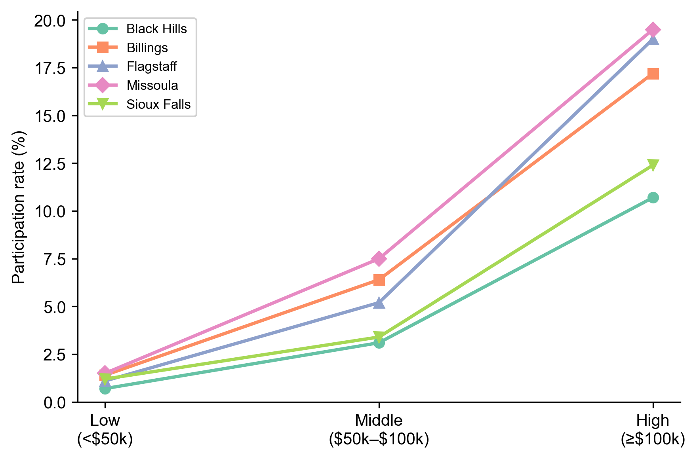

### Itemization and Observed Participation

Donor participation also relates to itemization, since only filers who itemize can report charitable deductions, and the itemization rate therefore sets the range within which giving can be observed. The Black Hills region has the lowest itemization rate of the five regions, at 4.6 percent. Among filers who do itemize, the share who report charitable gifts is similar across regions, between about 76 and 84 percent. This points to the region&#x27;s lower observed participation being tied more to how few filers itemize than to differences in reported giving among those who do. The same pattern holds within each income band. Because state tax rules can affect the incentive to itemize deductions, regional differences in how many filers itemize, and therefore in observed participation, may partly reflect differences in local tax policy. This is a contextual consideration only and was not examined in the present analysis.

Table 4-2. Participation, Itemization, and the Participation-to-Itemization Ratio by Region (%)

| Measure | Black Hills | Billings | Flagstaff | Missoula | Sioux Falls |
| --- | --- | --- | --- | --- | --- |
| Participation | 3.5 | 6.4 | 5.7 | 6.9 | 4.7 |
| Itemization | 4.6 | 8.4 | 7.1 | 9.1 | 5.6 |
| Participation / Itemization | 76.1 | 75.7 | 80.8 | 76.1 | 83.8 |

Table 4-3. Itemization Rate (%) by Income Group and Region

| Income group | Black Hills | Billings | Flagstaff | Missoula | Sioux Falls |
| --- | --- | --- | --- | --- | --- |
| Low (&lt;$50k) | 1.4 | 2.2 | 1.6 | 2.5 | 1.6 |
| Middle ($50k–$100k) | 4.4 | 9.5 | 7.0 | 10.6 | 4.6 |
| High (≥$100k) | 12.7 | 20.8 | 22.2 | 23.7 | 13.8 |
| Region overall | 4.6 | 8.4 | 7.1 | 9.1 | 5.6 |

### Average Contribution per Donor

Average annual contribution per donor is total charitable contributions divided by the number of returns that report them. This reflects how much participating donors give rather than the size of any single gift, since the data report annual totals per return rather than individual donations.

Among participating donors, Black Hills gives competitively across all income groups. Black Hills ranks first in the Middle-income group and second in the Low- and High-income groups, behind only Sioux Falls. Overall, Black Hills ranks second among the five regions, again behind Sioux Falls and well above the other three benchmarks.

Table 4-4. Average Annual Charitable Contributions per Donor by Income Group and Region, among returns reporting contributions

| Income group | Black Hills | Billings | Flagstaff | Missoula | Sioux Falls |
| --- | --- | --- | --- | --- | --- |
| Low (&lt;$50k) | $3,997 | $3,639 | $3,865 | $3,259 | $5,260 |
| Middle ($50k–$100k) | $7,826 | $5,132 | $6,386 | $4,574 | $7,446 |
| High (≥$100k) | $28,061 | $22,871 | $19,566 | $27,344 | $36,212 |
| Region Overall | $21,014 | $16,337 | $15,096 | $18,497 | $27,193 |

Figure 4-2. Average Annual Charitable Contributions per Donor by Income Group and Region, among returns reporting contributionsGiving Relative to Income

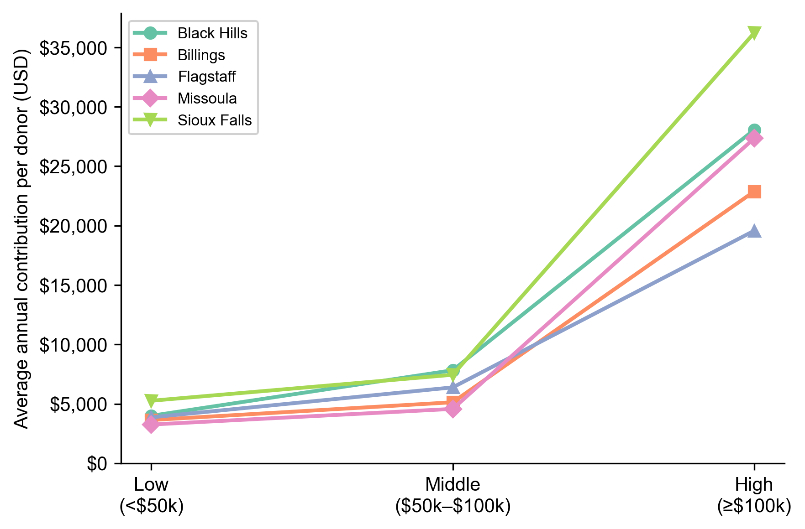

Two measures relate giving to income. The region-wide measure divides total contributions by the total adjusted gross income of all taxpayers, which shows the share of a region&#x27;s income that goes to charity. The itemizer-conditional measure divides total contributions by the estimated adjusted gross income of itemizers only, which shows the share of itemizers&#x27; income that is deducted as donations. The two measures place the Black Hills region quite differently. Under the region-wide measure (Panel A) it is the lowest in every income group. Under the itemizer-conditional measure (Panel B) it moves toward the middle or top of the range, ranking first in the middle-income group and second overall. The contrast shows that the low region-wide ratio has more to do with how many filers report giving than with how much itemizers actually give. One factor that may contribute to this divergence is the absence of a state income tax in South Dakota: because the only tax benefit from giving is at the federal level, a filer must give a larger share of income for itemizing to be worthwhile. This is noted as a contextual consideration only and was not examined in the present analysis.

Table 4-5. Giving ratio (%) by Income Group and Region

| Income group | Black Hills | Billings | Flagstaff | Missoula | Sioux Falls |
| --- | --- | --- | --- | --- | --- |
| Panel A. Region-wide (all returns) | Panel A. Region-wide (all returns) | Panel A. Region-wide (all returns) | Panel A. Region-wide (all returns) | Panel A. Region-wide (all returns) | Panel A. Region-wide (all returns) |
| Low (&lt;$50k) | 0.13 | 0.23 | 0.18 | 0.23 | 0.26 |
| Middle ($50k–$100k) | 0.34 | 0.45 | 0.47 | 0.48 | 0.35 |
| High (≥$100k) | 1.32 | 1.76 | 1.60 | 2.09 | 1.69 |
| Panel B. Itemizer-conditional | Panel B. Itemizer-conditional | Panel B. Itemizer-conditional | Panel B. Itemizer-conditional | Panel B. Itemizer-conditional | Panel B. Itemizer-conditional |
| Low (&lt;$50k) | 7.33 | 8.66 | 9.38 | 7.15 | 12.45 |
| Middle ($50k–$100k) | 7.67 | 4.57 | 6.44 | 4.39 | 7.42 |
| High (≥$100k) | 7.09 | 6.53 | 5.48 | 6.75 | 7.74 |

### Participation versus Contribution Size

Differences in total giving per taxpayer reflect two components: the share of taxpayers who donate (participation) and the amount each donor gives (average contribution per donor). Because giving per return is the product of these two figures, the gap between each benchmark region and the Black Hills region can be attributed to one or the other. Indexed to the Black Hills region at 100, every benchmark region is higher on both participation and giving per return, while the average contribution per donor is comparable or lower in three of the four. The differences in total giving therefore come mainly from participation, not from how much each donor gives. Black Hills donors give as much as or more than donors elsewhere, and the region’s lower overall giving traces back to the smaller share of people who give.

Figure 4-3. Decomposition of Regional Giving into Participation and Per-Donor Intensity

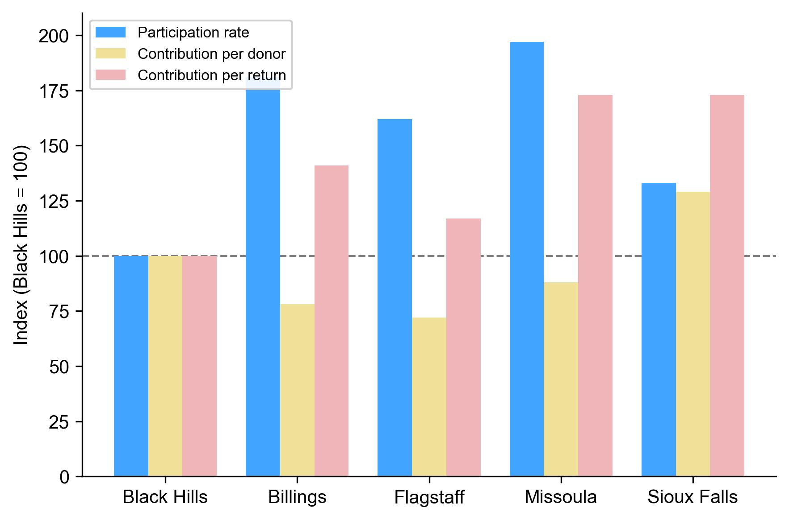

Table 4-6. Regional Giving Components Indexed to Black Hills (=100)

| Component | Black Hills | Billings | Flagstaff | Missoula | Sioux Falls |
| --- | --- | --- | --- | --- | --- |
| Participation rate | 100 | 181 | 162 | 197 | 133 |
| Contribution per donor | 100 | 78 | 72 | 88 | 129 |
| Contribution per return | 100 | 141 | 117 | 173 | 173 |

### Rurality and Donor Participation

Donor participation can also be compared to how rural each county is. Rurality is measured with the USDA Rural-Urban Continuum Code (RUCC), which ranges from 1 (large metropolitan areas of more than one million people) to 9 (small rural counties not adjacent to any metropolitan area).

Across the 18 counties, the rank correlation between rurality and participation is negative but weak (rs = −0.28, p = 0.26), consistent with somewhat lower participation in more rural counties. Here, rs is the Spearman rank-correlation estimator (an estimate of the population parameter ρ); it ranges from –1 to +1, with values near zero indicating little monotonic association, and p is the probability of observing a correlation at least this strong if rurality and participation were in fact unrelated. Given the small number of counties, the analysis has limited power to distinguish a modest association from none, and the magnitude and direction of the coefficient are therefore more instructive than its position relative to a fixed significance threshold.

This association should not be read as causal. Because more rural counties also tend to have lower incomes, and lower-income filers are less likely to itemize and report charitable deductions, the apparent rurality-participation link may instead reflect underlying differences in income rather than rurality itself.

A sensitivity check excluding Oglala Lakota County indicates that the negative association is strongest in the low-income group and persists after the exclusion. As one of several correlations examined, however, this result warrants confirmation with a larger set of counties.

Figure 4-4. Donor Participation Rate against rurality (RUCC) for the 18 study countiesTable 4-7.  Spearman rank correlation between rurality (RUCC) and donor participation rate

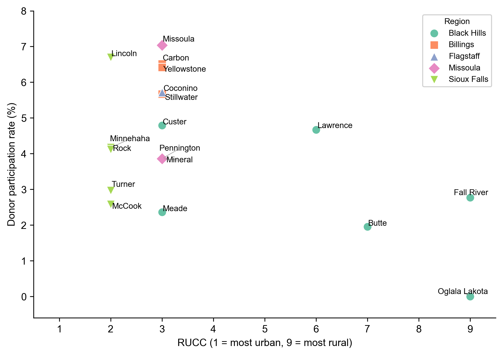

| Income group | Full sample (n = 18) | Excl. Oglala Lakota (n = 17) |
| --- | --- | --- |
| All incomes | rs = −0.28 (p = 0.26) | rs = −0.14 (p = 0.61) |
| Low (&lt;$50k) | rs = −0.67 (p = 0.003*) | rs = −0.61 (p = 0.009*) |
| Middle ($50k–$100k) | rs = +0.17 (p = 0.51) | rs = +0.36 (p = 0.16) |
| High (≥$100k) | rs = −0.11 (p = 0.66) | rs = +0.07 (p = 0.81) |

rs = Spearman rank-correlation coefficient; p = two-sided significance; * denotes p &lt; 0.05

### Nonprofit Density and Donor Participation

To assess whether the local availability of organizations is related to giving, donor participation is compared with the supply of nonprofits across the same 18 counties. Nonprofit density is the number of tax-exempt organizations registered with the IRS per 10,000 residents, drawn from the 2022 IRS Exempt Organizations Business Master File and 2022 American Community Survey County population estimates.

Across all 18 counties, nonprofit density shows essentially no relationship with overall donor participation (Pearson r = 0.07, p = 0.77), and the pattern is consistent within income groups (Table 4-6). In this case the coefficient is itself near zero, indicating little apparent association rather than a relationship obscured by the limited sample.

Table 4-8. Pearson Correlation between Nonprofit density and Donor Participation Rate

| Income group | Excl. hospitals / univ. / political | All included |
| --- | --- | --- |
| All incomes | r = 0.07 (p = 0.77) | r = 0.06 (p = 0.81) |
| Low (&lt;$50k) | r = −0.09 (p = 0.72) | r = −0.11 (p = 0.67) |
| Middle ($50k–$100k) | r = +0.36 (p = 0.14) | r = +0.37 (p = 0.14) |
| High (≥$100k) | r = +0.005 (p = 0.99) | r = −0.009 (p = 0.97) |

Cross-Source Check: SOI-Reported Donations and Form 990 Reported Contributions

The preceding results indicate that the Black Hills region’s lower observed participation is tied to its lower itemization rate rather than lower giving among itemizers. Because the SOI participation measure captures only charitable contributions reported by itemizing filers, SOI-reported donations are compared, as a cross-source check, with contributions reported by nonprofit organizations in Form 990-family filings which are not conditioned on itemization. A region that is also lower on the Form 990 measure would indicate lower charitable giving, whereas one that is not is more consistent with lower itemization or reporting.

The two measures are not directly equivalent. SOI donations per capita are the charitable contributions reported by itemizing taxpayers, based on donor residence and limited to gifts that appear in the tax data. Form 990 contributions per capita are the contributions reported by nonprofit organizations located in each region, based on organization location and distinct from total revenue. Both are expressed per capita using the 2022 ACS population for each region.

Table 4-9. Per-Capita Charitable Giving: SOI-Reported Donations and Form 990 Reported Contributions by Region, 2022

| Measure | Black Hills | Billings | Flagstaff | Missoula | Sioux Falls |
| --- | --- | --- | --- | --- | --- |
| SOI-reported donations per capita | $391 | $529 | $372 | $673 | $673 |
| Form 990 reported contributions per capita | $2,322 | $1,120 | $2,059 | $2,419 | $2,506 |

On the SOI measure, Black Hills ranks lowest or near lowest among the benchmark regions, consistent with the participation rates reported earlier. On the Form 990 measure, it is not lower than the benchmark regions, falling in the middle of the range, above Billings and Flagstaff and close to Missoula and Sioux Falls. The lower SOI participation rate should therefore not be read on its own as evidence that charitable activity is uniformly lower in the region; the pattern is consistent with lower itemization and reporting contributing to the lower participation observed in the SOI data.

This comparison is a cross-source check rather than a direct estimate of resident giving. SOI donations are reported by donor residence and Form 990 contributions by organization location, so the Form 990 totals may include gifts from donors outside the region, and reporting coverage varies across regions. The Form 990 data and methodology are described in Section 5.

Summary

Black Hills’ lower overall donation rate appears to be driven primarily by participation, not by lower giving amounts among donors. Once the analysis is limited to itemizers, the participation gap largely narrows, suggesting that itemization behavior is an important part of the observed regional difference.

Across the five regions, the Black Hills region has the lowest donor participation rate (3.5%) and the lowest itemization rate (4.6%). Among filers who itemize, the share reporting charitable contributions is comparable to the benchmark regions, ranging from 76% to 84%. Average contributions per donor are also comparable to or higher than the benchmark regions, including the highest value in the middle-income group. The two giving-relative-to-income measures place Black Hills differently: relative to total regional income, it gives the smallest share in every income group but relative to itemizers only, it ranks first in the middle-income group and second overall. Together, these results suggest that the gap in total giving between Black Hills and the benchmark regions reflects differences in participation rather than in the amount each donor gives.

A cross-source comparison with donor contributions reported in Form 990 filings is consistent with this interpretation: on a per-capita basis the Black Hills region is not lower than the benchmark regions, which would not be expected if its lower SOI participation reflected uniformly lower giving.

Neither rurality nor nonprofit density showed a meaningful association with participation.

# Characterization of non-profit organizations

## Relevant details about data sources

### Non-profit revenue analysis

This section uses the GivingTuesday Form 990-family data described under Data sources.

For tax year 2022, after requiring positive total revenue, the primary analysis file includes 1,799 filing records for 1,797 organizations: 422 in the Black Hills, 332 in Billings, 197 in Flagstaff, 283 in Missoula, and 565 in Sioux Falls.

We also checked the 2022 revenue-source comparisons with and without 25 records for hospitals, universities, and political organizations. Including those records did not materially change the direction or overall interpretation of the patterns. The revenue-source results presented below use the version without those organizations so the comparison focuses on more similar non-profit peers.

Definitions for the revenue sources analyzed in this section are provided in Appendix Table A-12.

The data cannot cleanly separate individual giving from foundation grants, corporate gifts, bequests, or other institutional support. That limitation applies especially to total contributions and mixed or unclassified contributions. These categories describe what organizations reported on IRS filings, not who ultimately made each gift.

This report presents two complementary views of the same filing data. Regional totals (Appendix Table A-1) sum reported dollars across all organizations in the analysis file for each source and region. That is the direct read on how much money flowed through each channel in the overall landscape, but a few very large filers can dominate those sums, so totals can differ sharply from what most organizations experience.

The headline comparisons in this section use the median reported dollar amount among organizations that reported a positive amount for that source. That answers a different question: when a local organization does use the channel, how large is the amount it reports? The median is less pulled up or down by a handful of extreme filers than a regional total or average would be, and it compares only organizations that actually reported the source rather than treating every non-reporter as zero. That separation matters because reporting rates differ by source and region, and on IRS forms a missing line does not always mean the organization earned nothing from that source. Reporting rates and reporter counts appear in Appendix Tables A-2 through A-11; regional totals appear in Appendix Table A-1.

### How many organizations could we compare?

Only organizations that reported income from a given revenue source were included in that source&#x27;s comparison. The number of organizations varies widely by source because different revenue lines appear on different IRS forms and because many organizations do not use every funding channel.

The 422 Black Hills records above are all Form 990-family filers with positive total revenue in 2022. Comparisons for Form 990 Part VIII contribution lines (government grants, federated campaigns, related-organization contributions, membership dues, and fundraising events) use only organizations that filed the full Form 990. That leaves 256 eligible Black Hills records for those detailed contribution lines. Organizations filing Form 990-EZ or Form 990-PF are not counted as zero for those lines because their forms do not provide the same line-level detail.

For total revenue, total contributions, program service revenue, mixed or unclassified contributions, and other revenue, most pairwise comparisons involved dozens or hundreds of positive reporters in each region.

Some Part VIII lines are reported by far fewer organizations. Among the 256 eligible Black Hills Form 990 records, 18 organizations (about 7%) reported positive federated campaign contributions. Some benchmark comparisons for that source involved as few as three to five organizations with positive amounts. Related-organization contributions were also uncommon: 10 eligible Black Hills organizations (about 4%) reported a positive amount. Fundraising event contributions and membership dues fell in between, with moderate sample sizes in some benchmark pairs.

Patterns for sources with very small reporter groups should be read with extra caution because a few organizations can have a large effect on the median. The reporting rates in Appendix Tables A-2 through A-11 show how common each revenue source was in each region.

## Results of non-profit organization analysis

Form 990 results and the IRS-BMF dataset were used to analyze the financial characteristics of non-profit organizations in Black Hills and benchmark regions. Total revenue and assets were used as indicators of organizations’ financial performance.

Yearly revenues of individual non-profit organizations vary widely within regions. The bar plot below shows average yearly revenue of non-profit organizations in each region from the 2022 IRS-BMF dataset. The error bars indicate 95% confidence intervals based on each regional average calculated through bootstrapping. Although Sioux Falls and Billings have high yearly revenue values on average, the differences between regions are not statistically significant due to the high variability. Sioux Falls and Billings also have organizations that produce small revenue comparable to Black Hills and other benchmark regions. An ANOVA revealed that the regional differences are not statistically significant (p = 0.529).

Figure 5-1. Average Yearly Revenue of Non-Profit Organizations by Region

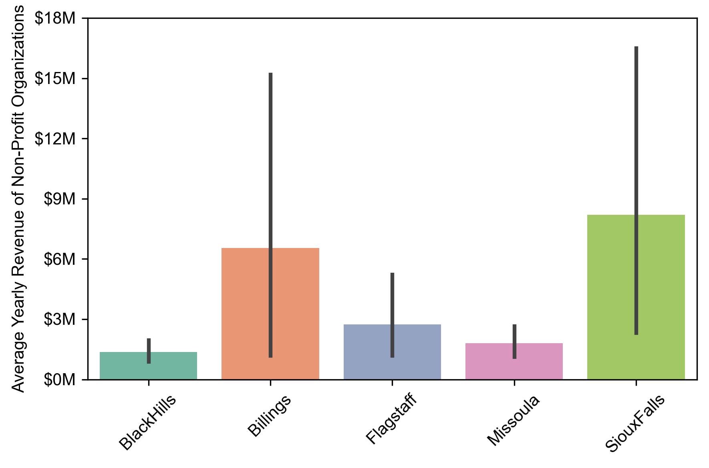

Filtering out hospitals and universities based on NTEE business field codes and political organizations (501 c4) shows a significant decrease in average yearly revenue of Sioux Falls and Billings. The average yearly revenue of Billings dropped to a similar amount to the average yearly revenue of Black Hills. The variability also decreased due to the filtered data from the three non-profit fields containing organizations with high yearly revenues. Sioux Falls continues to have the highest average yearly revenue and high associated variability, but the regional differences are not statistically significant based on an ANOVA (p = 0.889).

Figure 5-2. Average Yearly Revenue of Non-Profit Organizations by Region (Filtered)

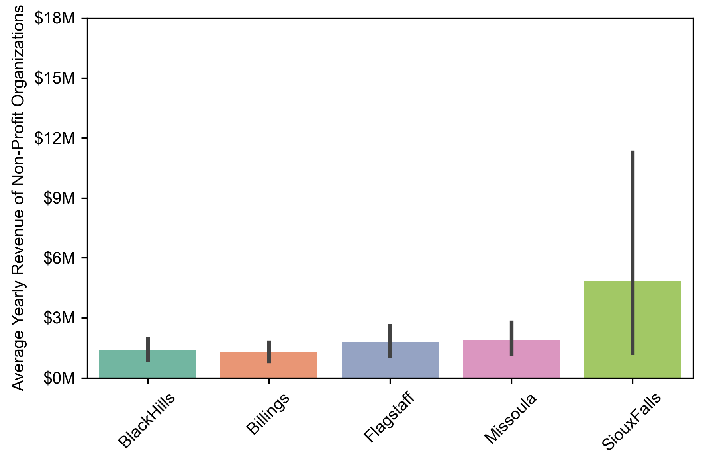

Organizations gain revenue from various sources including donations, fundraising events, and government grants. The bar plot below calculates grant ratio for each region from Giving Tuesday 990 dataset by dividing the total grant amount by yearly revenue. It shows that Sioux Falls has the highest average yearly revenue but the smallest grant ratio. On the other hand, Black Hills has the smallest average yearly revenue but the highest grant ratio. This result suggests that organizations in Black Hills, on average, rely more on grants for their revenues than donations from individuals or other community-based sources. This pattern is consistent with the filtered data as well. A Kruskal-Wallis test did not show statistically significant regional differences (p = 0.069), but moderately significant regional differences when hospitals, universities, and political organizations are filtered out (p = 0.034).

Figure 5-3 Average Grants to Yearly Revenue Ratio of Non-Profit Organizations by Region

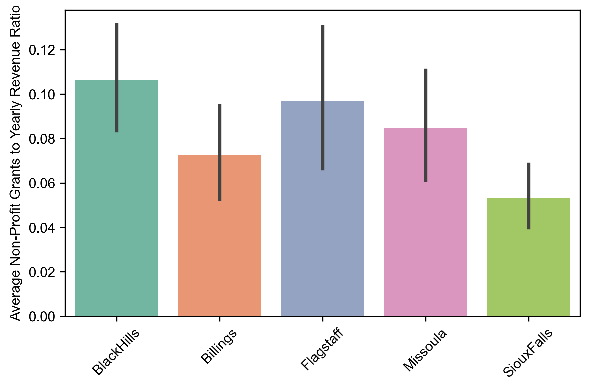

Figure 5-4. Average Grants to Yearly Revenue Ratio of Non-Profit Organizations by Region (Filtered)

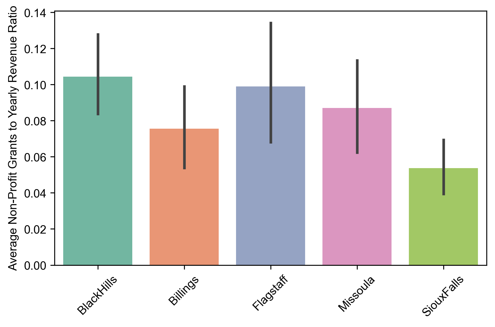

Yearly assets of individual organizations were analyzed from the IRS-BMF dataset. Similar to the yearly revenue bar plot, the bar plot below shows average yearly assets of non-profit organizations in each region with 95% confidence intervals as error bars. Although there is still variability within the region, Sioux Falls organizations on average reported higher yearly assets.  A Kruskal-Wallis test revealed statistical significance in regional differences (p = 0.0001).

Figure 5-5. Average Yearly Assets of Non-Profit Organizations by Region

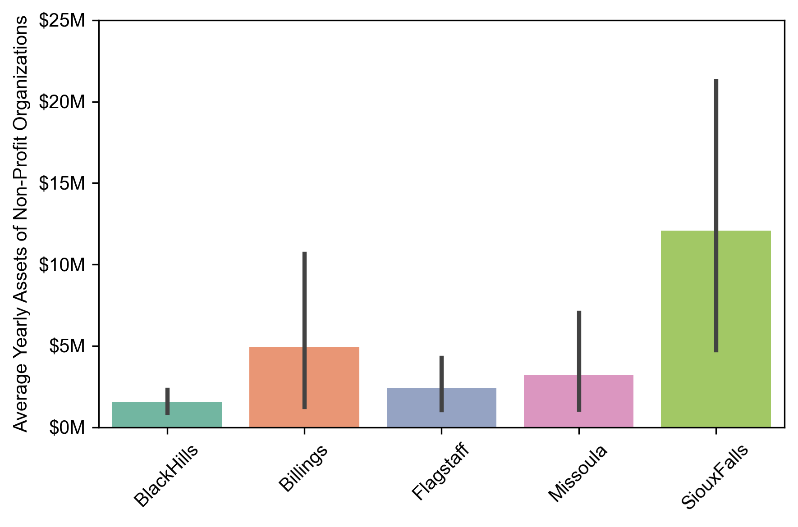

Filtered data excludes hospitals, universities, and political organizations. The difference is smaller, but Sioux Falls continues to have the highest average of yearly assets. The average yearly assets for Black Hills do not decrease as much as Sioux Falls and Billings. This further supports the observation on yearly revenues that the filtered-out businesses produce more financial gain and therefore inflates the regional average. A Kruskal-Wallis test showed statistically significant regional differences even after hospitals, universities, and political organizations are filtered out from the data (p = 0.001).

Figure 5-6. Average Yearly Assets of Non-Profit Organizations by Region (Filtered)

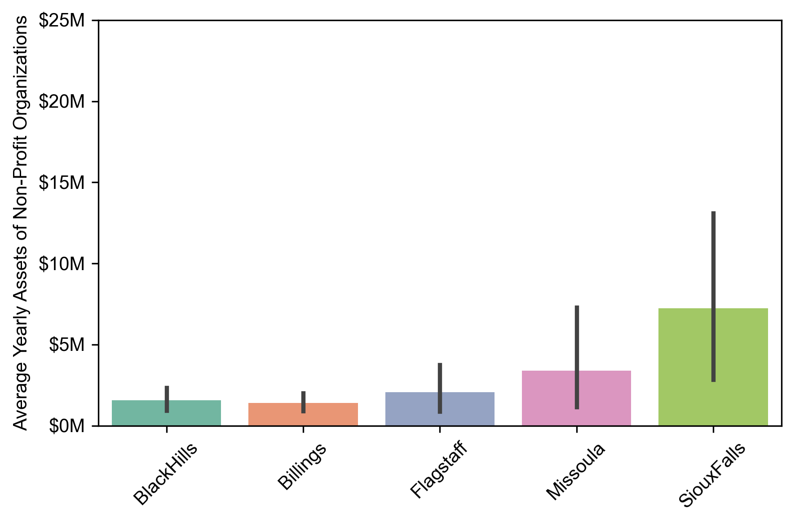

Non-profit density per 10,000 populations were calculated for each county based on the IRS-BMF dataset. The bar plot below shows the mean of county-level density in each region. Flagstaff has one county, and therefore the mean is equal to the raw value. While the average densities vary between regions, densities depend more based on counties than region, and ANOVA fails to show statistically significant regional differences (p = 0.575).

Figure 5-7 Mean Non-Profit Density by Region

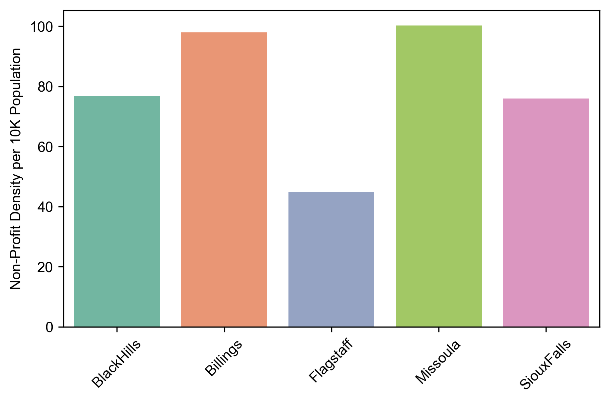

Within Black Hills, there is a wide variability of RUCC scores and indigenous population between counties based on the ACS dataset. The plots below show the relationship between non-profit density and each characteristic. Fall River County and Oglala Lakota County show the highest rurality score, indicating that they are very rural. However, they have a huge discrepancy in non-profit density. Oglala Lakota County is the only county in Black Hills to have a high indigenous population. Although it has a low nonprofit density, other counties with low indigenous population also show low nonprofit density. Without the outliers, the scatterplots do not show any strong correlation between the variables. Therefore, they infer that there is no significant correlation between non-profit density and the two county-level characteristics within Black Hills.

Figure 5-8. Non-Profit Density per 10K Population vs. Rurality and Indigenous Population (Black Hills)

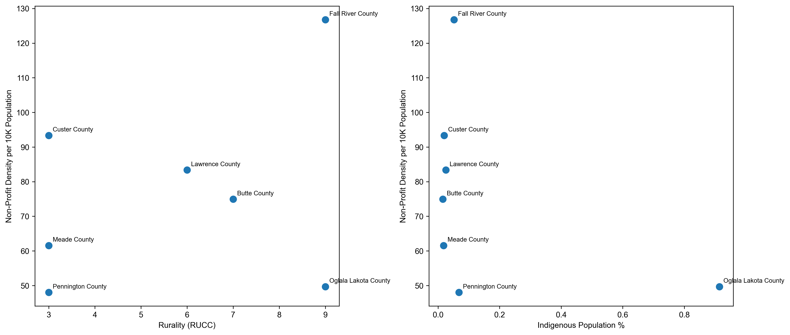

NTEE business field code from the NCCS dataset classifies non-profit organizations based on their activities and main focus. The heatmap below shows within-region proportions of organizations in each business category. Billings, Flagstaff, and Sioux Falls show a relatively higher ratio of religious organizations. Sioux Falls shows a slightly higher ratio of healthcare organizations compared to the other four regions. A chi-square test revealed significant association between NTEE business fields and regions (p &lt; 0.001). Billings had 26 organizations classified as unidentified, 24 in Black Hills, 11 in Flagstaff, 20 in Missoula, and 56 in Sioux Falls, ranging from 2 - 3% within-region ratios. Billings had 4 missing values, 1 in Missoula, and 6 in Sioux Falls.

Figure 5-9. Within-Region Proportions of Non-Profit Business Fields

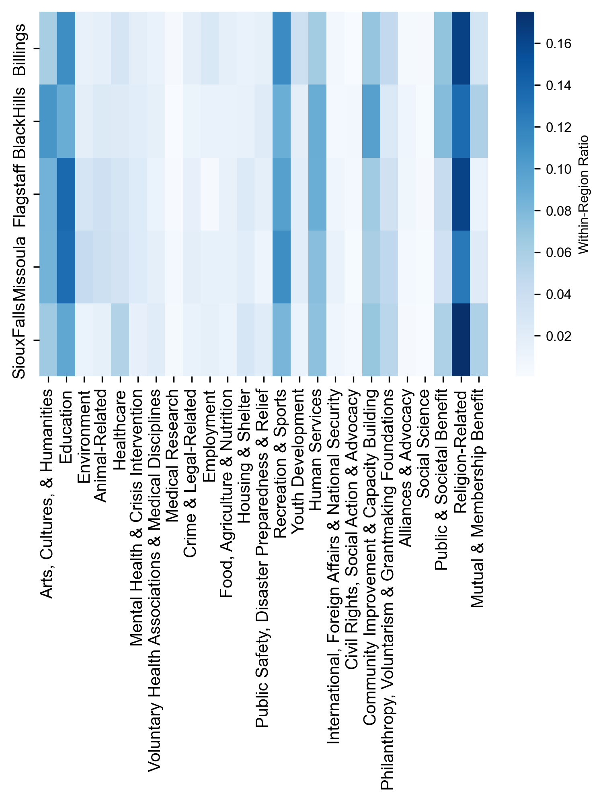

The second heatmap shows total revenue of non-profit organizations in each field. The yearly revenue values were logarithmically transformed to compress extremely high outliers and allow analysis focused on more common lower values. Billings and Sioux Falls show higher yearly revenue in healthcare sectors. Although religious organizations dominate in terms of the number of filing organizations, they do not produce high revenue. The IRS does not require religious organizations to report their revenues, and this could be causing bias in the reported revenue data.

Figure 5-10. Log-Transformed Total Revenue of Non-Profit Business Fields

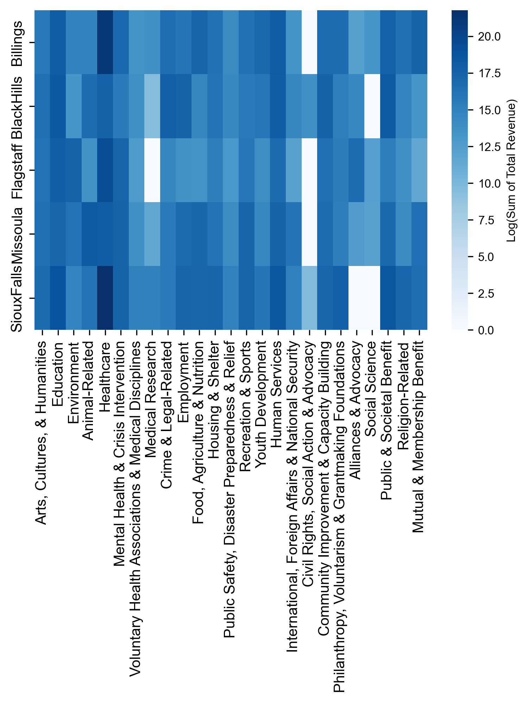

The available datasets do not allow for a causal analysis of regional or county characteristics and total revenue as they are observational. However, correlations can infer possible connections between organizations’ financial performance and the communities they are surrounded by. The plots below investigate the relationships between yearly revenues from individual organizations and county-level characteristics including percentages of population in retired households and armed forces, median household income, employment percentages in non-profit sectors, and average wage ratio between non-profit and for-profit organizations. Data on retired households, armed forces, and median household income were collected from the ACS dataset, and the data on non-profit employment and wage ratio were collected from the BLS dataset. None of the boxplots indicate a strong correlation between county characteristics and organizations’ total revenues.

Figure 5-11. Percentages of Retired Household in Counties vs. Log-Transformed Total Revenue of Non-Profit Organizations

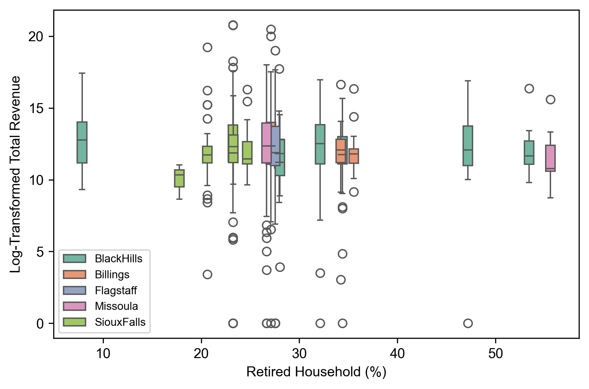

Figure 5-12. Proportion in Armed Forces in Counties vs. Log-Transformed Total Revenue of Non-Profit Organizations

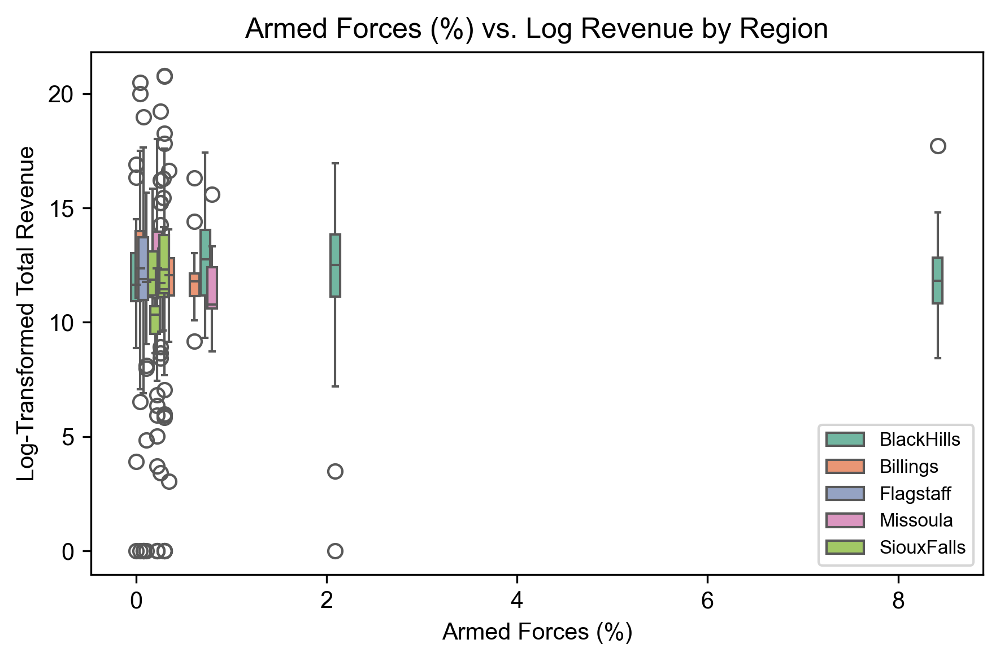

Figure 5-13. Median Household Income in Counties vs. Log-Transformed Total Revenue of Non-Profit Organizations

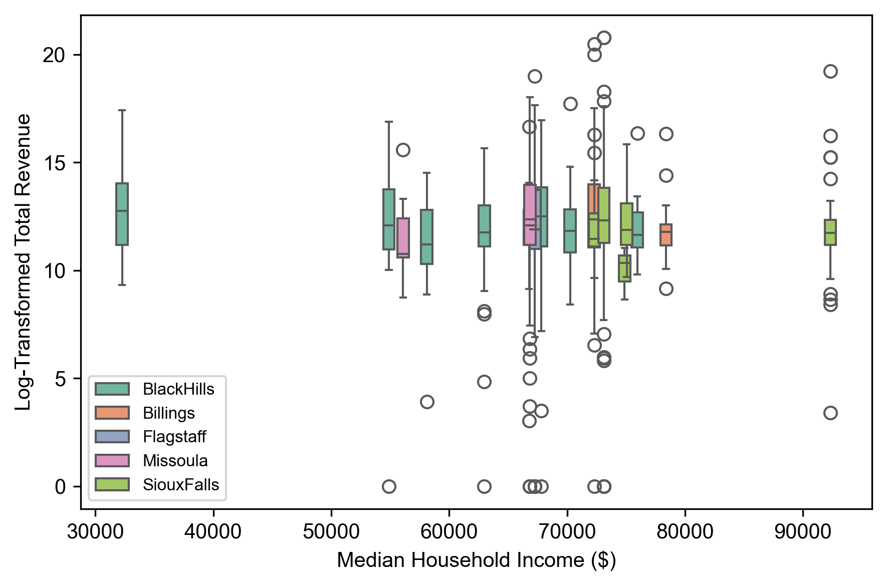

Figure 5-14. Non-Profit Employment in Counties vs. Log-Transformed Total Revenue of Non-Profit Organizations

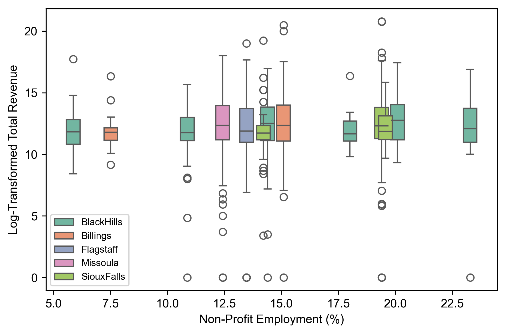

Figure 5-15. Non-Profit to Average Wage Ratio in Counties vs. Log-Transformed Total Revenue of Non-Profit Organizations

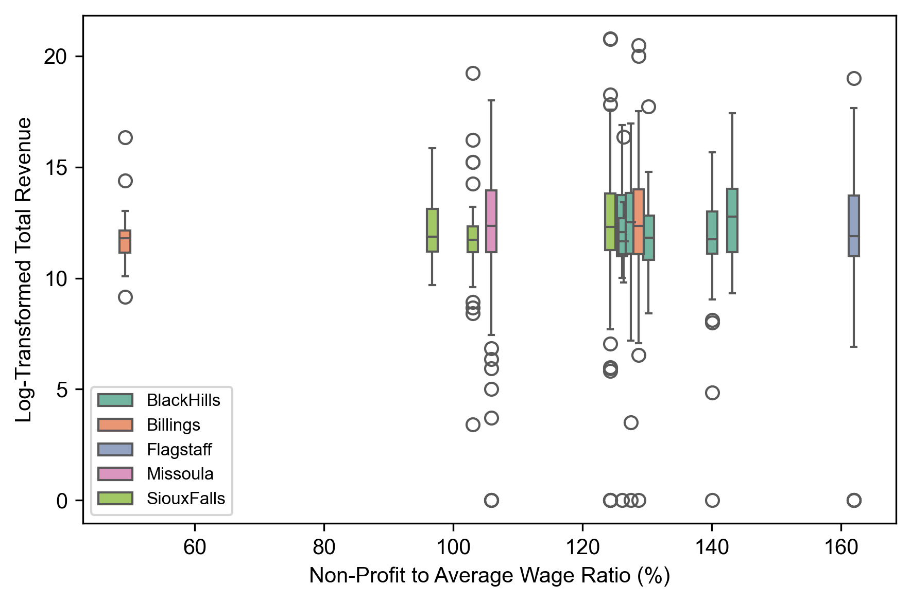

The table below shows Spearman’s correlation coefficient. Testing five predictor variables, we assume statistical significance with p values smaller than 0.01. All effect sizes are very small with p values higher than 0.01, confirming the suspected lack of significant correlation based on visual interpretation of the boxplots. Organizations are not restricted to serving communities in the county or region they register to. Therefore county-level characteristics may not correlate with their yearly revenue compared to the characteristics of their donors or business fields.

Table 5-1. Spearman’s Correlation between Log-Transformed Total Revenue and Predictor Variables

| Retired Household | Armed Forces | Median Household Income | Non-Profit Employment | Wage Ratio |
| --- | --- | --- | --- | --- |
| = -0.041  (p = 0.150) | = 0.021  (p = 0.457) | = -0.005  (p = 0.863) | = 0.057  (p = 0.050) | = -0.001  (p = 0.978) |

The boxplots below present yearly revenue of individual organizations in each region targeting healthcare or religious-related fields compared to other fields. Filtering data by specific business fields reduces the number of outliers shown in the boxplots, but medians do not significantly change.

Figure 5-16. Log-Transformed Total Revenue in Healthcare and Other Fields by Region

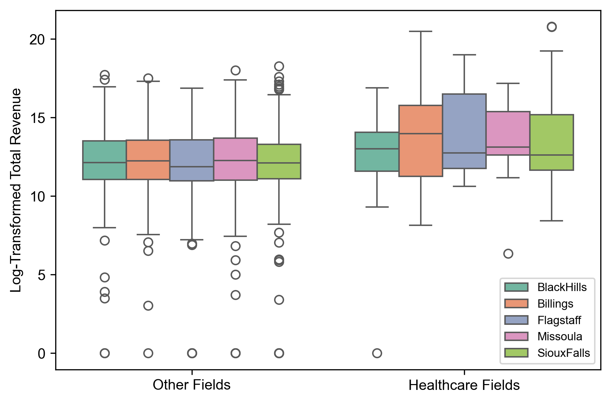

Figure 5-17. Log-Transformed Total Revenue in Religious-Related and Other Fields by Region

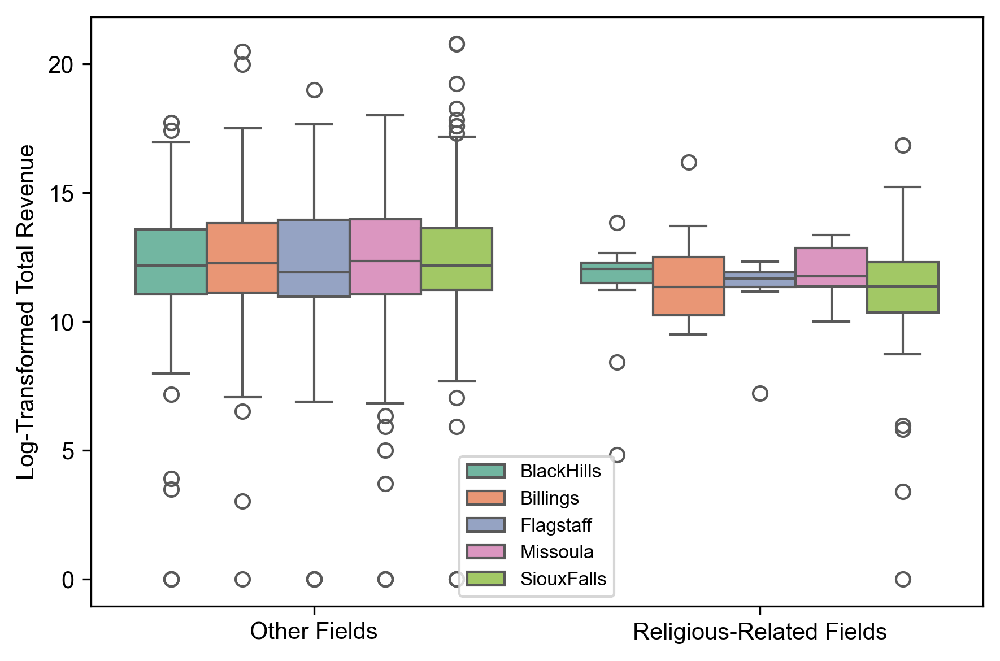

### Non-profit revenue source comparison (2022)

We compared whether non-profit revenue sources differ between the Black Hills and the benchmark regions using 2022 filings. The main comparisons use median dollars among organizations that reported a positive amount for each source. Complete technical details are provided in Appendix A. The pattern varies by revenue source and benchmark region.

The figures in this section show the revenue sources that carry the main story: total revenue, total contributions, program service revenue, government grants, and fundraising events. A compact table under each chart lists the median reported dollars by region for that revenue source. Additional source-specific charts and all detailed comparison tables appear in Appendix A.

### What the 2022 revenue-source comparison shows

Across the ten revenue sources, the Black Hills medians were often near the lower end of the regional range, but the pattern was not uniform; the size and direction of each gap depended on the source and the benchmark region.

For the two broadest measures, the regions were broadly similar. The Black Hills median total revenue was $176,760, somewhat below the benchmark medians of about $208,000 to $222,000, though that gap is small next to the wide spread in organization size within every region. The Black Hills median total contributions was $110,308, lower than Billings, Flagstaff, and Missoula but higher than Sioux Falls ($100,000).

Figure 5-2: Total Revenue by Region

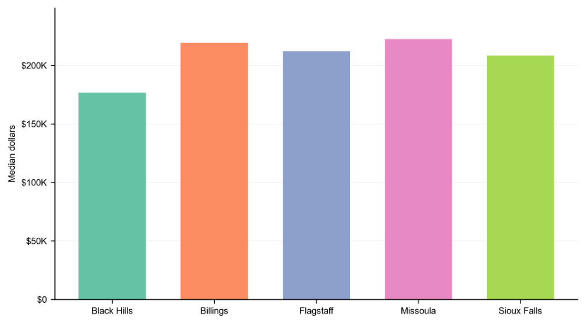

Table 5-2a: Median Reported Dollars for Total Revenue by Region

| Region | Median reported dollars |
| --- | --- |
| Black Hills | $176,760 |
| Billings | $219,228 |
| Flagstaff | $212,002 |
| Missoula | $222,401 |
| Sioux Falls | $208,149 |

Figure 5-4: Total Contributions by Region

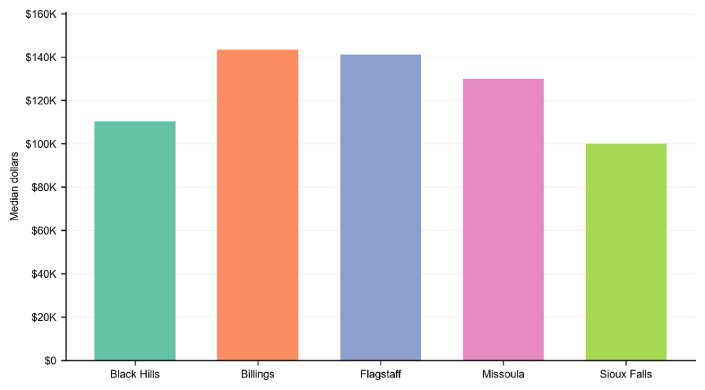

Table 5-4a: Median Reported Dollars for Total Contributions by Region

| Region | Median reported dollars |
| --- | --- |
| Black Hills | $110,308 |
| Billings | $143,479 |
| Flagstaff | $141,210 |
| Missoula | $129,864 |
| Sioux Falls | $100,000 |

Several sources showed wider gaps, with the Black Hills median well below the benchmark: program service revenue versus Flagstaff ($106,346 versus $188,968); government grants versus Billings ($163,367 versus $274,793) and Flagstaff ($163,367 versus $468,152); fundraising event contributions versus Billings, Missoula, and Sioux Falls ($12,427 versus $38,516, $41,756, and $70,761); other revenue versus Billings and Sioux Falls ($14,805 versus $27,630 and $32,467); mixed or unclassified contributions versus Flagstaff ($65,792 versus $92,278); and federated campaign contributions versus Sioux Falls ($30,096 versus $150,655). Across these sources the gap ran the same way, with the Black Hills amount the lower of the two.

Figure 5-3: Program Service Revenue by Region

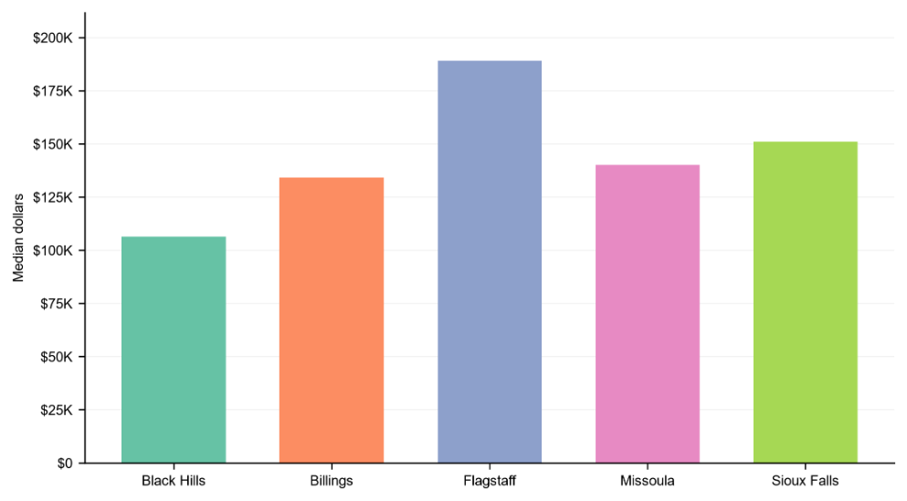

Table 5-3a: Median Reported Dollars for Program Service Revenue by Region

| Region | Median reported dollars |
| --- | --- |
| Black Hills | $106,346 |
| Billings | $134,079 |
| Flagstaff | $188,968 |
| Missoula | $140,091 |
| Sioux Falls | $151,055 |

Participation and dollar amounts can tell different stories. Government grants are a useful example: about 44% of eligible Black Hills organizations reported this source compared with about 34% in Billings, while the median reported amount was $163,367 in Black Hills and $274,793 in Billings. A region can have more organizations using a revenue source while still showing a lower typical dollar amount among the organizations that use it.

Figure 5-5: Government Grants Received by Region

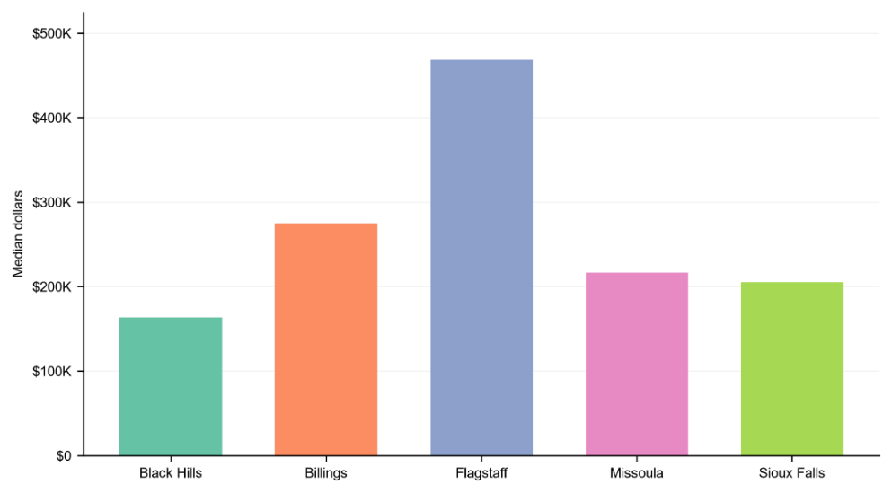

Table 5-5a: Median Reported Dollars for Government Grants Received by Region

| Region | Median reported dollars |
| --- | --- |
| Black Hills | $163,367 |
| Billings | $274,793 |
| Flagstaff | $468,152 |
| Missoula | $216,446 |
| Sioux Falls | $204,951 |

Fundraising event contributions are also important for the client-facing story because they describe a familiar local fundraising channel. The Black Hills median was $12,427, close to Flagstaff ($11,480) but below Billings, Missoula, and Sioux Falls.

Figure 5-9: Fundraising Event Contributions by Region

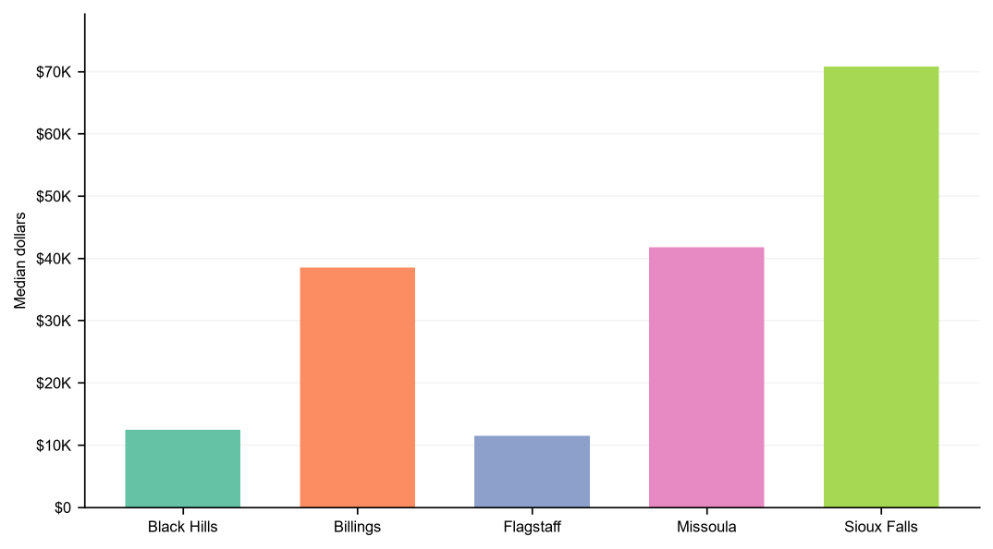

Table 5-9a: Median Reported Dollars for Fundraising Event Contributions by Region

| Region | Median reported dollars |
| --- | --- |
| Black Hills | $12,427 |
| Billings | $38,516 |
| Flagstaff | $11,480 |
| Missoula | $41,756 |
| Sioux Falls | $70,761 |

Black Hills was not lower everywhere. Its median was the higher one in at least one comparison for total contributions, membership dues, federated campaign contributions, and related-organization contributions. For membership dues the regional medians were similar in size, and related-organization contributions rest on very few reporters (noted above), so that ordering is unstable. Complete regional values and reporter counts for every comparison appear in Appendix Tables A-2 through A-11.

The connection to the Black Hills Area Community Foundation is most direct where participation and dollar amounts point in different directions. For example, a relatively large share of eligible Black Hills organizations reported government grants, but the typical grant amount among those organizations was lower than in every benchmark region. Black Hills organizations also reported lower typical amounts for program service revenue and several other sources. Together, these patterns suggest that local organizations may be accessing some funding channels but receiving smaller amounts through them. If this interpretation matches local experience, the Foundation could use it to inform conversations about revenue diversification, grant-seeking capacity, and financial planning. These data do not show why the patterns occur or describe the circumstances of any individual organization.

These findings describe observed 2022 revenue patterns, not causal explanations or proof that the regions differ in every comparable organization. Differences in organization type, local service needs, government funding, tourism-related activity, or the presence of large institutions could contribute but would require context beyond these filings. The results also do not separate individual giving from institutional giving. Appendix Tables A-2 through A-11 provide the complete numerical and technical comparison details.

### Number of Non-profit Organizations from 2022 to 2024

We compared the number of nonprofit organizations across 2022 through 2024 tax years. For each tax year, the number of nonprofit organizations was based on organizations listed in the IRS Business Master File. We also accounted for regional population growth using total population estimates from the American Community Survey.

Figure 5-18. Number of non-profit organizations by year and region from 2022 to 2024.

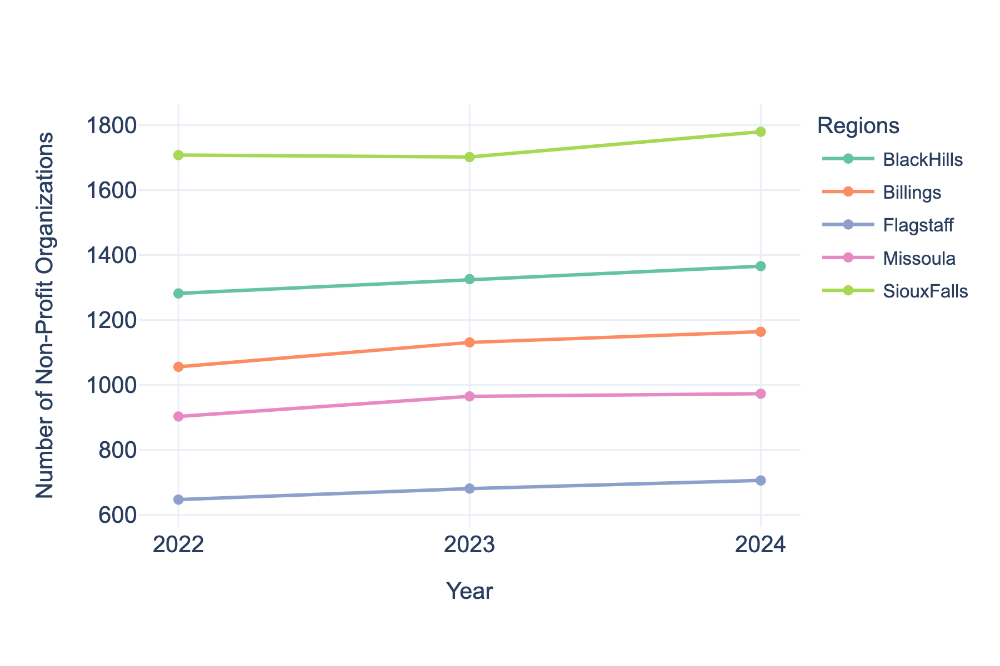

As shown in figure 5-18, the number of nonprofit organizations in the Black Hills region was slightly lower than in Sioux Falls across all years, but higher than in all other benchmark regions. Across regions, the number of nonprofit organizations increased slightly from 2022 to 2024. However, after accounting for population growth, the number of nonprofit organizations per capita did not increase over this period (Appendix Table XX). Excluding hospitals, universities, and political organizations did not change the overall trend in the number of nonprofit organizations.

### Performance of Non-profit Organizations from 2022 to 2024

We compared nonprofit organizational performance across the 2022 through 2024 tax years using harmonized data from the GivingTuesday 990 tax dataset. Performance was assessed using two metrics: months of reserves and net margin:

Months of reserves = (Net Assets ÷ Total Expenses) × 12

Net margin = (Revenue − Expenses) ÷ Total Revenue

Figure 5-19. Average net margin ratios by year and regions.

Each dot represents a marginal mean from a linear regression model with region, year and an interaction of region and year as explanatory variable, and average marginal ratio as response variable.

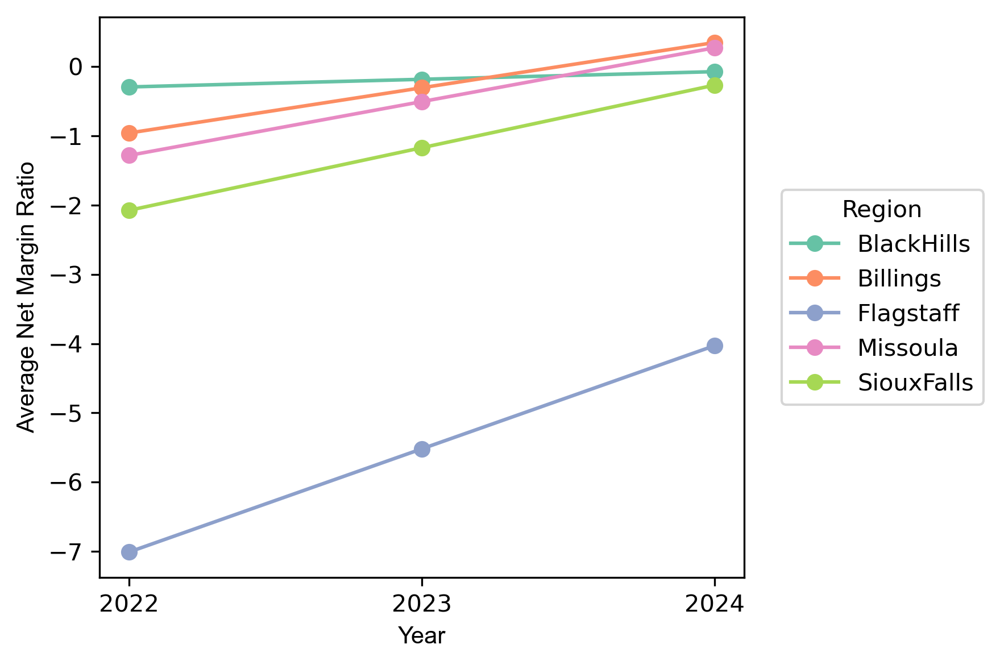

Figure 5-20. Average months of reserves by year and regions.

Each dot represents a marginal mean from a linear regression model with region, year and an interaction of region and year as explanatory variable, and average months of reserves as response variable.

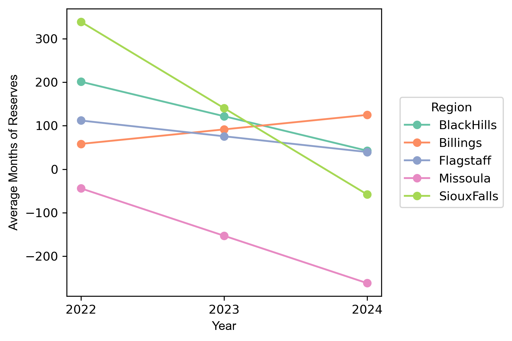

From 2022 to 2024, the average months of reserves decreased for most regions, with the exception of Billings where the average months of reserves increased slightly. By 2024, the average months of reserves across regions was close to zero or below zero for most regions except Billings. Average net margin ratio increased for most regions from 2022 to 2024, with the exception of Black Hills region where the net margin ratio remains mostly unchanged. By 2024, most regions (except Flagstaff) have an average net margin ratio close to 0. Excluding hospitals, universities, and political organizations did not change the trend observed (Appendix xx).

Conclusion needed for the section before we go to overall conclusions

# Conclusions

Write when finished

## Appendices

## Appendix A: Non-profit revenue source comparison details

The appendix provides the complete 2022 revenue-source comparison details. Tables A-2 through A-11 provide reporting rates, reporter counts, medians, median gaps, confidence intervals, and p-values for each revenue source. Table A-12 defines the revenue sources. Table A-1 lists the corresponding regional totals summed across all organizations in the analysis file. Figures A-1 through A-10 show the complete source-by-source chart set, including the charts also shown in the main narrative. The comparison columns apply only to each benchmark region versus Black Hills; no Black Hills-only p-value or median-gap confidence interval exists, so those Black Hills cells are marked NA. Rare revenue sources have fewer reporting organizations; see the sample-size discussion in the non-profit revenue analysis section.

Table A-1 sums reported dollars for each revenue source and region over that source&#x27;s eligible reporting universe in the 2022 analysis file. Totals for total revenue, total contributions, mixed or unclassified contributions, and other revenue include all organizations in the file. Government grants, federated campaigns, related-organization contributions, membership dues, and fundraising event contributions include Form 990 filers only; 990-EZ and 990-PF filers do not report those Part VIII sub-lines and are excluded from those rows, not counted as zero. Within Form 990, a blank sub-line is treated as zero. Program service revenue includes organizations for which that line is reported on the filed form. Regional totals reflect both universe size and report size; a few very large filers can dominate the sum. The compact tables under the main-text charts report medians among positive reporters only, which is the basis for the pairwise comparisons in Tables A-2 through A-11.

Table A-1: Total Reported Dollars by Revenue Source and Region (Aggregate)

| Revenue source | Black Hills | Billings | Flagstaff | Missoula | Sioux Falls |
| --- | --- | --- | --- | --- | --- |
| Total revenue | $749,703,903 | $455,373,976 | $431,958,713 | $599,281,084 | $2,831,897,257 |
| Program service revenue | $247,606,883 | $207,361,781 | $152,478,307 | $260,273,310 | $2,063,333,291 |
| Total contributions | $442,531,118 | $170,764,410 | $207,477,727 | $297,510,934 | $534,526,005 |
| Government grants received | $204,372,189 | $58,621,786 | $113,472,202 | $97,387,728 | $144,072,310 |
| Federated campaign contributions | $1,066,613 | $144,111 | $72,581 | $473,090 | $6,221,236 |
| Related organization contributions | $7,172,732 | $5,381,652 | $1,540,994 | $33,290,130 | $24,142,295 |
| Membership dues | $2,424,345 | $7,968,974 | $3,824,261 | $5,748,363 | $7,438,073 |
| Fundraising event contributions | $1,655,945 | $4,661,457 | $592,147 | $3,734,821 | $8,536,198 |
| Mixed or unclassified contributions | $225,839,294 | $93,986,430 | $87,975,542 | $156,923,629 | $344,115,893 |
| Other revenue | $60,262,123 | $78,920,732 | $72,064,743 | $42,359,406 | $236,399,961 |

How to read the comparison tables: In Tables A-2 through A-11, the column labeled &quot;Black Hills median minus benchmark median (95% bootstrap CI)&quot; compares the median reported dollars among organizations that reported a positive amount for that revenue source. It is not a difference of means. A negative value means the Black Hills median was lower than the benchmark-region median; a positive value means it was higher. The 95% confidence interval was calculated using 10,000 bootstrap resamples within each region and reflects uncertainty around the median difference.

Figure A-1: Total Revenue by Region

Table A-2: Total Revenue by Region

| Region | Reporting rate | Positive reporters (n) | Median reported dollars | Black Hills median minus benchmark median (95% bootstrap CI) | Pairwise p-value vs Black Hills |
| --- | --- | --- | --- | --- | --- |
| Black Hills | 100.0% | 422 | $176,760 | NA | NA |
| Billings | 100.0% | 332 | $219,228 | -$42,468 (95% CI -$125,394 to $33,850) | 0.269 |
| Flagstaff | 100.0% | 197 | $212,002 | -$35,242 (95% CI -$149,323 to $35,127) | 0.366 |
| Missoula | 100.0% | 283 | $222,401 | -$45,642 (95% CI -$126,653 to $32,158) | 0.242 |
| Sioux Falls | 100.0% | 565 | $208,149 | -$31,390 (95% CI -$84,901 to $26,666) | 0.246 |

Figure A-2: Program Service Revenue by Region

Table A-3: Program Service Revenue by Region

| Region | Reporting rate | Positive reporters (n) | Median reported dollars | Black Hills median minus benchmark median (95% bootstrap CI) | Pairwise p-value vs Black Hills |
| --- | --- | --- | --- | --- | --- |
| Black Hills | 51.6% | 205 | $106,346 | NA | NA |
| Billings | 57.2% | 171 | $134,079 | -$27,733 (95% CI -$96,511 to $25,161) | 0.292 |
| Flagstaff | 49.7% | 93 | $188,968 | -$82,622 (95% CI -$188,223 to $1,513) | 0.038 |
| Missoula | 65.5% | 173 | $140,091 | -$33,745 (95% CI -$91,143 to $18,223) | 0.175 |
| Sioux Falls | 59.5% | 298 | $151,055 | -$44,709 (95% CI -$114,440 to $6,707) | 0.089 |

Figure A-3: Total Contributions by Region

Table A-4: Total Contributions by Region

| Region | Reporting rate | Positive reporters (n) | Median reported dollars | Black Hills median minus benchmark median (95% bootstrap CI) | Pairwise p-value vs Black Hills |
| --- | --- | --- | --- | --- | --- |
| Black Hills | 83.6% | 353 | $110,308 | NA | NA |
| Billings | 78.0% | 259 | $143,479 | -$33,171 (95% CI -$85,280 to $16,324) | 0.161 |
| Flagstaff | 83.8% | 165 | $141,210 | -$30,902 (95% CI -$95,512 to $14,239) | 0.224 |
| Missoula | 82.7% | 234 | $129,864 | -$19,556 (95% CI -$95,775 to $26,776) | 0.309 |
| Sioux Falls | 72.7% | 411 | $100,000 | $10,308 (95% CI -$20,952 to $41,476) | 0.448 |

Figure A-4: Government Grants Received by Region

Table A-5: Government Grants Received by Region

| Region | Reporting rate | Positive reporters (n) | Median reported dollars | Black Hills median minus benchmark median (95% bootstrap CI) | Pairwise p-value vs Black Hills |
| --- | --- | --- | --- | --- | --- |
| Black Hills | 44.1% | 113 | $163,367 | NA | NA |
| Billings | 33.7% | 69 | $274,793 | -$111,426 (95% CI -$345,341 to $7,163) | 0.043 |
| Flagstaff | 40.5% | 49 | $468,152 | -$304,785 (95% CI -$817,302 to -$131,168) | 0.003 |
| Missoula | 42.9% | 76 | $216,446 | -$53,078 (95% CI -$292,032 to $26,850) | 0.197 |
| Sioux Falls | 31.9% | 104 | $204,951 | -$41,584 (95% CI -$156,414 to $89,266) | 0.507 |

Figure A-5: Federated Campaign Contributions by Region

Table A-6: Federated Campaign Contributions by Region

| Region | Reporting rate | Positive reporters (n) | Median reported dollars | Black Hills median minus benchmark median (95% bootstrap CI) | Pairwise p-value vs Black Hills |
| --- | --- | --- | --- | --- | --- |
| Black Hills | 7.0% | 18 | $30,096 | NA | NA |
| Billings | 2.4% | 5 | $37,500 | -$7,404 (95% CI -$41,337 to $36,319) | 0.688 |
| Flagstaff | 2.5% | 3 | $2,561 | $27,535 (95% CI -$50,214 to $38,331) | 0.179 |
| Missoula | 2.8% | 5 | $26,475 | $3,621 (95% CI -$374,904 to $29,973) | 0.819 |
| Sioux Falls | 7.1% | 23 | $150,655 | -$120,559 (95% CI -$251,704 to -$58,041) | 0.005 |

Figure A-6: Related Organization Contributions by Region

Table A-7: Related Organization Contributions by Region

| Region | Reporting rate | Positive reporters (n) | Median reported dollars | Black Hills median minus benchmark median (95% bootstrap CI) | Pairwise p-value vs Black Hills |
| --- | --- | --- | --- | --- | --- |
| Black Hills | 3.9% | 10 | $65,109 | NA | NA |
| Billings | 7.3% | 15 | $43,000 | $22,109 (95% CI -$205,000 to $1,417,018) | 0.627 |
| Flagstaff | 4.1% | 5 | $310,812 | -$245,703 (95% CI -$573,240 to $1,112,196) | 0.126 |
| Missoula | 4.5% | 8 | $977,600 | -$912,491 (95% CI -$3,371,000 to $150,595) | 0.173 |
| Sioux Falls | 4.6% | 15 | $233,400 | -$168,291 (95% CI -$1,493,390 to $1,137,398) | 0.203 |

Figure A-7: Membership Dues by Region

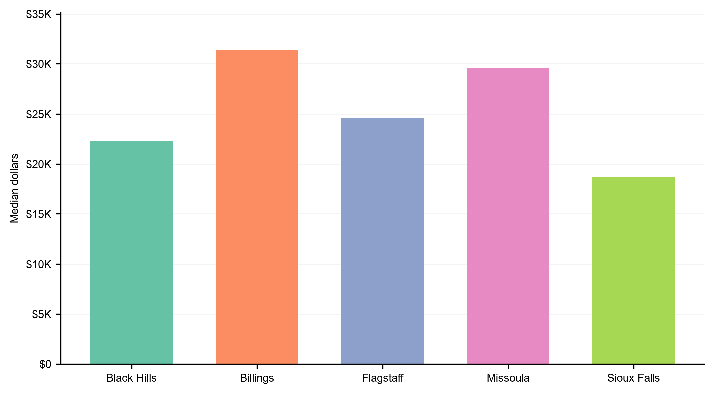

Table A-8: Membership Dues by Region

| Region | Reporting rate | Positive reporters (n) | Median reported dollars | Black Hills median minus benchmark median (95% bootstrap CI) | Pairwise p-value vs Black Hills |
| --- | --- | --- | --- | --- | --- |
| Black Hills | 20.3% | 52 | $22,250 | NA | NA |
| Billings | 20.5% | 42 | $31,344 | -$9,093 (95% CI -$51,928 to $10,338) | 0.342 |
| Flagstaff | 16.5% | 20 | $24,606 | -$2,355 (95% CI -$167,924 to $21,272) | 0.832 |
| Missoula | 16.9% | 30 | $29,529 | -$7,278 (95% CI -$20,952 to $13,858) | 0.601 |
| Sioux Falls | 11.3% | 37 | $18,651 | $3,600 (95% CI -$54,010 to $23,295) | 0.540 |

Figure A-8: Fundraising Event Contributions by Region

Table A-9: Fundraising Event Contributions by Region

| Region | Reporting rate | Positive reporters (n) | Median reported dollars | Black Hills median minus benchmark median (95% bootstrap CI) | Pairwise p-value vs Black Hills |
| --- | --- | --- | --- | --- | --- |
| Black Hills | 15.2% | 39 | $12,427 | NA | NA |
| Billings | 22.4% | 46 | $38,516 | -$26,088 (95% CI -$64,852 to -$6,639) | 0.009 |
| Flagstaff | 14.0% | 17 | $11,480 | $947 (95% CI -$9,712 to $13,322) | 0.849 |
| Missoula | 23.7% | 42 | $41,756 | -$29,329 (95% CI -$72,681 to $1,335) | 0.010 |
| Sioux Falls | 16.0% | 52 | $70,761 | -$58,334 (95% CI -$80,561 to -$31,388) | &lt; 0.001 |

Figure A-9: Mixed or Unclassified Contributions by Region

Table A-10: Mixed or Unclassified Contributions by Region

| Region | Reporting rate | Positive reporters (n) | Median reported dollars | Black Hills median minus benchmark median (95% bootstrap CI) | Pairwise p-value vs Black Hills |
| --- | --- | --- | --- | --- | --- |
| Black Hills | 76.8% | 324 | $65,792 | NA | NA |
| Billings | 68.4% | 227 | $83,785 | -$17,992 (95% CI -$49,754 to $8,827) | 0.157 |
| Flagstaff | 77.7% | 153 | $92,278 | -$26,486 (95% CI -$50,596 to -$2,907) | 0.033 |
| Missoula | 77.0% | 218 | $88,552 | -$22,760 (95% CI -$58,330 to $11,256) | 0.099 |
| Sioux Falls | 67.1% | 379 | $71,005 | -$5,212 (95% CI -$29,255 to $15,095) | 0.619 |

Figure A-10: Other Revenue by Region

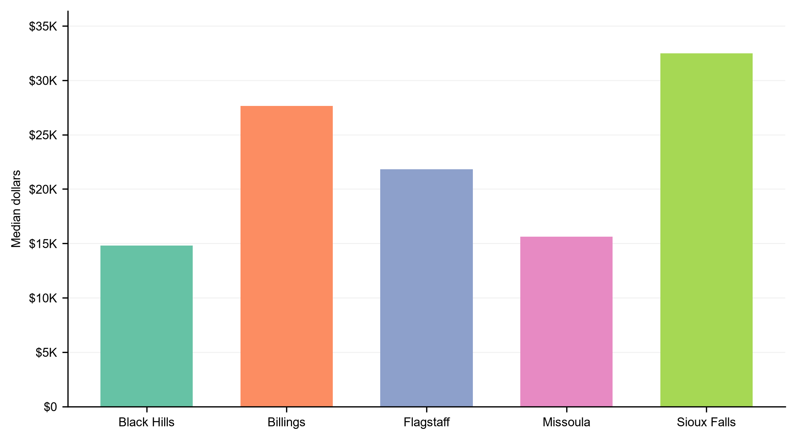

Table A-11: Other Revenue by Region

| Region | Reporting rate | Positive reporters (n) | Median reported dollars | Black Hills median minus benchmark median (95% bootstrap CI) | Pairwise p-value vs Black Hills |
| --- | --- | --- | --- | --- | --- |
| Black Hills | 79.1% | 334 | $14,805 | NA | NA |
| Billings | 81.0% | 269 | $27,630 | -$12,825 (95% CI -$22,923 to -$1,324) | 0.010 |
| Flagstaff | 72.6% | 143 | $21,811 | -$7,006 (95% CI -$27,475 to $6,558) | 0.292 |
| Missoula | 79.9% | 226 | $15,612 | -$807 (95% CI -$8,600 to $7,563) | 0.697 |
| Sioux Falls | 80.4% | 454 | $32,467 | -$17,662 (95% CI -$25,196 to -$6,938) | 0.001 |

Table A-12: Revenue Source Definitions

| Revenue source | What it measures | How it is reported on IRS filings |
| --- | --- | --- |
| Total revenue | All reported revenue for the organization in tax year 2022. | Form 990, Form 990-EZ, and Form 990-PF totals. |
| Total contributions | Total reported contributions, gifts, grants, and similar amounts. | Form 990, Form 990-EZ, and Form 990-PF totals. |
| Program service revenue | Money earned from services, programs, fees, or sales related to the organization&#x27;s mission. | Form 990 and Form 990-EZ; not comparable on Form 990-PF. |
| Government grants received | Funds reported from government sources. | Form 990 Part VIII Line 1e; comparisons use Form 990 filers only. |
| Federated campaign contributions | Support reported through federated campaigns (for example, United Way-style allocations). | Form 990 Part VIII Line 1a; comparisons use Form 990 filers only. |
| Related organization contributions | Contributions from related organizations or affiliates. | Form 990 Part VIII Line 1d; comparisons use Form 990 filers only. |
| Membership dues | Membership dues reported on the return. | Form 990 Part VIII Line 1b; comparisons use Form 990 filers only. |
| Fundraising event contributions | Contributions tied to fundraising events. | Form 990 Part VIII Line 1c; comparisons use Form 990 filers only. |
| Mixed / unclassified contributions | Contribution dollars the forms do not break down cleanly by donor type. | Form 990 Line 1f plus 990-EZ/PF contribution totals that cannot be split into Part VIII lines. |
| Other revenue | Remaining revenue after program service revenue and the contribution components above. | Calculated as total revenue minus those components. |

Table 5-13. Incidence Risk Ratios (IRR) and 95% confidence intervals from Poisson regression, with number of organizations as the response variable, tax year as explanatory variable (reference level 2022), and population count as offset for all organizations.

| term | IRR | 95% CI lower | 95% CI higher | P value |
| --- | --- | --- | --- | --- |
| 2023 | 1.03 | 0.85 | 1.25 | 0.74 |
| 2024 | 1.05 | 0.87 | 1.27 | 0.60 |

Table 5-14. Incidence Risk Ratios (IRR) and 95% confidence intervals (CI) from Poisson regression, with number of organizations as the response variable, tax year as explanatory variable (reference level 2022), and population count as offset after excluding political organizations, hospitals and universities.

| term | IRR | 95% CI lower | 95% CI higher | P value |
| --- | --- | --- | --- | --- |
| 2023 | 1.04 | 0.86 | 1.25 | 0.71 |
| 2024 | 1.06 | 0.88 | 1.28 | 0.56 |

Figure 5-12. Number of non-profit organizations by year and by region after excluding political organizations, hospitals, and universities.

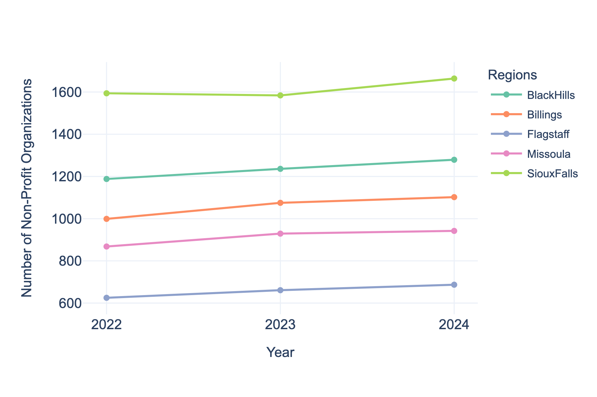

Table 5-15. Coefficients and 95% confidence intervals (CI) from linear regression with months of reserves as the response variable, benchmark region, tax year and an interaction between benchmark region and tax year as explanatory variable, for all organizations.

| term | Coefficient | 95% CI lower | 95% CI higher | P value |
| --- | --- | --- | --- | --- |
| Black Hills | 143.04 | -158.56 | 444.65 | 0.35 |
| Flagstaff | 53.77 | -38.80 | 146.34 | 0.25 |
| Missoula | -102.34 | -260.53 | 55.84 | 0.20 |
| Sioux Falls | 280.89 | -33.06 | 594.84 | 0.08 |
| Tax Year | 33.34 | -14.71 | 81.39 | 0.17 |
| Black Hills x Tax Year | -112.67 | -334.03 | 108.69 | 0.32 |
| Flagstaff x Tax Year | -69.58 | -150.77 | 11.62 | 0.09 |
| Missoula x Tax Year | -142.33 | -399.35 | 114.68 | 0.28 |
| Sioux Falls x Tax Year | -231.87 | -471.44 | 7.70 | 0.06 |

Table 5-16. Coefficients and 95% confidence intervals (CI) from linear regression with net margin ratio as the response variable, benchmark region, tax year and an interaction between benchmark region and tax year as explanatory variable, for all organizations.

| term | Coefficient | 95% CI lower | 95% CI higher | P value |
| --- | --- | --- | --- | --- |
| Black Hills | 0.67 | -0.76 | 2.09 | 0.36 |
| Flagstaff | -6.05 | -16.33 | 4.22 | 0.25 |
| Missoula | -0.32 | -2.91 | 2.27 | 0.81 |
| Sioux Falls | -1.12 | -3.25 | 1.01 | 0.30 |
| Tax Year | 0.65 | -0.35 | 1.66 | 0.20 |
| Black Hills x Tax Year | -0.54 | -1.59 | 0.51 | 0.31 |
| Flagstaff x Tax Year | 0.84 | -7.06 | 8.74 | 0.84 |
| Missoula x Tax Year | 0.12 | -1.81 | 2.05 | 0.90 |
| Sioux Falls x Tax Year | 0.25 | -1.37 | 1.88 | 0.76 |

Table 5-17. Coefficients and 95% confidence intervals (CI) from linear regression with months of reserves as the response variable, benchmark region, tax year and an interaction between benchmark region and tax year as explanatory variable, excluding politcal organizations, hospitals, and universities.

| term | Coefficient | 95% CI lower | 95% CI higher | P value |
| --- | --- | --- | --- | --- |
| Black Hills | 142.31 | -160.45 | 445.07 | 0.36 |
| Flagstaff | 53.03 | -40.19 | 146.25 | 0.26 |
| Missoula | -104.14 | -264.01 | 55.73 | 0.20 |
| Sioux Falls | 286.42 | -37.96 | 610.80 | 0.08 |
| Tax Year | 33.45 | -15.02 | 81.92 | 0.18 |
| Black Hills x Tax Year | -112.82 | -335.07 | 109.43 | 0.32 |
| Flagstaff x Tax Year | -70.08 | -151.78 | 11.63 | 0.09 |
| Missoula x Tax Year | -142.42 | -399.31 | 114.47 | 0.28 |
| Sioux Falls x Tax Year | -236.62 | -482.61 | 9.37 | 0.06 |

Table 5-18. Coefficients and 95% confidence intervals (CI) from linear regression with net margin ratio as the response variable, benchmark region, tax year and an interaction between benchmark region and tax year as explanatory variable, excluding politcal organizations, hospitals, and universities.

| term | Coefficient | 95% CI lower | 95% CI higher | P value |
| --- | --- | --- | --- | --- |
| Black Hills | 0.68 | -0.77 | 2.13 | 0.36 |
| Flagstaff | -6.06 | -16.39 | 4.27 | 0.25 |
| Missoula | -0.32 | -2.93 | 2.30 | 0.81 |
| Sioux Falls | -1.16 | -3.34 | 1.02 | 0.30 |
| Tax Year | 0.66 | -0.36 | 1.68 | 0.20 |
| Black Hills x Tax Year | -0.55 | -1.61 | 0.51 | 0.31 |
| Flagstaff x Tax Year | 0.83 | -7.14 | 8.80 | 0.84 |
| Missoula x Tax Year | 0.12 | -1.82 | 2.06 | 0.90 |
| Sioux Falls x Tax Year | 0.28 | -1.38 | 1.93 | 0.74 |

Figure 5-13, average net margin ratio by year and by benchmark regions, excluding political organizations, hospitals, and universities.

Figure 5-14, average months of reserves by year and by benchmark regions, excluding political organizations, hospitals, and universities.

# Appendix B. Data Processing Documentation

## Bureau of Labor Statistics Data Source Description

### Background

The Bureau of Labor Statistics (BLS) provides specialized research data on U.S. nonprofit employment, wages, and establishments, primarily focusing on 501 (c)(3) organizations. The dataset contains 2022 data.

### Data Provenance

Producer: The Bureau of Labor Statistics

Dataset page: https://www.bls.gov/bdm/nonprofits/nonprofits.htm

### Inclusion Criteria and Limitations

The programmatic pipeline extracts 2022 research data on U.S. nonprofit employment, wages, and establishments by scraping publicly available tables from the U.S. Bureau of Labor Statistics website. The raw data are subsequently filtered to include only counties within the Black Hills region and predefined benchmark regions and the Metropolitan Statistics Area (MSA) regions of the predefined benchmark regions, based on Federal Information Processing Standards (FIPS) codes.

It should be noted that data for some counties were suppressed by the Bureau of Labor Statistics due to small numbers of private establishments. These counties include McCook County, SD, Turner County, SD, Carbon County, MT, Mineral County MT, and Butte County, SD.

### Analysis-Ready Outputs

qcew_nonprofits_2022.csv

### Raw files

qcew-nonprofits-2022.xlsx

### Analysis Data Dictionary

bls_data_dictionary.xlsx

missing_regions_2022.csv

| Field name | Field description |
| --- | --- |
| fips | FIPS code (00 = U.S. Totals; excludes Puerto Rico and Virgin Islands) |
| geographic_title | Name of area |
| naics | Industry code using the North American Industrial Classification System (NAICS), (10 = total private figures) |
| industry_title | NAICS title |
| year | Calendar year for which estimates are available |
| average_establishments | The 4 quarter average number of establishments for the year |
| annual_average_employment | The 12 month average employment for the year |
| total_annual_wages_(in_thousands) | All wages paid for the year |
| annual_wages_per_employee | Total annual wages divided by average annual employment |
| average_weekly_wage | Average annual wage divided by 52 |
| average_establishments_np | 501(c)(3): The 4 quarter average number of establishments for the year |
| annual_average_employment_np | 501(c)(3): The 12 month average employment for the year |
| total_annual_wages_(in_thousands)_np | 501(c)(3): All wages paid for the year |
| annual_wages_per_employee_np | 501(c)(3): Total annual wages divided by average annual employment |
| average_weekly_wage_np | 501(c)(3): Average annual wage divided by 52 |
| percent_ employment_501(c)(3) | Percentage of employees in 501(c)(3) establishments relative to all establishments |
| wage_ratio | Ratio of wages in 501(c)(3) establishments relative to all non-501(c)(3) establishments |
| geographic_level | Four levels of detail: U.S., state, MSA and county |
| industry_level | Four levels of NAICS detail: total private, sector, subsector and industry group |

## American Community Survey  Data Source Description

### Background

The American Community Survey (ACS) is an ongoing U.S. Census Bureau program that surveys approximately 3.5 million households annually to provide up-to-date data on social, economic housing and demographic characteristics.

### Data Provenance

Producer: U.S. Census Bureau

Dataset page: https://data.census.gov/

Download: Data were automatically downloaded directly from the U.S. Census Bureau database using a structured data retrieval pipeline. Queries were executed programmatically via python scripts. Specifying survey years (2022 – 2024 for 5-year estimates), geographic levels (county), and variable codes. This approach enables reproducible data extraction and consistent updates.

### Inclusion Criteria and Limitations

The pipeline programmatically retrieves data on household income, employment, and civilian and armed forces composition for all U.S. counties from 2022 to 2024. The raw data are subsequently filtered to include only counties within the Black Hills region and predefined benchmark regions, based on FIPS codes.

### Data Transformation

County-level data were aggregated to the regional level using weighted averages, with weights defined by population or household size. The resulting regional-level estimates were subsequently normalized and expressed as percentages.

### Analysis-Ready Outputs

County level dataset: acs_county_22_24.csv

Region level dataset: acs_region__22_24.csv

### Raw files

acs5_full__22_24.csv

acs5_profile_22_24.csv

acs5_subject__22_24.csv

### Analysis Data Dictionary

| variable | description |
| --- | --- |
| NAME | Geographic Area Name |
| state | State |
| county | County |
| B01003_001E | Estimate Total |
| B19013_001E | Estimate Median household income in the past 12 months (in 2024 inflation-adjusted dollars) |
| B23025_003E | Estimate Total:  In labor force:  Civilian labor force: |
| B23025_004E | Estimate  Total:  In labor force:  Civilian labor force:  Employed |
| B23025_005E | Estimate  Total:  In labor force:  Civilian labor force:  Unemployed |
| B02001_004E | Estimate  Total:  American Indian and Alaska Native alone |
| S1902_C01_001E | Estimate  Number  HOUSEHOLD INCOME  All households |
| S2402_C01_001E | Estimate  Total  Full-time, year-round civilian employed population 16 years and over |
| S2402_C01_002E | Estimate  Total  Full-time, year-round civilian employed population 16 years and over  Management, business, science, and arts occupations: |
| S2402_C01_026E | Estimate  Total  Full-time, year-round civilian employed population 16 years and over  Sales and office occupations: |
| S2402_C01_029E | Estimate  Total  Full-time, year-round civilian employed population 16 years and over  Natural resources, construction, and maintenance occupations: |
| S2402_C01_033E | Estimate  Total  Full-time, year-round civilian employed population 16 years and over  Production, transportation, and material moving occupations: |
| DP03_0002E | Estimate  EMPLOYMENT STATUS  Population 16 years and over  In labor force |
| DP03_0006E | Estimate  EMPLOYMENT STATUS  Population 16 years and over  In labor force  Armed Forces |
| DP03_0064E | Estimate  INCOME AND BENEFITS (IN 2024 INFLATION-ADJUSTED DOLLARS)  Total households  With earnings |
| DP03_0052E | Estimate  INCOME AND BENEFITS (IN 2024 INFLATION-ADJUSTED DOLLARS)  Total households  Less than $10,000 |
| DP03_0053E | Estimate  INCOME AND BENEFITS (IN 2024 INFLATION-ADJUSTED DOLLARS)  Total households  $10,000 to $14,999 |
| DP03_0054E | Estimate  INCOME AND BENEFITS (IN 2024 INFLATION-ADJUSTED DOLLARS)  Total households  $15,000 to $24,999 |
| DP03_0055E | Estimate  INCOME AND BENEFITS (IN 2024 INFLATION-ADJUSTED DOLLARS)  Total households  $25,000 to $34,999 |
| DP03_0056E | Estimate  INCOME AND BENEFITS (IN 2024 INFLATION-ADJUSTED DOLLARS)  Total households  $35,000 to $49,999 |
| DP03_0057E | Estimate  INCOME AND BENEFITS (IN 2024 INFLATION-ADJUSTED DOLLARS)  Total households  $50,000 to $74,999 |
| DP03_0058E | Estimate  INCOME AND BENEFITS (IN 2024 INFLATION-ADJUSTED DOLLARS)  Total households  $75,000 to $99,999 |
| DP03_0059E | Estimate  INCOME AND BENEFITS (IN 2024 INFLATION-ADJUSTED DOLLARS)  Total households  $100,000 to $149,999 |
| DP03_0060E | Estimate  INCOME AND BENEFITS (IN 2024 INFLATION-ADJUSTED DOLLARS)  Total households  $150,000 to $199,999 |
| DP03_0061E | Estimate  INCOME AND BENEFITS (IN 2024 INFLATION-ADJUSTED DOLLARS)  Total households  $200,000 or more |
| DP03_0068E | Estimate  INCOME AND BENEFITS (IN 2024 INFLATION-ADJUSTED DOLLARS)  Total households  With retirement income |
