# Philanthropic characteristics of the Black Hills Area and comparison to selected benchmark regions

Prepared by Statistics Without Borders for the Black Hills Area Community Foundation

Introduction and executive summary ................................ ................................ ............. 2
Executive summary ................................ ................................ ................................ ... 2
Study background and objectives ................................ ................................ ............... 2
Limitations ................................ ................................ ................................ ............... 2
Data sources ................................ ................................ ................................ ............ 3
Selection and demographic analysis of benchmark regions ................................ ............. 3
Benchmark region selection................................ ................................ .......................  4
Relevant details about data sources ................................ ................................ ........... 4
Results of benchmark regions analyses ................................ ................................ ...... 4
Characterization of donation activity ................................ ................................ ............. 4
Relevant details about data sources ................................ ................................ ........... 5
Results of donation activity analysis ................................ ................................ ........... 5
Characterization of non-profit organizations ................................ ................................ .. 5
Relevant details about data sources ................................ ................................ ........... 6
Results of non-profit organization analysis ................................ ................................ .. 6
Conclusions ................................ ................................ ................................ ................ 6

## Introduction and executive summary

### Executive summary

(Need to write it at the end based on conclusions)

### Study background and objectives

The study objective is to describe, through publicly available quantitative data, the philanthropic landscape of the Black Hills region. The Black Hills region is compared to a set of benchmark regions selected to have similar demographic and qualitative characteristics, with the intention of identifying similarities and differences that may inform the strategy of Black Hills Area non-profit institutions.

The Black Hills area of South Dakota is made up of 7 counties in Western South Dakota (Butte, Meade, Lawrence, Pennington, Custer, Oglala Lakota, and Fall River Counties) and a small portion of Eastern Wyoming. This is a largely rural region with a strong tourism industry as well as agriculture, ranching, mining and is the home of Ellsworth Airforce Base. These characteristics were considered when selecting the benchmark regions for comparison, with a goal of identifying benchmark areas with broadly similar demographic, economic, historical, and cultural characteristics.

The philanthropic landscape of the Black Hills region is believed to be driven by its rural character and its tourism-driven economy. This study summarizes demographic characteristics, donor characteristics, and non-profit organization statistics in comparison with benchmark regions, with the intention of identifying similarities, differences, and correlations with philanthropic behavior.  The analysis covers the period after the COVID-19 epidemic of 2020- 2021, which represented a significant disturbance in economic activity.

### Limitations

General limitations of the study are described here, while limitations specific to individual data sources are described in later sections. This study was restricted to analysis of publicly available data from open-access internet resources rather than being collected specifically to support the desired analyses. Most of the data are self-reported in the context of tax filings and no audits or other accuracy checking were performed. The desire to focus on the post-covid period meant that some datasets had as few as one year’s worth of available data. Multiple years were analyzed where available, as indicted.

Commented [AR1]: get client input here to describe what is unique about BHR

Commented [AR2R1]: Background section has been shared with Eric for input (May 17)

Commented [AR3R1]: Eric's minor changes have been incorporated.

Commented [AR4]: this can be a high level overview, with details pertaining to each section later

Commented [MM5]: Some of this may be a little picky, but these are my thoughts:

1) I think we know how the data were collected and processed (wouldn't say details were limited), the limitation is that we had no control over any of this. The limitation is that we had to take what we could get, in the form we found it.

2) 990 data and tax deductions are self reported but I am not sure that introduces bias.  990 is an informational form so presumably filers are honest.  Tax deductions may be exaggerated but I think we should assume filers are honest (maybe an heroic assumption).

3) Some donations to religious organizations would be in the data set (e.g., faith based charities) unless we excluded them.

4) We were additionally limited by needing to look beyond the period of Covid. Since Covid would have significantly affected charitable giving, we looked at only the time periods after the most intense period of the pandemic. This left us with at most three years of data (and less in some cases).

Commented [MM6R5]: To follow up on the religious organizations, I think we just need to be more specific. Houses of worship and some auxiliary organizations don't have to report but some organizations that would be considered "religious" do. Houses of worship are the important category that is excluded.

Commented [AR7R5]: thanks michael i tried to address these

Several categories of philanthropic activity are known to be absent from these data due to falling outside the requirements for IRS reporting. For example, crowd-sourced donations such as GoFundMe, and informal donations to family or community members, do not appear in the data sources employed in the report.  Donations of any type that are paid by tax filers who don’t itemize deductions are not present in the analysis of donor characteristics. Non-itemizing filers constitute a large majority of taxpayers in the Black Hills and benchmark regions, so this is an especially noteworthy limitation. Similarly, non-profit organizations who are exempt from IRS reporting due to their size or function (ie, certain religious organizations) are not present in the organization-centered datasets and may make up a large proportion of non-profit organizations.

Correlations between demographic characteristics, donor behavior, and other variables may be identified, but causal relationships cannot be inferred.

### Data sources

What data sources were used and why?

What are their limitations?

Note appendices for details.

#### GivingTuesday 990 DataMart (data sources)

The GivingTuesday 990 DataMart is the main source used for non-profit financial information in this report. It is based on public IRS filings submitted by tax-exempt organizations, including Form 990, Form 990-EZ, and Form 990-PF. These forms report information such as total revenue, contributions, program service revenue, expenses, assets, filing year, form type, and organization identifiers.

The IRS form type matters because different organizations file different versions of the Form 990 family. Form 990 is the full annual return for larger non-profit organizations and provides the most detail. Form 990-EZ is a shorter return used by some smaller organizations and includes less detail. Form 990-PF is used by private foundations. Form 990-N, also called the e-Postcard, is used by very small organizations and contains only limited information, so those organizations are not included in the GivingTuesday financial analysis used here.

The project uses the GivingTuesday Basic Fields files for Form 990, Form 990-EZ, and Form 990-PF, limited to organizations located in the Black Hills and benchmark-region counties. The GivingTuesday Combined Forms file was used to help identify which records belonged in the project dataset, but the final financial values described here come from the Basic Fields files. When GivingTuesday did not include all classification details needed to group organizations consistently, the project supplemented those details with public registry sources from NCCS and the IRS.

The main strength of the GivingTuesday source is that it provides more financial detail than registry-only sources. This makes it useful for describing organization size, revenue sources, and overall financial composition. However, it should not be read as a complete count of every non-profit or every charitable activity in a region. Very small organizations that file only Form 990-N, organizations not required to file public Form 990-family returns, houses of worship and some related organizations, and informal giving are not fully represented.

The source also has limits because the IRS forms do not all ask for the same level of detail. Organizations filing the full Form 990 report more detail about where contributions come from. Organizations filing Form 990-EZ or Form 990-PF report less detail in some areas. In addition, one Form 990 contribution line combines several donor types, including individual gifts, foundation grants, donor-advised fund distributions, corporate gifts, bequests, and other contributions. Because of this, the data cannot cleanly split every contribution dollar into individual giving versus institutional giving.

For this reason, the report uses GivingTuesday as a practical view of reported non-profit finances on IRS filings. It does not capture all generosity in the region. The results are strongest when they describe broad regional patterns rather than when they try to assign every dollar to a specific donor type.

The appendices provide additional detail on the source files and fields used.

## Selection and demographic analysis of benchmark regions

### Benchmark region selection

What were the objectives?

What regions were selected and why?

### Relevant details about data sources

Anything the reader needs to know about how the data sources, availability, etc impact the interpretation of this section

### Results of benchmark regions analyses

This section presents a comparative analysis of the demographic characteristics of the Black Hills region in relation to the selected benchmark regions. Analyses were carried out across key structural characteristics, including population size, labor market dynamics, occupational composition, and household income.

#### Population Size and Structure

The Black Hills region has a smaller total population compared to the Sioux Falls region (suggesting higher density in Sioux Falls) but has a higher total population than the other three benchmark regions (Figure 1a).

However, the population aged 16 and above in the Black Hills region shows a substantial proportion of the total population falling within the working age category, which is consistent with the patterns observed in the benchmark regions (Figure 1b).

#### Labor Market Characteristics

Considering the population aged 16 and above, a larger fraction of them is in the labor force, across all the regions, while the smaller fraction is categorized as not in labor force. The labor force category is also classified into Civilian labor force, which takes the majority, and the Military labor force which takes only a very small, negligible share. The labor force signifies individuals aged 16 and above that are either employed or actively seeking employment.

Within the civilian labor force, employment levels are consistently high across both the Black Hills and benchmark regions, with unemployment levels representing a relatively small proportion.

Overall, the Black Hills region demonstrates labor market participation patterns that are broadly comparable to the benchmark regions, indicating similar levels of workforce engagement, despite differences in population size.

#### Occupational Structure

The occupational distribution highlights how employment is spread across major sectors. In the Black Hills and benchmark region, employment is distributed across five major sectors which are: Natural resources, construction, and maintenance; Production, transportation, and material moving; Service occupations; Sales and office occupations; and Management, business, science, and arts occupations.

Compared to benchmark regions (Figure 3), the Black Hills shows a higher concentration in the natural resources, construction and maintenance occupations, with a slightly lower proportion of employment in the management, business, science, and arts occupations.

## Characterization of donation activity

### Relevant details about data sources

Anything the reader needs to know about how the data sources, availability, etc impact the interpretation of this section

### Results of donation activity analysis

Main analysis content goes here

## Characterization of non-profit organizations

### Relevant details about data sources

Anything the reader needs to know about how the data sources, availability, etc impact the interpretation of this section

#### Non-profit revenue analysis (relevant details)

This section uses the GivingTuesday Form 990-family data described under Data sources (coverage limits, form types, and what is not in the file).

For tax year 2022, after requiring positive total revenue, the analysis file includes 1,799 filing records for 1,797 organizations: 422 in the Black Hills and 1,377 in benchmark counties. The filing mix is 1,085 Form 990 records, 563 Form 990-EZ records, and 151 Form 990-PF records. Hospitals, universities, and political organizations are excluded for peer comparability (25 records removed from the 2022 universe).

The revenue sources analyzed in this section are defined below.

| Revenue source | What it measures | How it is reported on IRS filings |
| --- | --- | --- |
| Total revenue | All reported revenue for the organization in tax year 2022. | Form 990, Form 990-EZ, and Form 990-PF totals. |
| Total contributions | Total reported contributions, gifts, grants, and similar amounts. | Form 990, Form 990-EZ, and Form 990-PF totals. |
| Program service revenue | Money earned from services, programs, fees, or sales related to the organization’s mission. | Form 990 and Form 990-EZ; not comparable on Form 990-PF. |
| Government grants received | Funds reported from government sources. | Form 990 Part VIII Line 1e; pairwise tests use Form 990 filers only. |
| Federated campaign contributions | Support reported through federated campaigns (for example, United Way-style allocations). | Form 990 Part VIII Line 1a; pairwise tests use Form 990 filers only. |
| Related organization contributions | Contributions from related organizations or affiliates. | Form 990 Part VIII Line 1d; pairwise tests use Form 990 filers only. |
| Membership dues | Membership dues reported on the return. | Form 990 Part VIII Line 1b; pairwise tests use Form 990 filers only. |
| Fundraising event contributions | Contributions tied to fundraising events. | Form 990 Part VIII Line 1c; pairwise tests use Form 990 filers only. |
| Mixed / unclassified contributions | Contribution dollars the forms do not break down cleanly by donor type. | Form 990 Line 1f plus 990-EZ/PF contribution totals that cannot be split into Part VIII lines. |
| Other revenue | Remaining revenue after program service revenue and the contribution components above. | Calculated as total revenue minus those components. |

The data cannot cleanly separate individual giving from foundation grants, corporate gifts, bequests, or other institutional support. That limitation applies especially to mixed or unclassified contributions.

A small number of very large organizations can affect how a region looks in the data. The findings below describe typical dollars among organizations that report a source, not a complete picture of every non-profit in the region.

### Results of non-profit organization analysis

Main analysis content goes here

We compared whether non-profit revenue sources differ between the Black Hills and the benchmark regions. For tax year 2022, the answer is yes. Black Hills differs from at least one benchmark region on several revenue sources. The pattern depends on which revenue source and which benchmark region are being compared.

Each revenue source was analyzed separately using organization-level dollars reported on IRS Form 990-family filings. Comparisons included only organizations that reported more than zero dollars for that specific source in 2022. For each source, we compared the typical reported amount in Black Hills with the typical amount in Billings, Flagstaff, Sioux Falls, and Missoula. The typical amount is the median among organizations that reported that source. Statistical tests used a two-sided permutation test on the difference between those medians. We treated p < 0.05 as evidence of a meaningful difference.

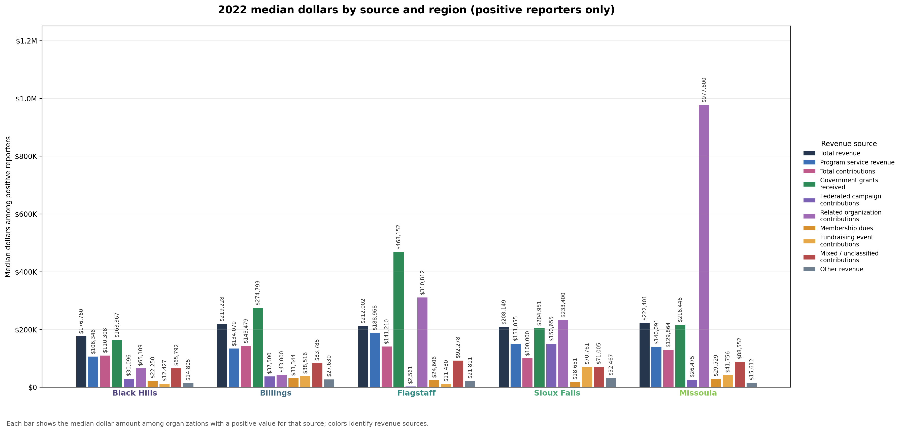

**Figure 4.** 2022 median reported dollars by revenue source and region. Each panel is one revenue source. Bar height is the typical amount among organizations in that region that reported a positive amount for that source. This figure does not show total dollars summed across all organizations in a region.

#### How many organizations could we compare?

Only organizations that reported income from a given revenue source were included in that source’s comparison. The number of organizations varies widely by source.

The 422 Black Hills records above are all Form 990-family filers with positive total revenue in 2022. Comparisons for Form 990 Part VIII contribution lines (government grants, federated campaigns, related-organization contributions, membership dues, and fundraising events) use a smaller eligible pool: 256 Black Hills organization-years where those lines exist (primarily full Form 990). Reporting rates for those rare sources are shares of that pool, not of all 422 records. Program service revenue uses a slightly different eligible count because 990-EZ filers can report it; see the appendix tables for reporter counts by pair.

For total revenue, total contributions, program service revenue, mixed or unclassified contributions, and other revenue, most pairwise comparisons involved dozens to hundreds of organizations with positive amounts on both sides. Those comparisons are more stable.

Some Part VIII lines are reported by far fewer organizations. In 2022, about 7% of eligible Black Hills filings (the Form 990 subset) reported federated campaign contributions, with 18 organizations showing a positive amount. Some benchmark comparisons for that source involved as few as three to five organizations with positive amounts. Related-organization contributions were reported by about 4% of eligible Black Hills filings, with 10 organizations showing a positive amount. Fundraising event contributions and membership dues fell in between, with moderate sample sizes in some benchmark pairs.

A statistically meaningful difference can still appear when the number of reporting organizations is small. For example, federated campaign contributions differed between Black Hills and Sioux Falls at p < 0.05, but that comparison should be read with extra caution because relatively few organizations report that source. Related-organization contributions showed no statistically meaningful pairwise differences, and they also had the smallest reporting groups. An absence of detected difference for those sources may reflect limited data as much as a true lack of gap.

#### Findings where Black Hills differed from a benchmark region (2022)

Among organizations that reported a positive amount for the source, Black Hills showed a lower typical dollar amount than the benchmark region in each comparison below (permutation p < 0.05). Significance is based on the two-sided permutation test, not on whether the 95% CI on the median gap excludes zero; some significant rows below have a CI that crosses zero.

| Revenue source | Benchmark region | Direction | Black Hills median | Benchmark median | Median gap (95% CI) | p-value |
| --- | --- | --- | ---: | ---: | ---: | ---: |
| Federated campaign contributions | Sioux Falls | Black Hills lower among reporters; significant | $30,096 | $150,655 | -$120,559 (95% CI -$251,704 to -$58,041) | 0.005 |
| Fundraising event contributions | Billings | Black Hills lower among reporters; significant | $12,427 | $38,516 | -$26,088 (95% CI -$64,852 to -$6,639) | 0.009 |
| Fundraising event contributions | Missoula | Black Hills lower among reporters; significant | $12,427 | $41,756 | -$29,329 (95% CI -$72,681 to +$1,335) | 0.010 |
| Fundraising event contributions | Sioux Falls | Black Hills lower among reporters; significant | $12,427 | $70,761 | -$58,334 (95% CI -$80,561 to -$31,388) | &lt; 0.001 |
| Government grants received | Billings | Black Hills lower among reporters; significant | $163,367 | $274,793 | -$111,426 (95% CI -$345,341 to +$7,163) | 0.043 |
| Government grants received | Flagstaff | Black Hills lower among reporters; significant | $163,367 | $468,152 | -$304,785 (95% CI -$817,302 to -$131,168) | 0.003 |
| Mixed / unclassified contributions | Flagstaff | Black Hills lower among reporters; significant | $65,792 | $92,278 | -$26,486 (95% CI -$50,596 to -$2,907) | 0.033 |
| Other revenue | Billings | Black Hills lower among reporters; significant | $14,805 | $27,630 | -$12,825 (95% CI -$22,923 to -$1,324) | 0.010 |
| Other revenue | Sioux Falls | Black Hills lower among reporters; significant | $14,805 | $32,467 | -$17,662 (95% CI -$25,196 to -$6,938) | 0.001 |
| Program service revenue | Flagstaff | Black Hills lower among reporters; significant | $106,346 | $188,968 | -$82,622 (95% CI -$188,223 to +$1,513) | 0.038 |

For total revenue and total contributions, none of the four Black Hills vs benchmark comparisons reached p < 0.05. The appendix tables list every source and benchmark pair, including comparisons that were not statistically meaningful at p < 0.05.

Participation and dollar amounts can tell different stories. Government grants are a useful example: a larger share of eligible Black Hills organizations reported the source (about 44%) than in Billings (about 34%), yet the typical grant amount among Black Hills reporters was lower ($163,367 versus $274,793, p = 0.043). A region can have more organizations using a revenue source while still showing a lower typical dollar amount among the organizations that use it. Reporting rates by source and region are available in the supporting analysis files referenced in the appendix.

The appendix lists the full set of p-values and confidence intervals from the client presentation, organized by revenue source, along with matching source-by-source bar charts (Figures 5–14).

For the Black Hills Area Community Foundation, these results suggest that many local non-profits may operate in a funding environment that differs from the benchmark regions. If this pattern aligns with local experience, it could affect how organizations plan for sustainability, pursue grants, and communicate funding needs to donors.

These findings describe 2022 reported revenue patterns by region, not causal explanations. Differences in organization type, local service needs, government funding, tourism-related activity, or the presence of large institutions could contribute but would require context beyond these filings. They also do not apply to every comparable organization in the region, and they do not separate individual giving from institutional giving. Interpret them together with reporting counts in the appendix and the sample-size discussion above.

## Conclusions

## Appendix: Non-profit revenue source comparison details

The tables below list all p-values shown in the client presentation, organized by revenue source. Figures 5–14 show the typical reported dollar amount by region for each revenue source (2022, among organizations that reported a positive amount for that source). These comparisons use organization-level reported dollars. Rare revenue sources have fewer reporting organizations; see the sample-size discussion in the results section above.

### Total revenue

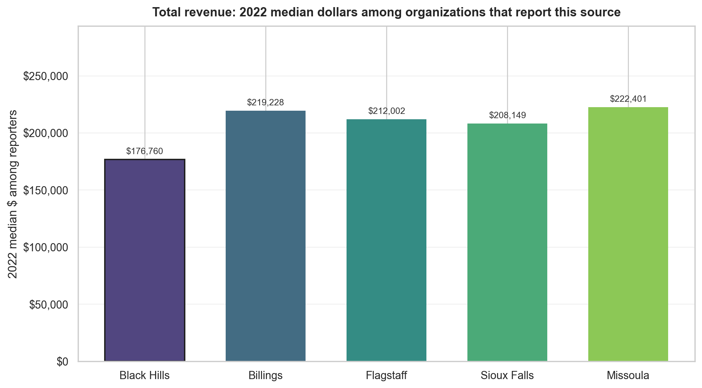

**Figure 5.** Total revenue (2022): typical reported dollars by region among organizations that reported positive total revenue.

| Benchmark region | Direction | Black Hills median | Benchmark median | Median gap (95% CI) | p-value |
| --- | --- | ---: | ---: | ---: | ---: |
| Billings | Black Hills lower among reporters; not significant | $176,760 | $219,228 | -$42,468 (95% CI -$125,394 to +$33,850) | 0.269 |
| Flagstaff | Black Hills lower among reporters; not significant | $176,760 | $212,002 | -$35,242 (95% CI -$149,323 to +$35,127) | 0.366 |
| Sioux Falls | Black Hills lower among reporters; not significant | $176,760 | $208,149 | -$31,390 (95% CI -$84,901 to +$26,666) | 0.246 |
| Missoula | Black Hills lower among reporters; not significant | $176,760 | $222,401 | -$45,642 (95% CI -$126,653 to +$32,158) | 0.242 |

### Program service revenue

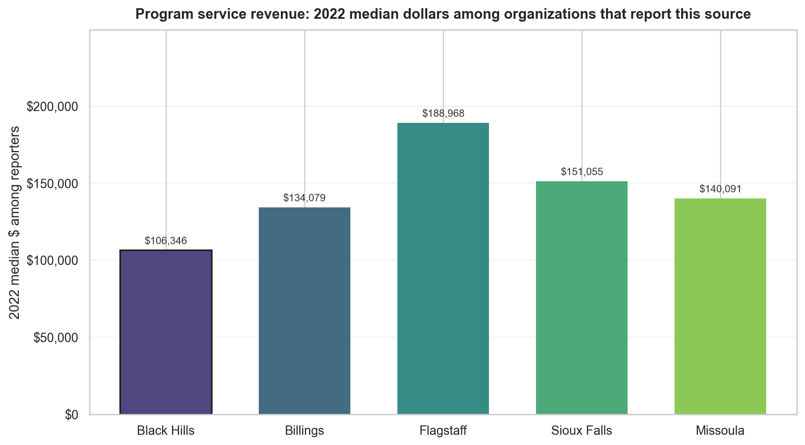

**Figure 6.** Program service revenue (2022): typical reported dollars by region among organizations that reported positive program service revenue.

| Benchmark region | Direction | Black Hills median | Benchmark median | Median gap (95% CI) | p-value |
| --- | --- | ---: | ---: | ---: | ---: |
| Billings | Black Hills lower among reporters; not significant | $106,346 | $134,079 | -$27,733 (95% CI -$96,511 to +$25,161) | 0.292 |
| Flagstaff | Black Hills lower among reporters; significant | $106,346 | $188,968 | -$82,622 (95% CI -$188,223 to +$1,513) | 0.038 |
| Sioux Falls | Black Hills lower among reporters; not significant | $106,346 | $151,055 | -$44,709 (95% CI -$114,440 to +$6,707) | 0.089 |
| Missoula | Black Hills lower among reporters; not significant | $106,346 | $140,091 | -$33,745 (95% CI -$91,143 to +$18,223) | 0.175 |

### Total contributions

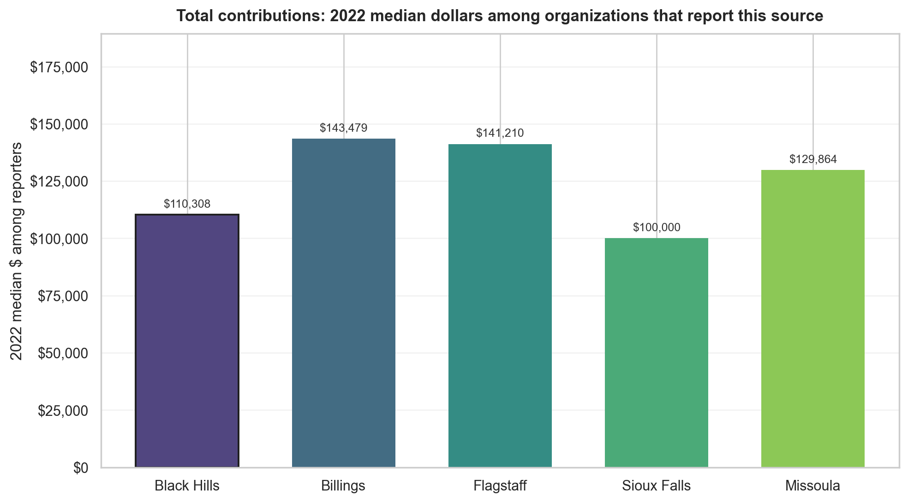

**Figure 7.** Total contributions (2022): typical reported dollars by region among organizations that reported positive total contributions.

| Benchmark region | Direction | Black Hills median | Benchmark median | Median gap (95% CI) | p-value |
| --- | --- | ---: | ---: | ---: | ---: |
| Billings | Black Hills lower among reporters; not significant | $110,308 | $143,479 | -$33,171 (95% CI -$85,280 to +$16,324) | 0.161 |
| Flagstaff | Black Hills lower among reporters; not significant | $110,308 | $141,210 | -$30,902 (95% CI -$95,512 to +$14,239) | 0.224 |
| Sioux Falls | Black Hills higher among reporters; not significant | $110,308 | $100,000 | +$10,308 (95% CI -$20,952 to +$41,476) | 0.448 |
| Missoula | Black Hills lower among reporters; not significant | $110,308 | $129,864 | -$19,556 (95% CI -$95,775 to +$26,776) | 0.309 |

### Government grants received

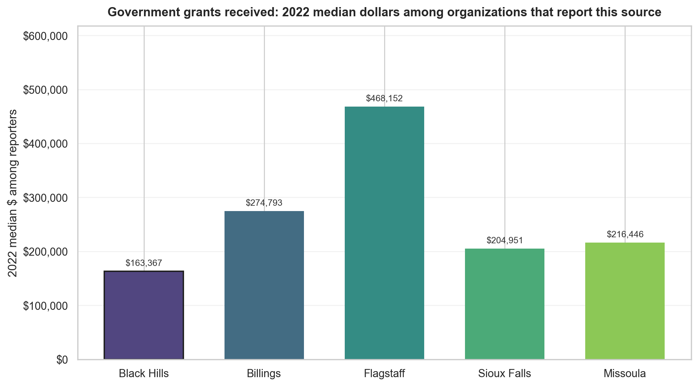

**Figure 8.** Government grants received (2022): typical reported dollars by region among organizations that reported positive government grants.

| Benchmark region | Direction | Black Hills median | Benchmark median | Median gap (95% CI) | p-value |
| --- | --- | ---: | ---: | ---: | ---: |
| Billings | Black Hills lower among reporters; significant | $163,367 | $274,793 | -$111,426 (95% CI -$345,341 to +$7,163) | 0.043 |
| Flagstaff | Black Hills lower among reporters; significant | $163,367 | $468,152 | -$304,785 (95% CI -$817,302 to -$131,168) | 0.003 |
| Sioux Falls | Black Hills lower among reporters; not significant | $163,367 | $204,951 | -$41,584 (95% CI -$156,414 to +$89,266) | 0.507 |
| Missoula | Black Hills lower among reporters; not significant | $163,367 | $216,446 | -$53,078 (95% CI -$292,032 to +$26,850) | 0.197 |

### Federated campaign contributions

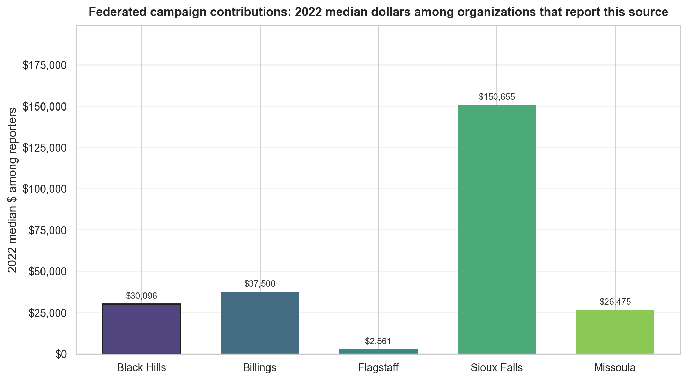

**Figure 9.** Federated campaign contributions (2022): typical reported dollars by region among organizations that reported positive federated campaign contributions.

| Benchmark region | Direction | Black Hills median | Benchmark median | Median gap (95% CI) | p-value |
| --- | --- | ---: | ---: | ---: | ---: |
| Billings | Black Hills lower among reporters; not significant | $30,096 | $37,500 | -$7,404 (95% CI -$41,337 to +$36,319) | 0.688 |
| Flagstaff | Black Hills higher among reporters; not significant | $30,096 | $2,561 | +$27,535 (95% CI -$50,214 to +$38,331) | 0.179 |
| Sioux Falls | Black Hills lower among reporters; significant | $30,096 | $150,655 | -$120,559 (95% CI -$251,704 to -$58,041) | 0.005 |
| Missoula | Black Hills higher among reporters; not significant | $30,096 | $26,475 | +$3,621 (95% CI -$374,904 to +$29,973) | 0.819 |

### Related organization contributions

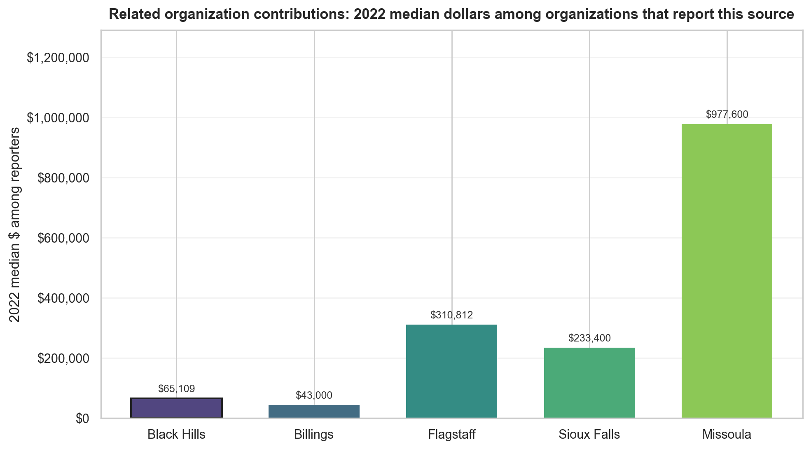

**Figure 10.** Related organization contributions (2022): typical reported dollars by region among organizations that reported positive related-organization contributions.

| Benchmark region | Direction | Black Hills median | Benchmark median | Median gap (95% CI) | p-value |
| --- | --- | ---: | ---: | ---: | ---: |
| Billings | Black Hills higher among reporters; not significant | $65,109 | $43,000 | +$22,109 (95% CI -$205,000 to +$1,417,018) | 0.627 |
| Flagstaff | Black Hills lower among reporters; not significant | $65,109 | $310,812 | -$245,703 (95% CI -$573,240 to +$1,112,196) | 0.126 |
| Sioux Falls | Black Hills lower among reporters; not significant | $65,109 | $233,400 | -$168,291 (95% CI -$1,493,390 to +$1,137,398) | 0.203 |
| Missoula | Black Hills lower among reporters; not significant | $65,109 | $977,600 | -$912,491 (95% CI -$3,371,000 to +$150,595) | 0.173 |

### Membership dues

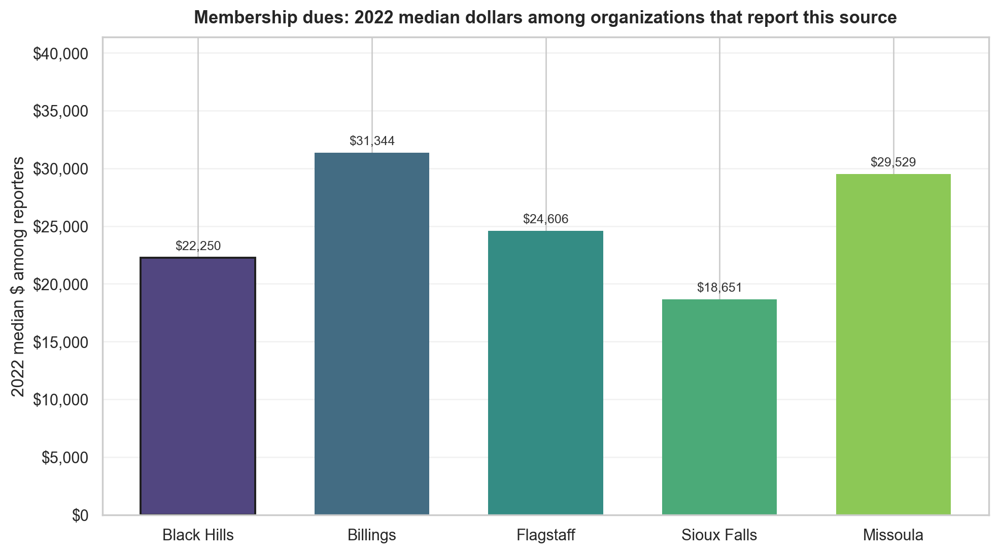

**Figure 11.** Membership dues (2022): typical reported dollars by region among organizations that reported positive membership dues.

| Benchmark region | Direction | Black Hills median | Benchmark median | Median gap (95% CI) | p-value |
| --- | --- | ---: | ---: | ---: | ---: |
| Billings | Black Hills lower among reporters; not significant | $22,250 | $31,344 | -$9,093 (95% CI -$51,928 to +$10,338) | 0.342 |
| Flagstaff | Black Hills lower among reporters; not significant | $22,250 | $24,606 | -$2,355 (95% CI -$167,924 to +$21,272) | 0.832 |
| Sioux Falls | Black Hills higher among reporters; not significant | $22,250 | $18,651 | +$3,600 (95% CI -$54,010 to +$23,295) | 0.540 |
| Missoula | Black Hills lower among reporters; not significant | $22,250 | $29,529 | -$7,278 (95% CI -$20,952 to +$13,858) | 0.601 |

### Fundraising event contributions

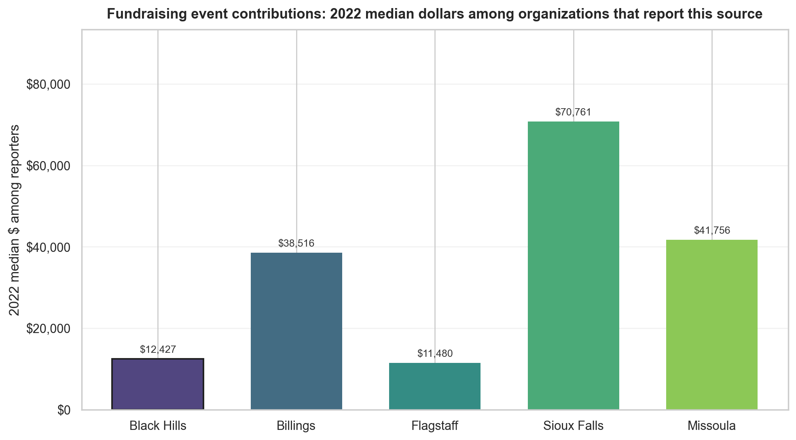

**Figure 12.** Fundraising event contributions (2022): typical reported dollars by region among organizations that reported positive fundraising event contributions.

| Benchmark region | Direction | Black Hills median | Benchmark median | Median gap (95% CI) | p-value |
| --- | --- | ---: | ---: | ---: | ---: |
| Billings | Black Hills lower among reporters; significant | $12,427 | $38,516 | -$26,088 (95% CI -$64,852 to -$6,639) | 0.009 |
| Flagstaff | Black Hills higher among reporters; not significant | $12,427 | $11,480 | +$947 (95% CI -$9,712 to +$13,322) | 0.849 |
| Sioux Falls | Black Hills lower among reporters; significant | $12,427 | $70,761 | -$58,334 (95% CI -$80,561 to -$31,388) | &lt; 0.001 |
| Missoula | Black Hills lower among reporters; significant | $12,427 | $41,756 | -$29,329 (95% CI -$72,681 to +$1,335) | 0.010 |

### Mixed / unclassified contributions

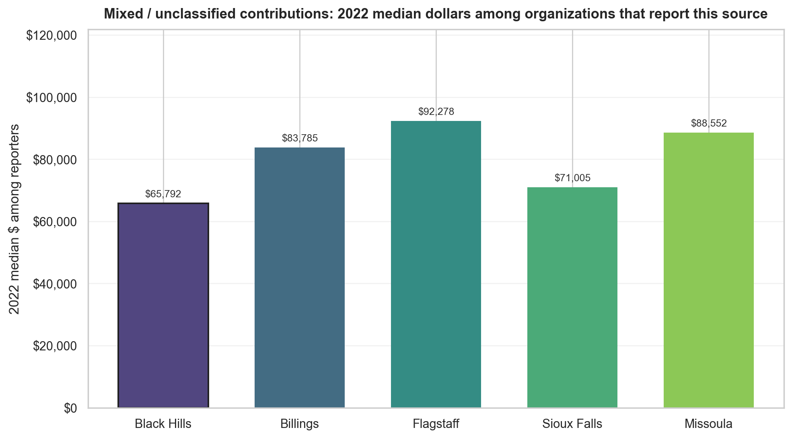

**Figure 13.** Mixed or unclassified contributions (2022): typical reported dollars by region among organizations that reported positive mixed or unclassified contributions.

| Benchmark region | Direction | Black Hills median | Benchmark median | Median gap (95% CI) | p-value |
| --- | --- | ---: | ---: | ---: | ---: |
| Billings | Black Hills lower among reporters; not significant | $65,792 | $83,785 | -$17,992 (95% CI -$49,754 to +$8,827) | 0.157 |
| Flagstaff | Black Hills lower among reporters; significant | $65,792 | $92,278 | -$26,486 (95% CI -$50,596 to -$2,907) | 0.033 |
| Sioux Falls | Black Hills lower among reporters; not significant | $65,792 | $71,005 | -$5,212 (95% CI -$29,255 to +$15,095) | 0.619 |
| Missoula | Black Hills lower among reporters; not significant | $65,792 | $88,552 | -$22,760 (95% CI -$58,330 to +$11,256) | 0.099 |

### Other revenue

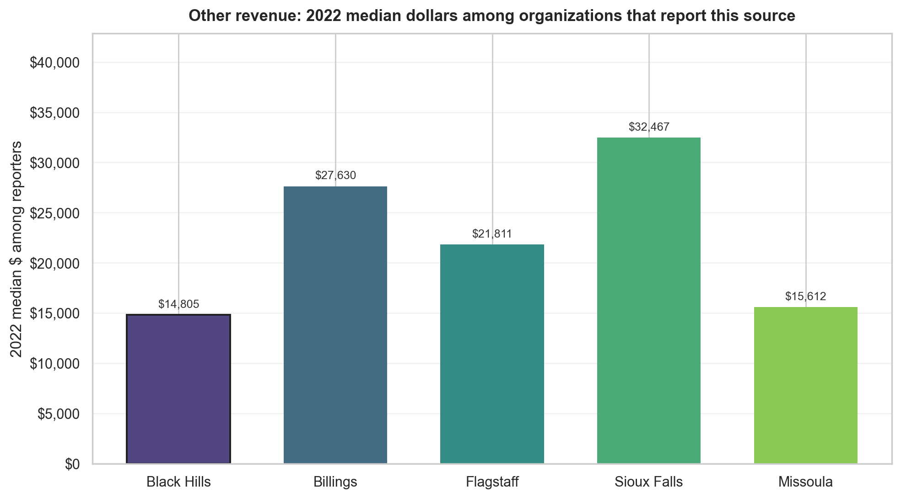

**Figure 14.** Other revenue (2022): typical reported dollars by region among organizations that reported positive other revenue.

| Benchmark region | Direction | Black Hills median | Benchmark median | Median gap (95% CI) | p-value |
| --- | --- | ---: | ---: | ---: | ---: |
| Billings | Black Hills lower among reporters; significant | $14,805 | $27,630 | -$12,825 (95% CI -$22,923 to -$1,324) | 0.010 |
| Flagstaff | Black Hills lower among reporters; not significant | $14,805 | $21,811 | -$7,006 (95% CI -$27,475 to +$6,558) | 0.292 |
| Sioux Falls | Black Hills lower among reporters; significant | $14,805 | $32,467 | -$17,662 (95% CI -$25,196 to -$6,938) | 0.001 |
| Missoula | Black Hills lower among reporters; not significant | $14,805 | $15,612 | -$807 (95% CI -$8,600 to +$7,563) | 0.697 |

The full client presentation and supporting analysis files include reporting rates and additional source-by-source interpretation.
