# Philanthropic characteristics of the Black Hills Area and comparison to selected benchmark regions

Prepared by Statistics Without Borders for the Black Hills Area Community Foundation

## Contents
- Executive summary 2

- 1. Introduction 2

- Study background and objectives 2

- Limitations 2

- 2. Data sources 3

- GivingTuesday 990 DataMart 3

- American Community Survey (ACS) 4

- Bureau of Labor Statistics Non-profit Research Dataset 5

- Geographic Area 5

- 3. Selection and demographic analysis of benchmark regions 6

- Benchmark region selection 7

- Relevant details about data sources 7

- Results of benchmark regions analyses 8

- 4. Characterization of donation activity 14

- Relevant details about data sources 15

- Results of donation activity analysis 15

- 5. Characterization of non-profit organizations 16

- Relevant details about data sources 17

- Non-profit revenue analysis 17

- Results of non-profit organization analysis 18

- How many organizations could we compare? 24

- Findings where Black Hills differed from a benchmark region (2022) 25

- 6. Conclusions 28

- Appendix: Non-profit revenue source comparison details 29

- Total revenue 29

- Program service revenue 30

- Total contributions 30

- Government grants received 31

- Federated campaign contributions 32

- Related organization contributions 33

- Membership dues 34

- Fundraising event contributions 35

- Mixed / unclassified contributions 36

- Other revenue 37

# Executive summary

(Need to write it at the end based on conclusions)

# 1. Introduction

## Study background and objectives

The study objective is to describe, through publicly available quantitative data, the philanthropic landscape of the Black Hills region. The Black Hills region is compared to a set of benchmark regions selected to have similar demographic and qualitative characteristics, with the intention of identifying similarities and differences that may inform the strategy of Black Hills Area non-profit institutions.

<strong>The Black Hills area of South Dakota is made up of 7 counties in Western South Dakota (Butte, Meade, Lawrence, Pennington, Custer, Oglala Lakota, and Fall River Counties) and a small portion of Eastern Wyoming. This is a largely rural region with a strong tourism industry as well as agriculture, ranching, mining and is the home of Ellsworth Airforce Base. These characteristics were considered when selecting the benchmark regions for comparison, with a goal of identifying benchmark areas with broadly similar demographic, economic, historical, and cultural characteristics.</strong>

<strong>The philanthropic landscape of the Black Hills region is believed to be driven by its rural character and its tourism-driven economy. This study summarizes demographic characteristics, donor characteristics, and non-profit organization statistics in comparison with benchmark regions, with the intention of identifying similarities, differences, and correlations with philanthropic behavior. The analysis covers the period after the COVID-19 epidemic of 2020- 2021, which represented a significant disturbance in economic activity.</strong>

## Limitations

General limitations of the study are described here, while limitations specific to individual data sources are described in later sections. This study was restricted to analysis of publicly available data from open-access internet resources rather than being collected specifically to support the desired analyses. Most of the data are self-reported in the context of tax filings and no audits or other accuracy checking were performed. The desire to focus on the post-covid period meant that some datasets had as few as one year’s worth of available data. Multiple years were analyzed where available, as indicted.

Several categories of philanthropic activity are known to be absent from these data due to falling outside the requirements for IRS reporting. For example, crowd-sourced donations such as GoFundMe, and informal donations to family or community members, do not appear in the data sources employed in the report. Donations of any type that are paid by tax filers who don’t itemize deductions are not present in the analysis of donor characteristics. Non-itemizing filers constitute a large majority of taxpayers in the Black Hills and benchmark regions, so this is an especially noteworthy limitation. Similarly, non-profit organizations who are exempt from IRS reporting due to their size or function (ie, certain religious organizations) are not present in the organization-centered datasets and may make up a large proportion of non-profit organizations.

Correlations between demographic characteristics, donor behavior, and other variables may be identified, but causal relationships cannot be inferred.

# 2. Data sources

What data sources were used and why?

What are their limitations?

Note appendices for details.

### GivingTuesday 990 DataMart

The GivingTuesday 990 DataMart is the main source used for non-profit financial information in this report. It is based on public IRS filings submitted by tax-exempt organizations, including Form 990, Form 990-EZ, and Form 990-PF. These forms report information such as total revenue, contributions, program service revenue, expenses, assets, filing year, form type, and organization identifiers.

The IRS form type matters because different organizations file different versions of the Form 990 family. Form 990 is the full annual return for larger non-profit organizations and provides the most detail. Form 990-EZ is a shorter return used by some smaller organizations and includes less detail. Form 990-PF is used by private foundations. Form 990-N, also called the e-Postcard, is used by very small organizations and contains only limited information, so those organizations are not included in the GivingTuesday financial analysis used here.

The project uses the GivingTuesday Basic Fields files for Form 990, Form 990-EZ, and Form 990-PF, limited to organizations located in the Black Hills and benchmark-region counties. When GivingTuesday did not include all classification details needed to group organizations consistently, the project supplemented those details with public registry sources from NCCS and the IRS.

The main strength of the GivingTuesday source is that it provides more financial detail than registry-only sources. This makes it useful for describing organization size, revenue sources, and overall financial composition. However, it should not be read as a complete count of every non-profit or every charitable activity in a region. Very small organizations that file only Form 990-N, organizations not required to file public Form 990-family returns, houses of worship and some related organizations, and informal giving are not fully represented.

The source also has limits because the IRS forms do not all ask for the same level of detail. Organizations filing the full Form 990 report more detail about where contributions come from. Organizations filing Form 990-EZ or Form 990-PF report less detail in some areas. In addition, one Form 990 contribution line combines several donor types, including individual gifts, foundation grants, donor-advised fund distributions, corporate gifts, bequests, and other contributions. Because of this, the data cannot cleanly split every contribution dollar into individual giving versus institutional giving.

For this reason, the report uses GivingTuesday as a practical view of reported non-profit finances on IRS filings. It does not capture all generosity in the region. The results are strongest when they describe broad regional patterns rather than when they try to assign every dollar to a specific donor type.

The appendices provide additional detail on the source files and fields used.

### American Community Survey (ACS)

The American Community Survey (ACS) is an ongoing U.S. Census Bureau program that surveys approximately 3.5 million households annually to provide up-to-date information on social, economic, housing, and demographic characteristics. For this report, ACS data provide county-level information on household income, employment, and civilian and armed forces composition from 2022 to 2024.

The use of ACS data in this report is twofold. First, ACS data provide the economic and demographic information needed to assess whether, and to what extent, the Black Hills region is comparable to other regions, thereby supporting data-driven benchmark region selection. Second, ACS data contribute to the analysis of factors that may explain differences in the nonprofit organizational landscape between the Black Hills region and the benchmark regions.

One limitation of ACS data is that only housing units with long-term residents are eligible for inclusion. The ACS uses the concept of “current residence” to determine who should be counted within sampled housing units. Specifically, individuals who live at an address for less than two months in a year are not included in the survey. As a result, in regions with a high proportion of vacation homes, seasonal residents in those homes are not captured in ACS estimates.

The ACS appendix provides additional details on data provenance, extraction, and processing, as well as descriptions of the specific data elements extracted.

### Bureau of Labor Statistics Non-profit Research Dataset

The Bureau of Labor Statistics (BLS) provides specialized research data on U.S. non-profit employment, wages, and establishments, with a primary focus on 501(c)(3) organizations. The dataset used in this report contains 2022 data. BLS data provide an overview of how employment and wages in the nonprofit sector compare with the broader private sector across multiple geographic levels, including counties, metropolitan statistical areas, and states.

There are several limitations to the BLS data. First, only 2022 data are available, which prevents examination of changes in the nonprofit sector over time. Second, for privacy reasons, BLS suppresses county-level estimates in areas with a small number of private establishments. As a result, county-level data are unavailable for five counties across the Black Hills region and the benchmark regions. Third, only organizations classified as 501(c)(3) are included in the dataset, which limits the extent to which findings can be generalized to nonprofit organizations with other tax-exempt classifications.

The BLS appendix provides additional details on data provenance, extraction, and processing, including the specific counties excluded from the analysis and definitions of the variables used.

### Geographic Area

Land area measures from the U.S. Census Bureau provide context for comparing the size of the Black Hills region with selected benchmark regions and for estimating population density. The land area measure excludes water bodies within census boundaries.

The geographic area appendix provides additional details on data extraction, aggregation, and transformation.

# 3. Selection and demographic analysis of benchmark regions

## Benchmark region selection

The primary objective of the benchmark region selection process was to assess the set of regions that had been pre-identified by the client, for reasonable comparability, and to verify that they closely resemble the Black Hills in key structural characteristics. These characteristics include population size, economic composition, rural–urban balance, and income levels. More specifically, the selection aimed to:

- ensure comparability in population scale, targeting regions with populations broadly within the range of approximately 75,000 to 155,000 at the county level.

- match rural and urban composition, using census definitions to evaluate the proportion of urban versus rural areas.

- capture similar economic structures, and align demographic and socioeconomic indicators, such as age distribution, employment patterns, and income levels.

Overall, the goal was to ensure that the set of benchmark regions suggested by the client provide meaningful context for comparison by reflecting similar underlying economic and demographic conditions.

The eventually selected benchmark regions, Sioux Falls, which is made up of 5 counties (Minnehaha, Lincoln, McCook, Turner, and Rock), Billings, which is made up of 3 counties (Carbon, Stillwater, Yellowstone), Flagstaff, which has 1 county (Coconino), and Missoula, which is made up of 2 counties (Mineral, Missoula), offer a balanced comparison set. Together, these regions establish a robust foundation for analyzing how the Black Hills compares to peer regions.

## Relevant details about data sources

The demographic analysis of the Black Hills and benchmark regions relied on data from the American Community Survey (ACS), which provides annually updated estimates based on survey samples rather than complete population counts. For this study, the latest ACS 5-year estimates were used due to their full geographic coverage and higher reliability for smaller and rural regions. These estimates aggregate data over a five-year period, producing a single, stable value for each variable.

While this improves statistical reliability, it also means that the data represent average conditions over time rather than for specific years, limiting the ability to capture short-term changes or trends.

Additionally, because ACS outputs are pre-aggregated estimates, each region is represented by a single value per variable, which restricts the use of inferential statistical testing. As a result, the demographic comparison across benchmark regions is interpreted using descriptive analysis and visual comparison, focusing on relative magnitudes and patterns rather than statistically significant differences. This approach ensures that comparisons remain meaningful while acknowledging the limitations inherent in the data structure.

## Results of benchmark regions analyses

This section presents a comparative analysis of the demographic characteristics of the Black Hills region in relation to the selected benchmark regions. Analyses were carried out across key structural characteristics, including population size, labor market dynamics, occupational composition, and household income.

<strong>Population Size and Structure</strong>

<strong>The Black Hills region has a smaller total population compared to the Sioux Falls region but has a higher total population than the other three benchmark regions (Figure 1a).</strong>

<strong>However, the population aged 16 and above in the Black Hills region shows a substantial proportion of the total population falling within the working age category, which is consistent with the patterns observed in the benchmark regions (Figure 1b).</strong>

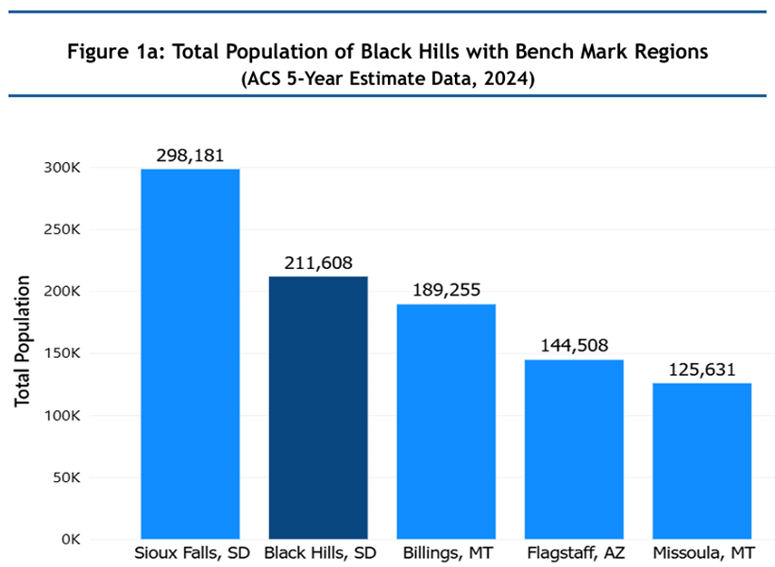

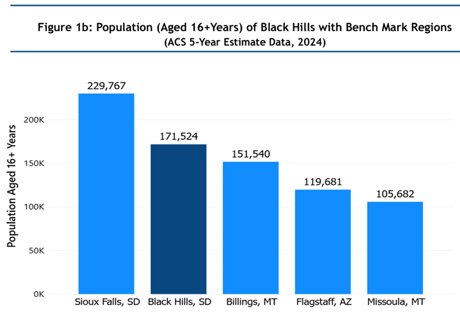

<strong>Labor Market Characteristics</strong>

Considering the population aged 16 and above, a larger fraction of them is in the labor force, across all the regions, while the smaller fraction is categorized as not in labor force (Figure 2a). The labor force category is also classified into Civilian labor force, which takes the majority, and the Military labor force which takes only a very small, negligible share. The labor force signifies individuals aged 16 and above that are either employed or actively seeking employment.

Within the civilian labor force, employment levels are consistently high across both the Black Hills and benchmark regions, with unemployment levels representing a relatively small proportion (Figure 2b).

Overall, the Black Hills region demonstrates labor market participation patterns that are broadly comparable to the benchmark regions, indicating similar levels of workforce engagement, despite differences in population size.

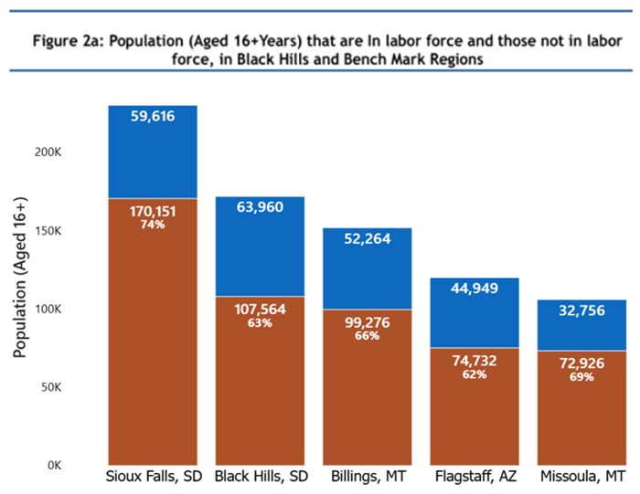

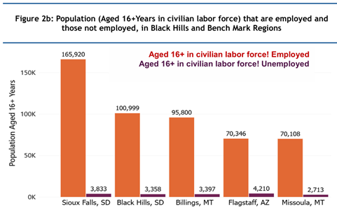

<strong>Occupational Structure</strong>

The occupational distribution highlights how employment is spread across major sectors. In the Black Hills and benchmark regions, employment is distributed across five major sectors which are: Natural resources, construction, and maintenance; Production, transportation, and material moving; Service occupations; Sales and office occupations; and Management, business, science, and arts occupations.

The occupational distribution in the Black Hills and benchmark regions reflect notable representation in all five sectors. Although, compared to benchmark regions (Figure 3), the Black Hills shows a slightly higher concentration in the natural resources, construction and maintenance occupations, with a slightly lower proportion of employment in the management, business, science, and arts occupations, while the benchmark regions tend to have a slightly larger proportion of employment in management, business, science, and arts occupations.

However, the general overview demonstrates comparable occupational distribution patterns across all regions.

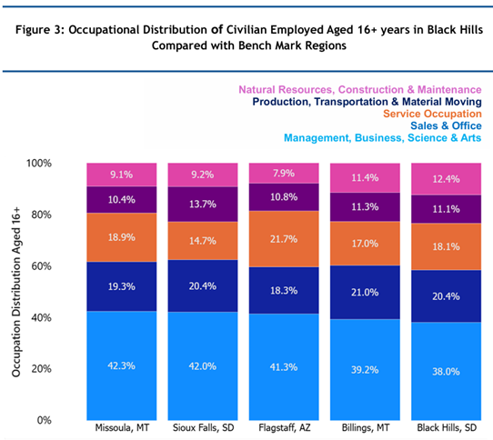

<strong>Household Income Characteristics</strong>

The visualization of total households (Figure 4a) indicates that the Black Hills has fewer households than Sioux Falls but higher than the other benchmark regions, which is consistent with the population size visualization (Figure 1a).

A notable feature is the presence of households with retirement income, which constitutes an important segment of the population (Figure 4b). The Black Hills shows a measurable share of households receiving retirement income, suggesting the presence of an older or retired population segment (Figure 4c).

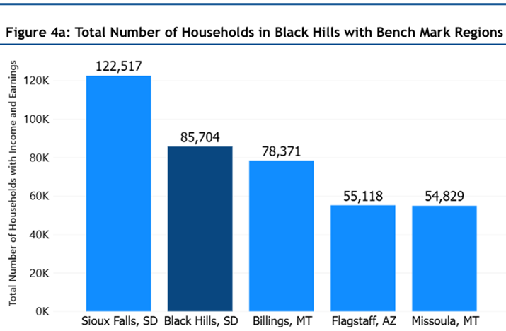

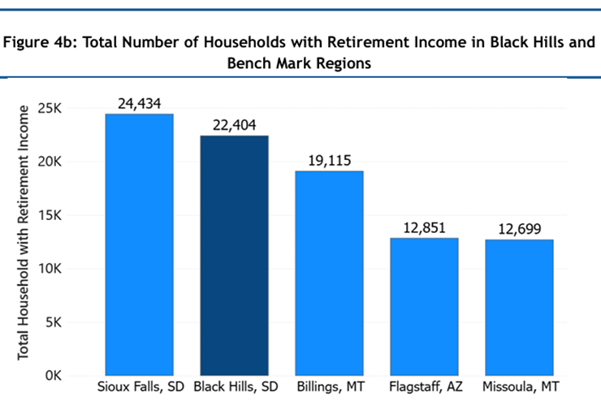

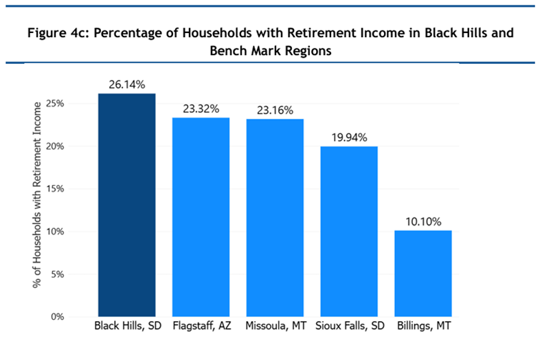

<strong>Income Distribution</strong>

Household income distribution is divided into three categories: low (&lt;$50,000), middle ($50,000–$149,000), and high ($150,000+) income. Although the Black Hills region tends to reflect a slightly lower share in the high-income category, the general household income distribution overview demonstrates comparable income distribution patterns across all regions (Figure 5a).

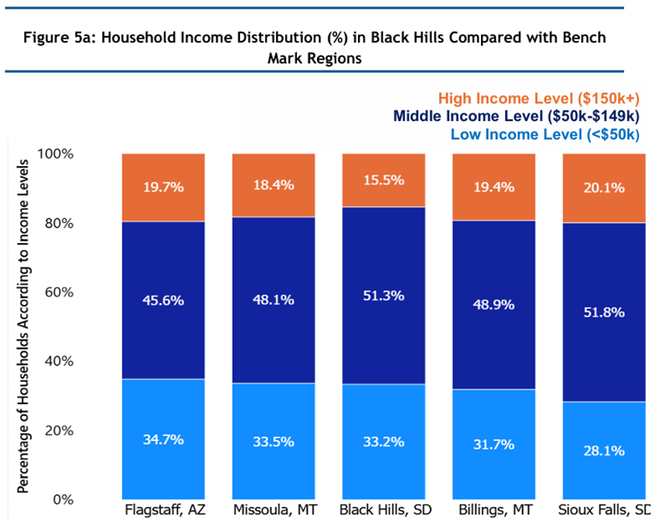

<strong>Average Household Income</strong>

Average household income in the Black Hills, adjusted for inflation, provides a key indicator of overall economic well-being. While the Black Hills region demonstrates stable income levels, benchmark regions report slightly higher average household incomes (Figure 5b). This disparity may suggest a comparatively smaller pool of high-capacity donors in the Black Hills region.

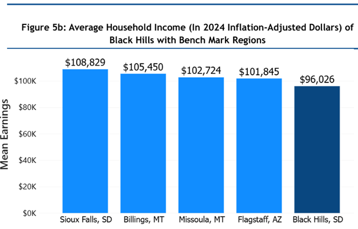

# 4. Characterization of donation activity

This section describes tax-reported donor behavior in the Black Hills region relative to the four benchmark regions, with attention to how charitable giving varies across regions once differences in income are taken into account. The analysis draws on county-level tax data and characterizes reported giving patterns.

## Relevant details about data sources

The analysis in this section uses the Internal Revenue Service Statistics of Income (SOI) 2022 County Data. Regions are defined by aggregating the counties that make up each area. All dollar values in the source file are reported in thousands, and the figures shown here have been converted to whole dollars.

Returns are grouped into three income bands based on adjusted gross income: low (under $50,000), middle ($50,000 to $100,000), and high ($100,000 or more). Two features of the data shape how the results should be read. First, charitable contributions appear in tax data only for filers who itemize their deductions, so giving by non-itemizers is not observable. Because non-itemizers are a large majority of filers in these regions, observed giving will understate total giving. Second, the data are totals at the county-level and do not identify individual donors, so they cannot distinguish one-time from recurring gifts, account for household size, or describe the relationship between donors and the organizations they support.

## Results of donation activity analysis

<strong>Donor participation</strong>

Donor participation is measured as the share of tax returns that report charitable contributions out of all returns filed. Participation rises with income in every region. Across all income groups, the Black Hills region has a lower participation rate than each benchmark region, both overall (3.5 percent) and within each income band.

Table 4-1. Donor Participation Rate (%) by Income Group and Region.

| Income group | Black Hills | Billings | Flagstaff | Missoula | Sioux Falls |
| --- | --- | --- | --- | --- | --- |
| Low (&lt;$50k) | 0.7 | 1.4 | 1.1 | 1.5 | 1.2 |
| Middle ($50k–$100k) | 3.1 | 6.4 | 5.2 | 7.5 | 3.4 |
| High (≥$100k) | 10.7 | 17.2 | 19.0 | 19.5 | 12.4 |
| Region overall | 3.5 | 6.4 | 5.7 | 6.9 | 4.7 |

Figure 4-1. Donor Participation Rate by Income Group and Region

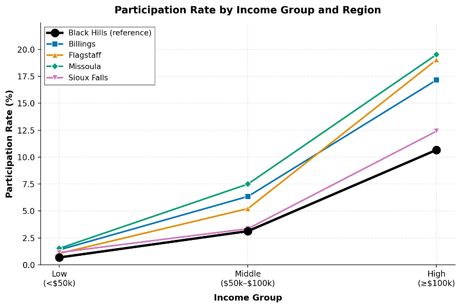

<strong>Itemization and Observed Participation</strong>

Donor participation also relates to itemization, since only filers who itemize can report charitable deductions, and the itemization rate therefore sets the range within which giving can be observed. The Black Hills region has the lowest itemization rate of the five regions, at 4.6 percent. Among filers who do itemize, the share who report charitable gifts is similar across regions, between about 76 and 84 percent. This points to the region's lower observed participation being tied more to how few filers itemize than to differences in reported giving among those who do. The same pattern holds within each income band. Because state tax rules can affect the incentive to itemize deductions, regional differences in how many filers itemize, and therefore in observed participation, may partly reflect differences in local tax policy. This is a contextual consideration only and was not examined in the present analysis.

Table 4-2. Participation, Itemization, and the Participation-to-Itemization Ratio by Region (%)

| Measure | Black Hills | Billings | Flagstaff | Missoula | Sioux Falls |
| --- | --- | --- | --- | --- | --- |
| Participation | 3.5 | 6.4 | 5.7 | 6.9 | 4.7 |
| Itemization | 4.6 | 8.4 | 7.1 | 9.1 | 5.6 |
| Participation / Itemization | 76.1 | 75.7 | 80.8 | 76.1 | 83.8 |

Table 4-3. Itemization Rate (%) by Income Group and Region

| Income group | Black Hills | Billings | Flagstaff | Missoula | Sioux Falls |
| --- | --- | --- | --- | --- | --- |
| Low (&lt;$50k) | 1.4 | 2.2 | 1.6 | 2.5 | 1.6 |
| Middle ($50k–$100k) | 4.4 | 9.5 | 7.0 | 10.6 | 4.6 |
| High (≥$100k) | 12.7 | 20.8 | 22.2 | 23.7 | 13.8 |
| Region overall | 4.6 | 8.4 | 7.1 | 9.1 | 5.6 |

<strong>Average Contribution per Donor</strong>

Average annual contribution per donor is total charitable contributions divided by the number of returns that report them. This reflects how much participating donors give rather than the size of any single gift, since the data report annual totals per return rather than individual donations.

Among participating donors, Black Hills gives competitively across all income groups. Black Hills ranks first in the Middle-income group and second in the Low- and High-income groups, behind only Sioux Falls. Overall, Black Hills ranks second among the five regions, again behind Sioux Falls and well above the other three benchmarks.

Table 4-4. Average Annual Charitable Contributions per Donor by Income Group and Region, among returns reporting contributions

| Income group | Black Hills | Billings | Flagstaff | Missoula | Sioux Falls |
| --- | --- | --- | --- | --- | --- |
| Low (&lt;$50k) | $3,997 | $3,639 | $3,865 | $3,259 | $5,260 |
| Middle ($50k–$100k) | $7,826 | $5,132 | $6,386 | $4,574 | $7,446 |
| High (≥$100k) | $28,061 | $22,871 | $19,566 | $27,344 | $36,212 |
| Region Overall | $21,014 | $16,337 | $15,096 | $18,497 | $27,193 |

Figure 4-2. Average Annual Charitable Contributions per Donor by Income Group and Region, among returns reporting contributions

<strong>Giving Relative to Income</strong>
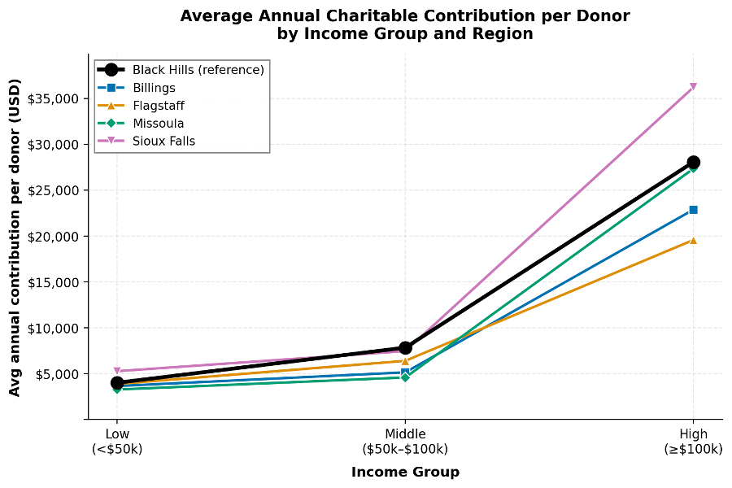

Two measures relate giving to income. The region-wide measure divides total contributions by the total adjusted gross income of all taxpayers, which shows the share of a region's income that goes to charity. The itemizer-conditional measure divides total contributions by the estimated adjusted gross income of itemizers only, which shows the share of itemizers' income that is deducted as donations. The two measures place the Black Hills region quite differently. Under the region-wide measure (Panel A) it is the lowest in every income group. Under the itemizer-conditional measure (Panel B) it moves toward the middle or top of the range, ranking first in the middle-income group and second overall. The contrast shows that the low region-wide ratio has more to do with how many filers report giving than with how much itemizers actually give.

Table 4-5. Giving ratio (%) by Income Group and Region

| Income group | Black Hills | Billings | Flagstaff | Missoula | Sioux Falls |
| --- | --- | --- | --- | --- | --- |
| Panel A. Region-wide (all returns) |  |  |  |  |  |
| Low (&lt;$50k) | 0.13 | 0.23 | 0.18 | 0.23 | 0.26 |
| Middle ($50k–$100k) | 0.34 | 0.45 | 0.47 | 0.48 | 0.35 |
| High (≥$100k) | 1.32 | 1.76 | 1.60 | 2.09 | 1.69 |
| Panel B. Itemizer-conditional |  |  |  |  |  |
| Low (&lt;$50k) | 7.33 | 8.66 | 9.38 | 7.15 | 12.45 |
| Middle ($50k–$100k) | 7.67 | 4.57 | 6.44 | 4.39 | 7.42 |
| High (≥$100k) | 7.09 | 6.53 | 5.48 | 6.75 | 7.74 |

<strong>Participation versus Contribution Size</strong>

Differences in total giving per taxpayer reflect two components: the share of taxpayers who donate (participation) and the amount each donor gives (average contribution per donor). Because giving per return is the product of these two figures, the gap between each benchmark region and the Black Hills region can be attributed to one or the other. Indexed to the Black Hills region at 100, every benchmark region is higher on both participation and giving per return, while the average contribution per donor is comparable or lower in three of the four. The differences in total giving therefore come mainly from participation, not from how much each donor gives. Black Hills donors give as much as or more than donors elsewhere, and the region’s lower overall giving traces back to the smaller share of people who give.

Figure 4-3. Decomposition of Regional Giving into Participation and Per-Donor Intensity

<strong>Rurality and Donor Participation</strong>
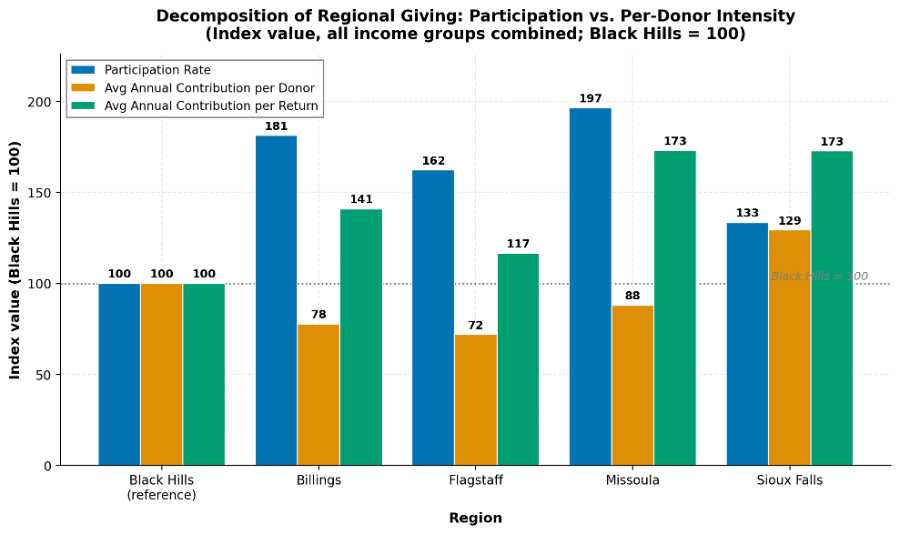

Donor participation can also be compared to how rural each county is. Rurality is measured with the USDA Rural-Urban Continuum Code (RUCC), which ranges from 1 (large metropolitan areas of more than one million people) to 9 (small rural counties not adjacent to any metropolitan area).

Across the 18 counties, the rank correlation between rurality and participation is negative but weak (rs = −0.28, p = 0.26), consistent with somewhat lower participation in more rural counties. Here, rs is the Spearman rank-correlation estimator (an estimate of the population parameter ρ); it ranges from –1 to +1, with values near zero indicating little monotonic association, and p is the probability of observing a correlation at least this strong if rurality and participation were in fact unrelated. Given the small number of counties, the analysis has limited power to distinguish a modest association from none, and the magnitude and direction of the coefficient are therefore more instructive than its position relative to a fixed significance threshold.

This association should not be read as causal. Because more rural counties also tend to have lower incomes, and lower-income filers are less likely to itemize and report charitable deductions, the apparent rurality-participation link may instead reflect underlying differences in income rather than rurality itself.

A sensitivity check excluding Oglala Lakota County indicates that the negative association is strongest in the low-income group and persists after the exclusion. As one of several correlations examined, however, this result warrants confirmation with a larger set of counties.

<em>Figure 4-4. Donor Participation Rate against rurality (RUCC) for the 18 study counties</em>

Table 4-6. Spearman rank correlation between rurality (RUCC) and donor participation rate
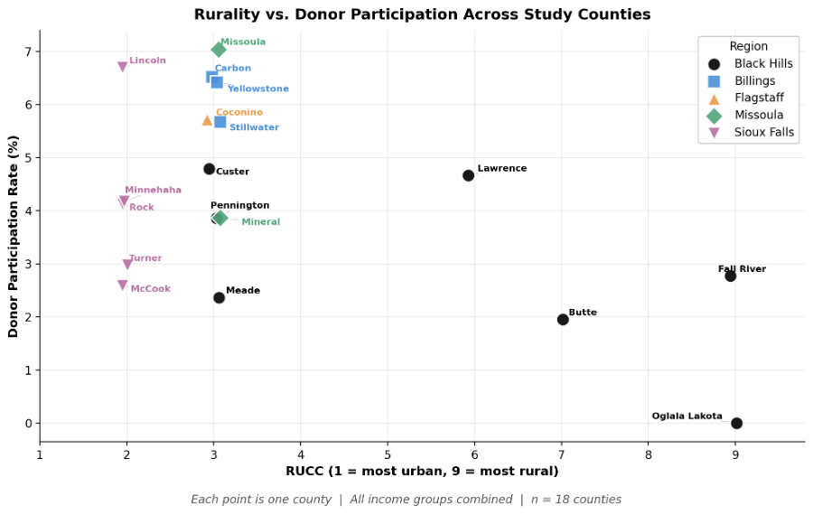

| Income group | Full sample (n = 18) | Excl. Oglala Lakota (n = 17) |
| --- | --- | --- |
| All incomes | rs = −0.28 (p = 0.26) | rs = −0.14 (p = 0.61) |
| Low (&lt;$50k) | rs = −0.67 (p = 0.003*) | rs = −0.61 (p = 0.009*) |
| Middle ($50k–$100k) | rs = +0.17 (p = 0.51) | rs = +0.36 (p = 0.16) |
| High (≥$100k) | rs = −0.11 (p = 0.66) | rs = +0.07 (p = 0.81) |

rs = Spearman rank-correlation coefficient; p = two-sided significance; * denotes p &lt; 0.05

<strong>Nonprofit Density and Donor Participation</strong>

To assess whether the local availability of organizations is related to giving, donor participation is compared with the supply of nonprofits across the same 18 counties. Nonprofit density is the number of tax-exempt organizations registered with the IRS per 10,000 residents, drawn from the 2022 IRS Exempt Organizations Business Master File and 2022 American Community Survey County population estimates.

Across all 18 counties, nonprofit density shows essentially no relationship with overall donor participation (Pearson r = 0.07, p = 0.77), and the pattern is consistent within income groups (Table 4-6). In this case the coefficient is itself near zero, indicating little apparent association rather than a relationship obscured by the limited sample.

Table 4-7. Pearson Correlation between Nonprofit density and Donor Participation Rate

| Income group | Excl. hospitals / univ. / political | All included |
| --- | --- | --- |
| All incomes | r = 0.07 (p = 0.77) | r = 0.06 (p = 0.81) |
| Low (&lt;$50k) | r = −0.09 (p = 0.72) | r = −0.11 (p = 0.67) |
| Middle ($50k–$100k) | r = +0.36 (p = 0.14) | r = +0.37 (p = 0.14) |
| High (≥$100k) | r = +0.005 (p = 0.99) | r = −0.009 (p = 0.97) |

<strong>Summary</strong>

<strong>Black Hills’ lower overall donation rate appears to be driven primarily by participation, not by lower giving amounts among donors. Once the analysis is limited to itemizers, the participation gap largely narrows, suggesting that itemization behavior is an important part of the observed regional difference.</strong>

<strong>Across the five regions, the Black Hills region has the lowest donor participation rate (3.5 %) and the lowest itemization rate (4.6 %). Among filers who itemize, the share reporting charitable contributions is comparable to the benchmark regions, ranging from 76% to 84%. Average contributions per donor are also comparable to or higher than the benchmark regions, including the highest value in the middle-income group. The two giving-relative-to-income measures place Black Hills differently: relative to total regional income, it gives the smallest share in every income group but relative to itemizers only, it ranks first in the middle-income group and second overall. Together, these results suggest that the gap in total giving between Black Hills and the benchmark regions reflects differences in participation rather than in the amount each donor gives.</strong>

<strong>Rurality shows a weak negative association with participation, more pronounced in the low-income group, though the small number of counties limits what can be concluded, and the pattern is not interpreted as causal. Nonprofit density shows little or no association with participation, with correlations close to zero across income groups.</strong>

# 5. Characterization of non-profit organizations

## Relevant details about data sources

Anything the reader needs to know about how the data sources, availability, etc impact the interpretation of this section

### Non-profit revenue analysis

This section uses the GivingTuesday Form 990-family data described under Data sources (coverage limits, form types, and what is not in the file).

For tax year 2022, after requiring positive total revenue, the primary analysis file includes 1,799 filing records for 1,797 organizations: 422 in the Black Hills and 1,377 in benchmark counties. The filing mix is 1,085 Form 990 records, 563 Form 990-EZ records, and 151 Form 990-PF records. We ran the analysis both with and without 25 records for hospitals, universities, and political organizations. Including those records did not reverse the direction of any of the 40 Black Hills-to-benchmark comparisons and did not change the overall interpretation. The results presented here exclude those organizations so the regions better represent comparable non-profit peers.

Definitions for the revenue sources analyzed in this section are provided in Appendix Table 5-12.

The data cannot cleanly separate individual giving from foundation grants, corporate gifts, bequests, or other institutional support. That limitation applies especially to mixed or unclassified contributions.

This report presents two complementary views of the same filing data. Regional totals (Appendix Table 5-13) sum reported dollars across all organizations in the analysis file for each source and region. That is the direct read on how much money flowed through each channel in the overall landscape, but a few very large filers can dominate those sums, so totals can differ sharply from what most organizations experience.

The headline comparisons in this section use the median reported dollar amount among organizations that reported a positive amount for that source. That answers a different question: when a local organization does use the channel, how large is the amount it reports? The median is less pulled up or down by a handful of extreme filers than a regional total or average would be, and it compares only organizations that actually reported the source rather than treating every non-reporter as zero. That separation matters because reporting rates differ by source and region, and on IRS forms a missing line does not always mean the organization earned nothing from that source. Reporting rates and reporter counts appear in Appendix Tables 5-2 through 5-11; regional totals appear in Table 5-13.

### How many organizations could we compare?

Only organizations that reported income from a given revenue source were included in that source's comparison. The number of organizations varies widely by source.

The 422 Black Hills records above are all Form 990-family filers with positive total revenue in 2022. Comparisons for Form 990 Part VIII contribution lines (government grants, federated campaigns, related-organization contributions, membership dues, and fundraising events) use a smaller eligible pool: 256 Black Hills organization-years where those lines exist (primarily full Form 990). Reporting rates for those rare sources are shares of that pool, not of all 422 records. Program service revenue uses a slightly different eligible count because 990-EZ filers can report it; Tables 5-2 through 5-11 provide reporter counts for each region.

For total revenue, total contributions, program service revenue, mixed or unclassified contributions, and other revenue, most pairwise comparisons involved dozens to hundreds of organizations with positive amounts on both sides. Those comparisons are more stable.

Some Part VIII lines are reported by far fewer organizations. In 2022, about 7% of eligible Black Hills filings (the Form 990 subset) reported federated campaign contributions, with 18 organizations showing a positive amount. Some benchmark comparisons for that source involved as few as three to five organizations with positive amounts. Related-organization contributions were reported by about 4% of eligible Black Hills filings, with 10 organizations showing a positive amount. Fundraising event contributions and membership dues fell in between, with moderate sample sizes in some benchmark pairs.

Patterns for sources with very small reporter groups should be read with extra caution because a few organizations can have a large effect on the median. The reporter counts in Tables 5-2 through 5-11 provide context for every regional comparison.

## Results of non-profit organization analysis

Form 990 results and IRS-BMF dataset was used to analyze the financial characteristics of non-profit organizations in Black Hills and benchmark regions. Total revenue and assets were used as indicators of organizations’ financial performance.

The non-profit densities per 10,000 population calculated on a county-level are not significantly different across the five regions. Although the density varies within regions, there is no particular region that has an extreme nonprofit density statistic compared to their counterparts.

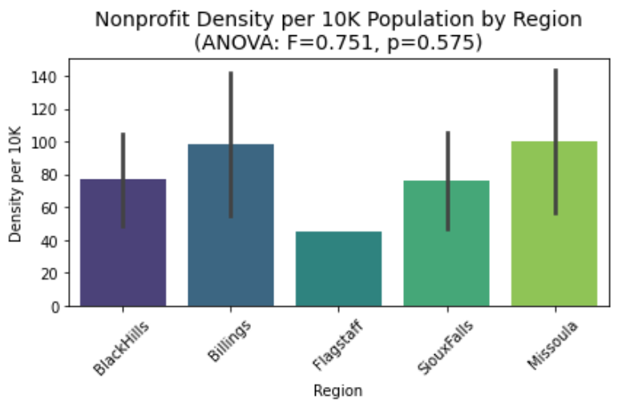

NTEE business field code classifies non-profit organizations based on their activities and main focus. Billings had 26 organizations classified as unidentified, 24 in Black Hills, 11 in Flagstaff, 20 in Missoula, and 56 in Sioux Falls, ranging from 2 - 3% within-region ratios. Billings had 4 missing values, 1 in Missoula, and 6 in Sioux Falls. The heatmap below shows within-region ratios of broad business fields given the total count of non-profit organizations in each region. Billings, Flagstaff, and Sioux Falls show a relatively higher ratio of religious organizations. Sioux Falls shows a slightly higher ratio of healthcare organizations compared to the other four regions.

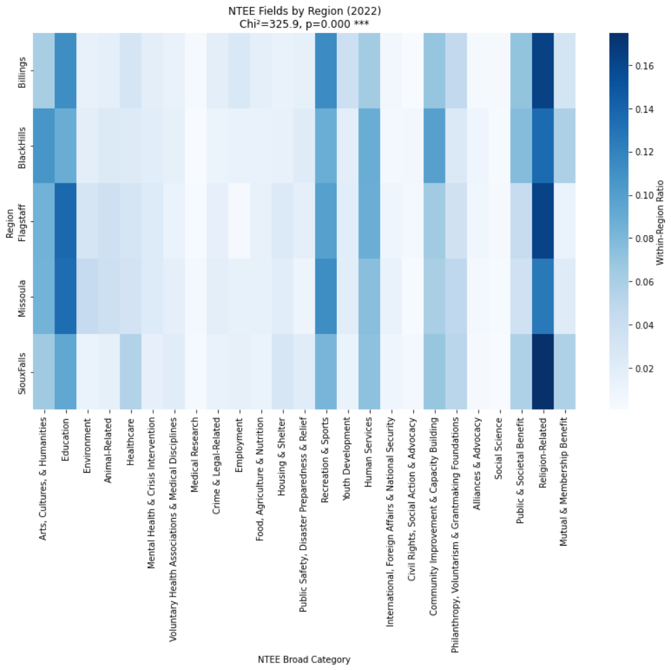

The second heatmap shows total revenue of non-profit organizations in each field. The total revenue values were logarithmically transformed to compress extremely high outliers and allow analysis focused on lower values. Billings and Sioux Falls show higher total revenue in healthcare sectors. Although religious organizations dominate in terms of numbers, they do not produce high revenue. This is partly due to the IRS not requiring religious organizations to report their revenues.

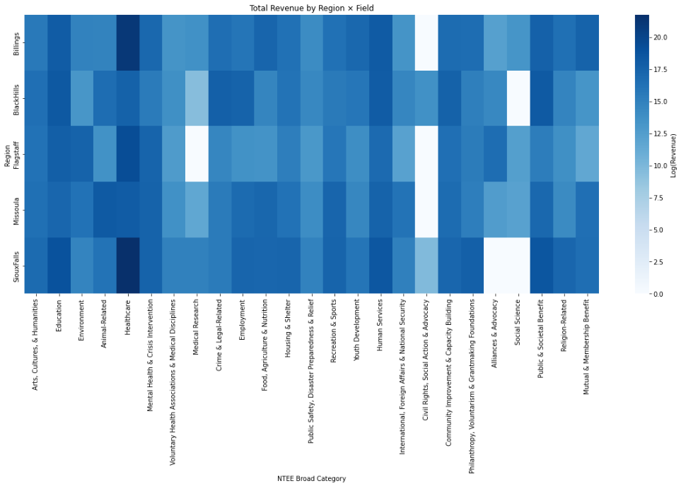

Overall, total revenue of non-profit organizations varies widely within regions. Although Sioux Falls and Billings have high total revenue values on average, the differences between regions are small due to the high variability. The high variabilities in Sioux Falls and Billings are likely due to the revenue gains from healthcare organizations as suggested by the heatmap above. This result suggests that non-profit organizations in Black Hills and benchmark regions generally receive similar amounts of revenue and differences of average total revenue are caused by extreme outliers.

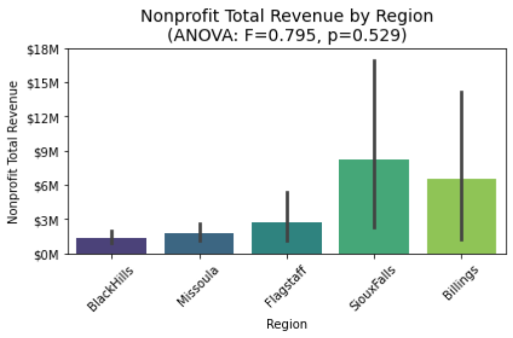

Filtering out hospitals, universities, and political organizations shows a significant decrease in average total revenue of Sioux Falls and Billings. The average total revenue of Billings drops to a similar amount to the average total revenue of Black Hills. The reduction of variability also indicates that the extreme outliers came from the three business fields filtered out in the bar graph below. Sioux Falls continues to have the highest average total revenue.

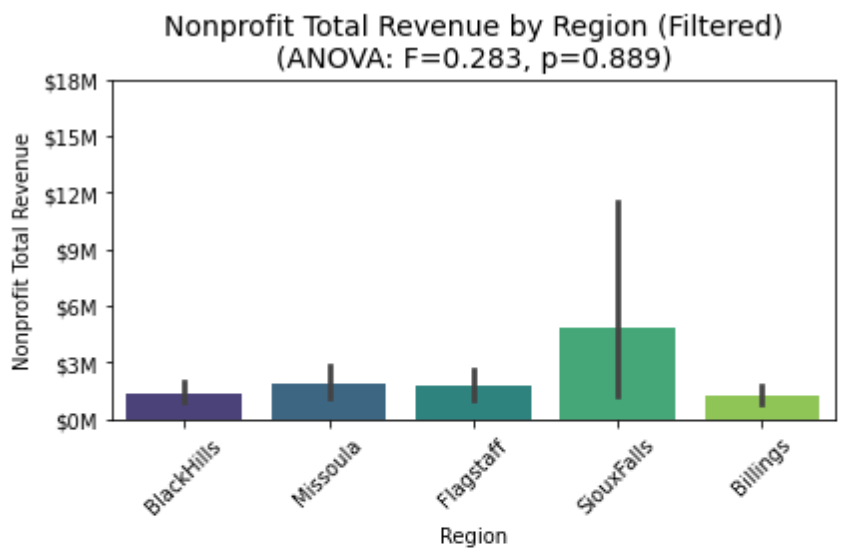

### Non-profit revenue source comparison (2022)

We compared whether non-profit revenue sources differ between the Black Hills and the benchmark regions using the approach described above (2022 filings; medians among positive reporters for the headline comparisons; reporting rates and regional totals in the appendix). The pattern varies by revenue source and benchmark region.

Appendix Table 5-1 provides the exact median reported dollars among positive reporters for all ten revenue sources and regions. Appendix Table 5-13 provides the corresponding regional totals summed across all organizations in the analysis file.

### What the 2022 revenue-source comparison shows

Across the ten revenue sources, the Black Hills medians were often near the lower end of the regional range, but the pattern was not uniform; the size and direction of each gap depended on the source and the benchmark region.

For the two broadest measures, the regions were broadly similar. The Black Hills median total revenue was $176,760, somewhat below the benchmark medians of about $208,000 to $222,000, though that gap is small next to the wide spread in organization size within every region. The Black Hills median total contributions was $110,308, lower than Billings, Flagstaff, and Missoula but higher than Sioux Falls ($100,000).

Several sources showed wider gaps, with the Black Hills median well below the benchmark: program service revenue versus Flagstaff ($106,346 versus $188,968); government grants versus Billings ($163,367 versus $274,793) and Flagstaff ($163,367 versus $468,152); fundraising event contributions versus Billings, Missoula, and Sioux Falls ($12,427 versus $38,516, $41,756, and $70,761); other revenue versus Billings and Sioux Falls ($14,805 versus $27,630 and $32,467); mixed or unclassified contributions versus Flagstaff ($65,792 versus $92,278); and federated campaign contributions versus Sioux Falls ($30,096 versus $150,655). Across these sources the gap ran the same way, with the Black Hills amount the lower of the two.

Black Hills was not lower everywhere. Its median was the higher one in at least one comparison for total contributions, membership dues, federated campaign contributions, and related-organization contributions. For membership dues the regional medians were similar in size, and related-organization contributions rest on very few reporters (noted above), so that ordering is unstable. Complete regional values and reporter counts for every comparison appear in Appendix Tables 5-1 through 5-11.

Participation and dollar amounts can tell different stories. Government grants are a useful example: about 44% of eligible Black Hills organizations reported this source compared with about 34% in Billings, while the median reported amount was $163,367 in Black Hills and $274,793 in Billings. A region can have more organizations using a revenue source while still showing a lower typical dollar amount among the organizations that use it.

The connection to the Black Hills Area Community Foundation is most direct where participation and dollar amounts point in different directions. For example, a relatively large share of eligible Black Hills organizations reported government grants, but the typical grant amount among those organizations was lower than in every benchmark region. Black Hills organizations also reported lower typical amounts for program service revenue and several other sources. Together, these patterns suggest that local organizations may be accessing some funding channels but receiving smaller amounts through them. If this interpretation matches local experience, the Foundation could use it to inform conversations about revenue diversification, grant-seeking capacity, and financial planning. These data do not show why the patterns occur or describe the circumstances of any individual organization.

These findings describe observed 2022 revenue patterns, not causal explanations or proof that the regions differ in every comparable organization. Differences in organization type, local service needs, government funding, tourism-related activity, or the presence of large institutions could contribute but would require context beyond these filings. The results also do not separate individual giving from institutional giving. Appendix Tables 5-1 through 5-11 provide the complete numerical and technical comparison details.

# 6. Conclusions

Write when finished

# Appendix: Non-profit revenue source comparison details

**The appendix provides the complete 2022 revenue-source comparison details. Table 5-1 lists the median reported dollars among organizations with a positive amount for each source. Table 5-13 lists the corresponding regional totals summed across all organizations in the analysis file. Figures 5-2 through 5-11 show each source separately, and their paired tables provide reporting rates, reporter counts, medians, median gaps, confidence intervals, and p-values. The comparison columns apply only to each benchmark region versus Black Hills; no Black Hills-only p-value or median-gap confidence interval exists, so those Black Hills cells are marked NA. Table 5-12 defines the revenue sources. Rare revenue sources have fewer reporting organizations; see the sample-size discussion in the non-profit revenue analysis section.**

**Table 5-1: Median Reported Dollars by Revenue Source and Region**

| Revenue source | Black Hills | Billings | Flagstaff | Missoula | Sioux Falls |
| --- | --- | --- | --- | --- | --- |
| Total revenue | $176,760 | $219,228 | $212,002 | $222,401 | $208,149 |
| Program service revenue | $106,346 | $134,079 | $188,968 | $140,091 | $151,055 |
| Total contributions | $110,308 | $143,479 | $141,210 | $129,864 | $100,000 |
| Government grants received | $163,367 | $274,793 | $468,152 | $216,446 | $204,951 |
| Federated campaign contributions | $30,096 | $37,500 | $2,561 | $26,475 | $150,655 |
| Related organization contributions | $65,109 | $43,000 | $310,812 | $977,600 | $233,400 |
| Membership dues | $22,250 | $31,344 | $24,606 | $29,529 | $18,651 |
| Fundraising event contributions | $12,427 | $38,516 | $11,480 | $41,756 | $70,761 |
| Mixed or unclassified contributions | $65,792 | $83,785 | $92,278 | $88,552 | $71,005 |
| Other revenue | $14,805 | $27,630 | $21,811 | $15,612 | $32,467 |

Table 5-13 sums reported dollars for each revenue source and region over that source's eligible reporting universe in the 2022 analysis file. Totals for total revenue, total contributions, mixed or unclassified contributions, and other revenue include all organizations in the file. Government grants, federated campaigns, related-organization contributions, membership dues, and fundraising event contributions include Form 990 filers only; 990-EZ and 990-PF filers do not report those Part VIII sub-lines and are excluded from those rows, not counted as zero. Within Form 990, a blank sub-line is treated as zero. Program service revenue includes organizations for which that line is reported on the filed form. Regional totals reflect both universe size and report size; a few very large filers can dominate the sum. Table 5-1 reports medians among positive reporters only and is the basis for the pairwise comparisons in Tables 5-2 through 5-11.

**Table 5-13: Total Reported Dollars by Revenue Source and Region (Aggregate)**

| Revenue source | Black Hills | Billings | Flagstaff | Missoula | Sioux Falls |
| --- | --- | --- | --- | --- | --- |
| Total revenue | $749,703,903 | $455,373,976 | $431,958,713 | $599,281,084 | $2,831,897,257 |
| Program service revenue | $247,606,883 | $207,361,781 | $152,478,307 | $260,273,310 | $2,063,333,291 |
| Total contributions | $442,531,118 | $170,764,410 | $207,477,727 | $297,510,934 | $534,526,005 |
| Government grants received | $204,372,189 | $58,621,786 | $113,472,202 | $97,387,728 | $144,072,310 |
| Federated campaign contributions | $1,066,613 | $144,111 | $72,581 | $473,090 | $6,221,236 |
| Related organization contributions | $7,172,732 | $5,381,652 | $1,540,994 | $33,290,130 | $24,142,295 |
| Membership dues | $2,424,345 | $7,968,974 | $3,824,261 | $5,748,363 | $7,438,073 |
| Fundraising event contributions | $1,655,945 | $4,661,457 | $592,147 | $3,734,821 | $8,536,198 |
| Mixed or unclassified contributions | $225,839,294 | $93,986,430 | $87,975,542 | $156,923,629 | $344,115,893 |
| Other revenue | $60,262,123 | $78,920,732 | $72,064,743 | $42,359,406 | $236,399,961 |

**Figure 5-2: Total Revenue by Region**

**Table 5-2: Total Revenue by Region**

| Region | Reporting rate | Positive reporters (n) | Median reported dollars | Black Hills minus benchmark region (95% CI) | Pairwise p-value vs Black Hills |
| --- | --- | --- | --- | --- | --- |
| Black Hills | 100.0% | 422 | $176,760 | NA | NA |
| Billings | 100.0% | 332 | $219,228 | -$42,468 (95% CI -$125,394 to +$33,850) | 0.269 |
| Flagstaff | 100.0% | 197 | $212,002 | -$35,242 (95% CI -$149,323 to +$35,127) | 0.366 |
| Missoula | 100.0% | 283 | $222,401 | -$45,642 (95% CI -$126,653 to +$32,158) | 0.242 |
| Sioux Falls | 100.0% | 565 | $208,149 | -$31,390 (95% CI -$84,901 to +$26,666) | 0.246 |

**Figure 5-3: Program Service Revenue by Region**

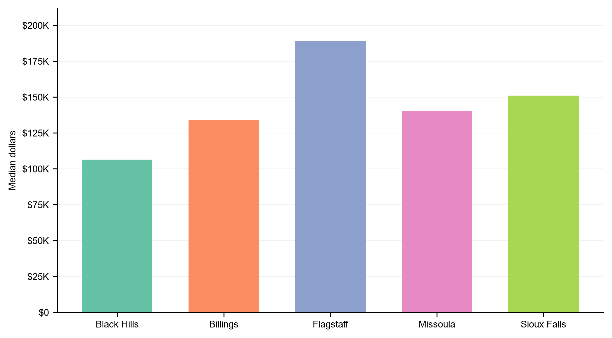

**Table 5-3: Program Service Revenue by Region**

| Region | Reporting rate | Positive reporters (n) | Median reported dollars | Black Hills minus benchmark region (95% CI) | Pairwise p-value vs Black Hills |
| --- | --- | --- | --- | --- | --- |
| Black Hills | 51.6% | 205 | $106,346 | NA | NA |
| Billings | 57.2% | 171 | $134,079 | -$27,733 (95% CI -$96,511 to +$25,161) | 0.292 |
| Flagstaff | 49.7% | 93 | $188,968 | -$82,622 (95% CI -$188,223 to +$1,513) | 0.038 |
| Missoula | 65.5% | 173 | $140,091 | -$33,745 (95% CI -$91,143 to +$18,223) | 0.175 |
| Sioux Falls | 59.5% | 298 | $151,055 | -$44,709 (95% CI -$114,440 to +$6,707) | 0.089 |

**Figure 5-4: Total Contributions by Region**

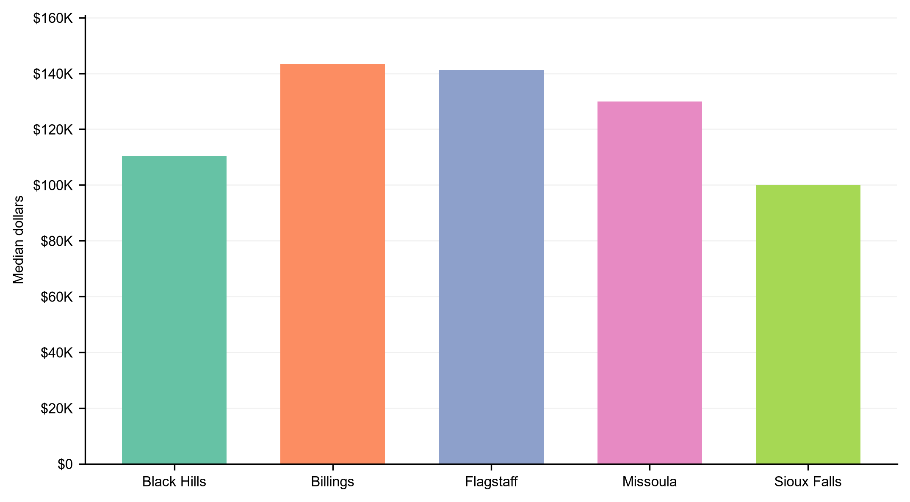

**Table 5-4: Total Contributions by Region**

| Region | Reporting rate | Positive reporters (n) | Median reported dollars | Black Hills minus benchmark region (95% CI) | Pairwise p-value vs Black Hills |
| --- | --- | --- | --- | --- | --- |
| Black Hills | 83.6% | 353 | $110,308 | NA | NA |
| Billings | 78.0% | 259 | $143,479 | -$33,171 (95% CI -$85,280 to +$16,324) | 0.161 |
| Flagstaff | 83.8% | 165 | $141,210 | -$30,902 (95% CI -$95,512 to +$14,239) | 0.224 |
| Missoula | 82.7% | 234 | $129,864 | -$19,556 (95% CI -$95,775 to +$26,776) | 0.309 |
| Sioux Falls | 72.7% | 411 | $100,000 | +$10,308 (95% CI -$20,952 to +$41,476) | 0.448 |

**Figure 5-5: Government Grants Received by Region**

**Table 5-5: Government Grants Received by Region**

| Region | Reporting rate | Positive reporters (n) | Median reported dollars | Black Hills minus benchmark region (95% CI) | Pairwise p-value vs Black Hills |
| --- | --- | --- | --- | --- | --- |
| Black Hills | 44.1% | 113 | $163,367 | NA | NA |
| Billings | 33.7% | 69 | $274,793 | -$111,426 (95% CI -$345,341 to +$7,163) | 0.043 |
| Flagstaff | 40.5% | 49 | $468,152 | -$304,785 (95% CI -$817,302 to -$131,168) | 0.003 |
| Missoula | 42.9% | 76 | $216,446 | -$53,078 (95% CI -$292,032 to +$26,850) | 0.197 |
| Sioux Falls | 31.9% | 104 | $204,951 | -$41,584 (95% CI -$156,414 to +$89,266) | 0.507 |

**Figure 5-6: Federated Campaign Contributions by Region**

**Table 5-6: Federated Campaign Contributions by Region**

| Region | Reporting rate | Positive reporters (n) | Median reported dollars | Black Hills minus benchmark region (95% CI) | Pairwise p-value vs Black Hills |
| --- | --- | --- | --- | --- | --- |
| Black Hills | 7.0% | 18 | $30,096 | NA | NA |
| Billings | 2.4% | 5 | $37,500 | -$7,404 (95% CI -$41,337 to +$36,319) | 0.688 |
| Flagstaff | 2.5% | 3 | $2,561 | +$27,535 (95% CI -$50,214 to +$38,331) | 0.179 |
| Missoula | 2.8% | 5 | $26,475 | +$3,621 (95% CI -$374,904 to +$29,973) | 0.819 |
| Sioux Falls | 7.1% | 23 | $150,655 | -$120,559 (95% CI -$251,704 to -$58,041) | 0.005 |

**Figure 5-7: Related Organization Contributions by Region**

**Table 5-7: Related Organization Contributions by Region**

| Region | Reporting rate | Positive reporters (n) | Median reported dollars | Black Hills minus benchmark region (95% CI) | Pairwise p-value vs Black Hills |
| --- | --- | --- | --- | --- | --- |
| Black Hills | 3.9% | 10 | $65,109 | NA | NA |
| Billings | 7.3% | 15 | $43,000 | +$22,109 (95% CI -$205,000 to +$1,417,018) | 0.627 |
| Flagstaff | 4.1% | 5 | $310,812 | -$245,703 (95% CI -$573,240 to +$1,112,196) | 0.126 |
| Missoula | 4.5% | 8 | $977,600 | -$912,491 (95% CI -$3,371,000 to +$150,595) | 0.173 |
| Sioux Falls | 4.6% | 15 | $233,400 | -$168,291 (95% CI -$1,493,390 to +$1,137,398) | 0.203 |

**Figure 5-8: Membership Dues by Region**

**Table 5-8: Membership Dues by Region**

| Region | Reporting rate | Positive reporters (n) | Median reported dollars | Black Hills minus benchmark region (95% CI) | Pairwise p-value vs Black Hills |
| --- | --- | --- | --- | --- | --- |
| Black Hills | 20.3% | 52 | $22,250 | NA | NA |
| Billings | 20.5% | 42 | $31,344 | -$9,093 (95% CI -$51,928 to +$10,338) | 0.342 |
| Flagstaff | 16.5% | 20 | $24,606 | -$2,355 (95% CI -$167,924 to +$21,272) | 0.832 |
| Missoula | 16.9% | 30 | $29,529 | -$7,278 (95% CI -$20,952 to +$13,858) | 0.601 |
| Sioux Falls | 11.3% | 37 | $18,651 | +$3,600 (95% CI -$54,010 to +$23,295) | 0.540 |

**Figure 5-9: Fundraising Event Contributions by Region**

**Table 5-9: Fundraising Event Contributions by Region**

| Region | Reporting rate | Positive reporters (n) | Median reported dollars | Black Hills minus benchmark region (95% CI) | Pairwise p-value vs Black Hills |
| --- | --- | --- | --- | --- | --- |
| Black Hills | 15.2% | 39 | $12,427 | NA | NA |
| Billings | 22.4% | 46 | $38,516 | -$26,088 (95% CI -$64,852 to -$6,639) | 0.009 |
| Flagstaff | 14.0% | 17 | $11,480 | +$947 (95% CI -$9,712 to +$13,322) | 0.849 |
| Missoula | 23.7% | 42 | $41,756 | -$29,329 (95% CI -$72,681 to +$1,335) | 0.010 |
| Sioux Falls | 16.0% | 52 | $70,761 | -$58,334 (95% CI -$80,561 to -$31,388) | &lt; 0.001 |

**Figure 5-10: Mixed or Unclassified Contributions by Region**

**Table 5-10: Mixed or Unclassified Contributions by Region**

| Region | Reporting rate | Positive reporters (n) | Median reported dollars | Black Hills minus benchmark region (95% CI) | Pairwise p-value vs Black Hills |
| --- | --- | --- | --- | --- | --- |
| Black Hills | 76.8% | 324 | $65,792 | NA | NA |
| Billings | 68.4% | 227 | $83,785 | -$17,992 (95% CI -$49,754 to +$8,827) | 0.157 |
| Flagstaff | 77.7% | 153 | $92,278 | -$26,486 (95% CI -$50,596 to -$2,907) | 0.033 |
| Missoula | 77.0% | 218 | $88,552 | -$22,760 (95% CI -$58,330 to +$11,256) | 0.099 |
| Sioux Falls | 67.1% | 379 | $71,005 | -$5,212 (95% CI -$29,255 to +$15,095) | 0.619 |

**Figure 5-11: Other Revenue by Region**

**Table 5-11: Other Revenue by Region**

| Region | Reporting rate | Positive reporters (n) | Median reported dollars | Black Hills minus benchmark region (95% CI) | Pairwise p-value vs Black Hills |
| --- | --- | --- | --- | --- | --- |
| Black Hills | 79.1% | 334 | $14,805 | NA | NA |
| Billings | 81.0% | 269 | $27,630 | -$12,825 (95% CI -$22,923 to -$1,324) | 0.010 |
| Flagstaff | 72.6% | 143 | $21,811 | -$7,006 (95% CI -$27,475 to +$6,558) | 0.292 |
| Missoula | 79.9% | 226 | $15,612 | -$807 (95% CI -$8,600 to +$7,563) | 0.697 |
| Sioux Falls | 80.4% | 454 | $32,467 | -$17,662 (95% CI -$25,196 to -$6,938) | 0.001 |

**Table 5-12: Revenue Source Definitions**

| Revenue source | What it measures | How it is reported on IRS filings |
| --- | --- | --- |
| Total revenue | All reported revenue for the organization in tax year 2022. | Form 990, Form 990-EZ, and Form 990-PF totals. |
| Total contributions | Total reported contributions, gifts, grants, and similar amounts. | Form 990, Form 990-EZ, and Form 990-PF totals. |
| Program service revenue | Money earned from services, programs, fees, or sales related to the organization's mission. | Form 990 and Form 990-EZ; not comparable on Form 990-PF. |
| Government grants received | Funds reported from government sources. | Form 990 Part VIII Line 1e; comparisons use Form 990 filers only. |
| Federated campaign contributions | Support reported through federated campaigns (for example, United Way-style allocations). | Form 990 Part VIII Line 1a; comparisons use Form 990 filers only. |
| Related organization contributions | Contributions from related organizations or affiliates. | Form 990 Part VIII Line 1d; comparisons use Form 990 filers only. |
| Membership dues | Membership dues reported on the return. | Form 990 Part VIII Line 1b; comparisons use Form 990 filers only. |
| Fundraising event contributions | Contributions tied to fundraising events. | Form 990 Part VIII Line 1c; comparisons use Form 990 filers only. |
| Mixed / unclassified contributions | Contribution dollars the forms do not break down cleanly by donor type. | Form 990 Line 1f plus 990-EZ/PF contribution totals that cannot be split into Part VIII lines. |
| Other revenue | Remaining revenue after program service revenue and the contribution components above. | Calculated as total revenue minus those components. |

**The full client presentation and supporting analysis files include reporting rates and additional source-by-source interpretation.**
