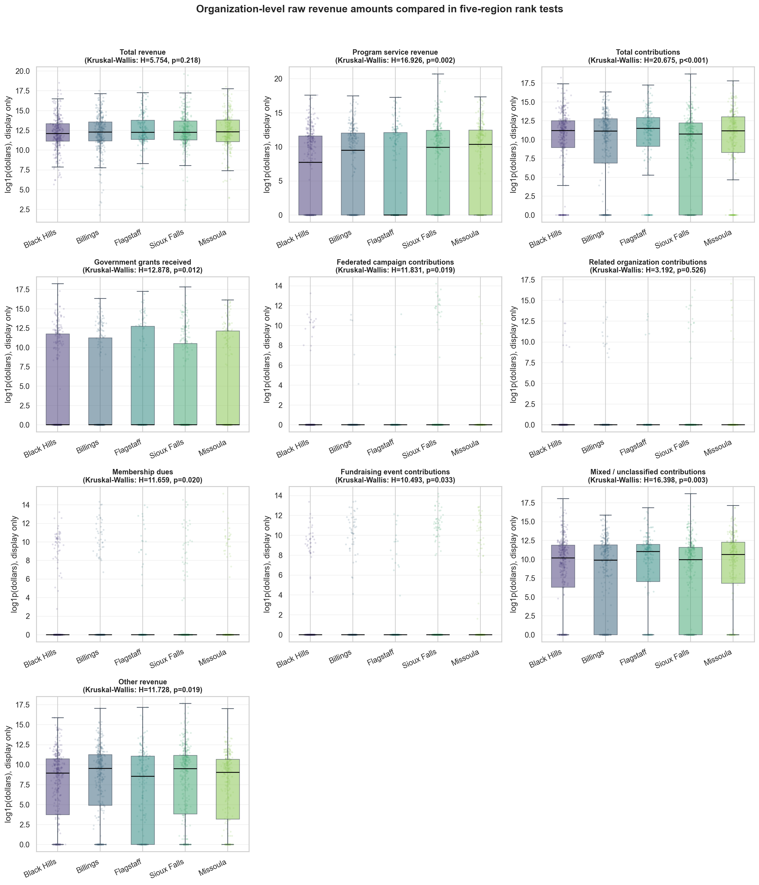
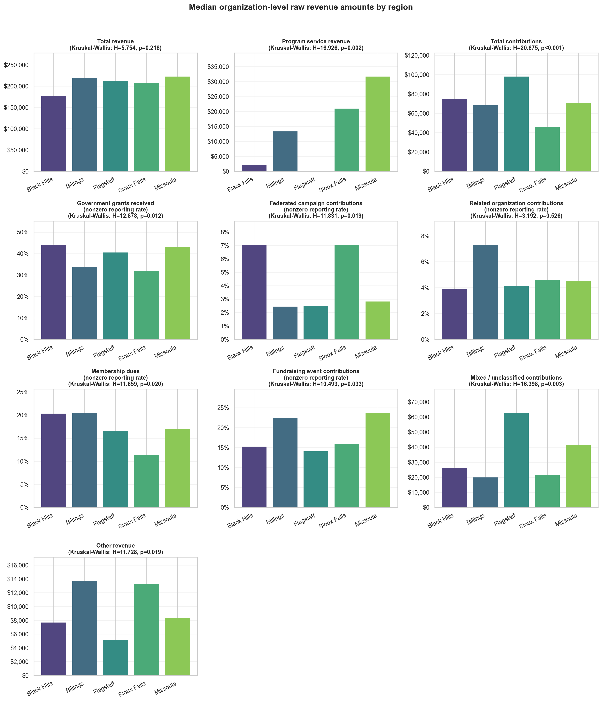

# Revenue Sources Analysis Results

## Question

Is there a difference in revenue sources between Black Hills nonprofit organizations and nonprofit organizations in the benchmark regions?

## Analysis Performed

The analysis uses the GivingTuesday Form 990 basic all-forms analysis dataset as the primary source because it covers Form 990, Form 990-EZ, and Form 990-PF and contains the requested revenue-source fields. The primary comparison excludes hospitals, universities, and political organizations so the benchmark regions better reflect the client-peer universe; the full Form 990/990-EZ/990-PF universe is retained as a sensitivity check. NCCS Core is used separately as a 2022 sensitivity check where comparable fields exist.

The script filtered to positive total revenue, valid region/year/form records, and the comparable peer universe, then derived detailed revenue-source segments aligned with Section 3 Q9. For Form 990 filers (the bulk of the analytical sample) the contribution side of total revenue is decomposed into the IRS Part VIII Line 1 sub-channels:

1. **program_service_revenue** - Form 990 / 990-EZ Line 2g program service revenue (Form 990-PF stays missing; that form lacks an equivalent concept).
2. **government_grants_received** - Form 990 Line 1e (`GOVERNGRANTS`). The only Line 1 sub-component the IRS labels unambiguously as institutional.
3. **federated_campaigns** - Form 990 Line 1a (`FEDERACAMPAI`). Institutional/intermediary campaign support, such as United Way-style campaigns.
4. **related_org_contributions** - Form 990 Line 1d (`RELATEORGANI`). Institutional or affiliate support from related organizations.
5. **membership_dues** - Form 990 Line 1b (`MEMBERDUESUE`). Individual-adjacent support, but not pure individual giving.
6. **fundraising_events_contributions** - Form 990 Line 1c (`FUNDRAEVENTS`). Individual-adjacent support from fundraising events, but not pure individual giving.
7. **mixed_unclassified_contributions** - Form 990 Line 1f (`ALLOOTHECONT`). The IRS lumps individual gifts together with private foundation grants, donor-advised fund distributions, corporate gifts, and bequests in this single line and does not separate the donor types. For 990-EZ and 990-PF filers, which do not separately report comparable Line 1 sub-components, the entire reported Line 1 / Part I Line 1 contributions total is routed into this bucket for the all-form revenue partition.
8. **residual_other_revenue** - total revenue minus the segments above; clipped at zero for plotting.

Total contributions used as the contribution-side denominator are the GT canonical field `analysis_total_contributions_amount` (Line 1h via `TOTACASHCONT` for 990; Part I Line 1 via `CONGIFGRAETC` for 990-EZ; Part I Line 1 via `STREACGRTOIN` for 990-PF). Blank supported amount fields are interpreted as reported zero; unavailable form-specific subcomponents are kept missing. The institutional aggregate (`analysis_calculated_grants_total_amount` = Line 1a + 1d + 1e on Form 990) is exposed for diagnostics; earlier versions of that aggregate accidentally included Form 990 Part IX grants paid out (`FOREGRANTOTA`, `GRANTOORORGA`) and have been corrected.

**Interpretation caveat for the client question.** This decomposition is the most informative split the IRS basic 990 family can support for distinguishing source channels. It cannot fully isolate individual giving because Line 1f mixes individuals, foundations, DAFs, corporates, and bequests, and Form 990-EZ / 990-PF expose only a single contributions total. Government grants, federated campaigns, related-organization contributions, membership dues, and fundraising event contributions are tested only where the form actually reports the comparable field, so unavailable EZ/PF source detail is not counted as zero. Government grants, federated campaigns, and related-organization contributions are institutional channels; membership dues and fundraising events are individual-adjacent proxies; mixed / unclassified contributions should not be read as either pure-individual or pure-institutional.

The statistical analysis includes descriptive summaries, raw-dollar rank tests, permutation tests, FDR-adjusted p-values, effect sizes, supplemental share/compositional tests, log-dollar checks, OLS models with EIN-clustered standard errors, EIN-clustered logistic presence models, MANOVA-style tests, year-by-year tests, form-type sensitivity tests, revenue-size sensitivity tests, a full-universe sensitivity that includes the excluded organization types, a one-row-per-EIN independence sensitivity, EIN-cluster bootstrap confidence intervals, and concentration metrics. Where the same nonprofit appears in multiple tax years, inference uses cluster-robust adjustments rather than treating org-years as independent.

## Coverage

- Analytic organization-year rows: 1,799
- Unique EINs: 1,797
- Excluded hospital/university/political org rows: 25 (25 EINs) from the full valid universe of 1,824 rows
- Tax years: 2022
- Regions: Billings, Black Hills, Flagstaff, Missoula, Sioux Falls
- Rows flagged for negative residual or over-100-percent source shares: 99

## Headline Findings

The clearest headline comparison is now the five-region Kruskal-Wallis test on organization-level raw revenue-source dollars. Follow-up Black Hills versus pooled benchmark tests use Mann-Whitney U and permutation mean-difference tests. This avoids making the compositional source-share variables the main inferential test.

The stacked-bar share visuals are descriptive aggregate-dollar revenue-mix charts. They are useful for presentation, but they are not the values being tested in the primary raw-dollar rank tests.

## Aggregate Reported Component Mix

The table below shows both the reported component share of total revenue and the normalized share used in the stacked charts. With the Q9 donor-channel decomposition, reported segment shares should sum to roughly 100 percent within rounding; larger deviations indicate upstream overlap or missing contribution totals on specific rows.

| Group | Revenue source | Amount | Reported share of total revenue | Normalized chart share |
| --- | --- | --- | --- | --- |
| Benchmark | program_service_revenue | $2,683,445,791 | 62.1% | 62.1% |
| Benchmark | government_grants_received | $413,554,026 | 9.6% | 9.6% |
| Benchmark | federated_campaigns | $6,911,018 | 0.2% | 0.2% |
| Benchmark | related_org_contributions | $64,355,071 | 1.5% | 1.5% |
| Benchmark | membership_dues | $24,979,671 | 0.6% | 0.6% |
| Benchmark | fundraising_events_contributions | $17,477,796 | 0.4% | 0.4% |
| Benchmark | mixed_unclassified_contributions | $683,001,494 | 15.8% | 15.8% |
| Benchmark | residual_other_revenue | $429,744,842 | 10.0% | 9.9% |
| Black Hills | program_service_revenue | $247,606,883 | 33.0% | 33.0% |
| Black Hills | government_grants_received | $204,372,189 | 27.3% | 27.2% |
| Black Hills | federated_campaigns | $1,066,613 | 0.1% | 0.1% |
| Black Hills | related_org_contributions | $7,172,732 | 1.0% | 1.0% |
| Black Hills | membership_dues | $2,424,345 | 0.3% | 0.3% |
| Black Hills | fundraising_events_contributions | $1,655,945 | 0.2% | 0.2% |
| Black Hills | mixed_unclassified_contributions | $225,839,294 | 30.1% | 30.1% |
| Black Hills | residual_other_revenue | $60,262,123 | 8.0% | 8.0% |

Reported component share sums by group:

| Group | Reported component shares summed |
| --- | --- |
| Benchmark | 100.1% |
| Black Hills | 100.1% |

## Raw-Dollar Descriptive Summary

These medians and nonzero rates summarize the organization-level dollar amounts used in the primary tests. Means are shown only as context because the distributions are strongly right-skewed.

| Variable | Region | N | Mean | Median | Nonzero % | Positive-only median |
| --- | --- | --- | --- | --- | --- | --- |
| Total revenue | Black Hills | 422 | $1,776,550 | $176,760 | 100.0% | $176,760 |
| Total revenue | Billings | 332 | $1,371,608 | $219,228 | 100.0% | $219,228 |
| Total revenue | Flagstaff | 197 | $2,192,684 | $212,002 | 100.0% | $212,002 |
| Total revenue | Sioux Falls | 565 | $5,012,208 | $208,149 | 100.0% | $208,149 |
| Total revenue | Missoula | 283 | $2,117,601 | $222,401 | 100.0% | $222,401 |
| Program service revenue | Black Hills | 397 | $623,695 | $2,264 | 51.6% | $106,346 |
| Program service revenue | Billings | 299 | $693,518 | $13,340 | 57.2% | $134,079 |
| Program service revenue | Flagstaff | 187 | $815,392 | $0 | 49.7% | $188,968 |
| Program service revenue | Sioux Falls | 501 | $4,118,430 | $20,998 | 59.5% | $151,055 |
| Program service revenue | Missoula | 264 | $985,884 | $31,672 | 65.5% | $140,091 |
| Total contributions | Black Hills | 422 | $1,048,652 | $74,832 | 83.6% | $110,308 |
| Total contributions | Billings | 332 | $514,351 | $68,275 | 78.0% | $143,479 |
| Total contributions | Flagstaff | 197 | $1,053,186 | $97,934 | 83.8% | $141,210 |
| Total contributions | Sioux Falls | 565 | $946,064 | $46,082 | 72.7% | $100,000 |
| Total contributions | Missoula | 283 | $1,051,275 | $71,026 | 82.7% | $129,864 |
| Government grants received | Black Hills | 256 | $798,329 | $0 | 44.1% | $163,367 |
| Government grants received | Billings | 205 | $285,960 | $0 | 33.7% | $274,793 |
| Government grants received | Flagstaff | 121 | $937,787 | $0 | 40.5% | $468,152 |
| Government grants received | Sioux Falls | 326 | $441,940 | $0 | 31.9% | $204,951 |
| Government grants received | Missoula | 177 | $550,213 | $0 | 42.9% | $216,446 |
| Federated campaign contributions | Black Hills | 256 | $4,166 | $0 | 7.0% | $30,096 |
| Federated campaign contributions | Billings | 205 | $703 | $0 | 2.4% | $37,500 |
| Federated campaign contributions | Flagstaff | 121 | $600 | $0 | 2.5% | $2,561 |
| Federated campaign contributions | Sioux Falls | 326 | $19,084 | $0 | 7.1% | $150,655 |
| Federated campaign contributions | Missoula | 177 | $2,673 | $0 | 2.8% | $26,475 |
| Related organization contributions | Black Hills | 256 | $28,018 | $0 | 3.9% | $65,109 |
| Related organization contributions | Billings | 205 | $26,252 | $0 | 7.3% | $43,000 |
| Related organization contributions | Flagstaff | 121 | $12,735 | $0 | 4.1% | $310,812 |
| Related organization contributions | Sioux Falls | 326 | $74,056 | $0 | 4.6% | $233,400 |
| Related organization contributions | Missoula | 177 | $188,080 | $0 | 4.5% | $977,600 |
| Membership dues | Black Hills | 256 | $9,470 | $0 | 20.3% | $22,250 |
| Membership dues | Billings | 205 | $38,873 | $0 | 20.5% | $31,344 |
| Membership dues | Flagstaff | 121 | $31,605 | $0 | 16.5% | $24,606 |
| Membership dues | Sioux Falls | 326 | $22,816 | $0 | 11.3% | $18,651 |
| Membership dues | Missoula | 177 | $32,477 | $0 | 16.9% | $29,529 |
| Fundraising event contributions | Black Hills | 256 | $6,469 | $0 | 15.2% | $12,427 |
| Fundraising event contributions | Billings | 205 | $22,739 | $0 | 22.4% | $38,516 |
| Fundraising event contributions | Flagstaff | 121 | $4,894 | $0 | 14.0% | $11,480 |
| Fundraising event contributions | Sioux Falls | 326 | $26,185 | $0 | 16.0% | $70,761 |
| Fundraising event contributions | Missoula | 177 | $21,101 | $0 | 23.7% | $41,756 |
| Mixed / unclassified contributions | Black Hills | 422 | $535,164 | $26,324 | 76.8% | $65,792 |
| Mixed / unclassified contributions | Billings | 332 | $283,092 | $19,861 | 68.4% | $83,785 |
| Mixed / unclassified contributions | Flagstaff | 197 | $446,576 | $62,786 | 77.7% | $92,278 |
| Mixed / unclassified contributions | Sioux Falls | 565 | $609,055 | $21,454 | 67.1% | $71,005 |
| Mixed / unclassified contributions | Missoula | 283 | $554,500 | $41,419 | 77.0% | $88,552 |
| Other revenue | Black Hills | 422 | $142,801 | $7,673 | 79.1% | $14,805 |
| Other revenue | Billings | 332 | $237,713 | $13,736 | 81.0% | $27,630 |
| Other revenue | Flagstaff | 197 | $365,811 | $5,124 | 72.6% | $21,811 |
| Other revenue | Sioux Falls | 565 | $418,407 | $13,273 | 80.4% | $32,467 |
| Other revenue | Missoula | 283 | $149,680 | $8,347 | 79.9% | $15,612 |

## Normality and Skew Diagnostics

D'Agostino-Pearson normality tests reject normality for the raw dollar variables in every region. Log1p-transformed values also reject normality in every region, so Kruskal-Wallis and Mann-Whitney U are preferred over ANOVA for the primary Q9 tests.

| Variable | Region | N | Zero % | Mean | Median | Mean/median | Skew | Raw normality p | Log1p normality p |
| --- | --- | --- | --- | --- | --- | --- | --- | --- | --- |
| Total revenue | Black Hills | 422 | 0.0% | $1,776,550 | $176,760 | 10.1 | 9.38 | <0.001 | 0.03337 |
| Total revenue | Billings | 332 | 0.0% | $1,371,608 | $219,228 | 6.26 | 5.83 | <0.001 | <0.001 |
| Total revenue | Flagstaff | 197 | 0.0% | $2,192,684 | $212,002 | 10.3 | 5.73 | <0.001 | 0.02598 |
| Total revenue | Sioux Falls | 565 | 0.0% | $5,012,208 | $208,149 | 24.1 | 18.5 | <0.001 | <0.001 |
| Total revenue | Missoula | 283 | 0.0% | $2,117,601 | $222,401 | 9.52 | 6.04 | <0.001 | <0.001 |
| Program service revenue | Black Hills | 397 | 48.4% | $623,695 | $2,264 | 275 | 9.06 | <0.001 | <0.001 |
| Program service revenue | Billings | 299 | 42.8% | $693,518 | $13,340 | 52 | 8.27 | <0.001 | <0.001 |
| Program service revenue | Flagstaff | 187 | 50.3% | $815,392 | $0 | not defined | 6.43 | <0.001 | <0.001 |
| Program service revenue | Sioux Falls | 501 | 40.5% | $4,118,430 | $20,998 | 196 | 18.2 | <0.001 | <0.001 |
| Program service revenue | Missoula | 264 | 34.5% | $985,884 | $31,672 | 31.1 | 5.83 | <0.001 | <0.001 |
| Total contributions | Black Hills | 422 | 16.4% | $1,048,652 | $74,832 | 14 | 11.1 | <0.001 | <0.001 |
| Total contributions | Billings | 332 | 22.0% | $514,351 | $68,275 | 7.53 | 5.02 | <0.001 | <0.001 |
| Total contributions | Flagstaff | 197 | 16.2% | $1,053,186 | $97,934 | 10.8 | 5.86 | <0.001 | <0.001 |
| Total contributions | Sioux Falls | 565 | 27.3% | $946,064 | $46,082 | 20.5 | 16.1 | <0.001 | <0.001 |
| Total contributions | Missoula | 283 | 17.3% | $1,051,275 | $71,026 | 14.8 | 8.9 | <0.001 | <0.001 |
| Government grants received | Black Hills | 256 | 55.9% | $798,329 | $0 | not defined | 12.5 | <0.001 | <0.001 |
| Government grants received | Billings | 205 | 66.3% | $285,960 | $0 | not defined | 7.67 | <0.001 | <0.001 |
| Government grants received | Flagstaff | 121 | 59.5% | $937,787 | $0 | not defined | 6.45 | <0.001 | <0.001 |
| Government grants received | Sioux Falls | 326 | 68.1% | $441,940 | $0 | not defined | 15 | <0.001 | <0.001 |
| Government grants received | Missoula | 177 | 57.1% | $550,213 | $0 | not defined | 4.08 | <0.001 | <0.001 |
| Federated campaign contributions | Black Hills | 256 | 93.0% | $4,166 | $0 | not defined | 14.5 | <0.001 | <0.001 |
| Federated campaign contributions | Billings | 205 | 97.6% | $703 | $0 | not defined | 9.13 | <0.001 | <0.001 |
| Federated campaign contributions | Flagstaff | 121 | 97.5% | $600 | $0 | not defined | 11 | <0.001 | <0.001 |
| Federated campaign contributions | Sioux Falls | 326 | 92.9% | $19,084 | $0 | not defined | 9.29 | <0.001 | <0.001 |
| Federated campaign contributions | Missoula | 177 | 97.2% | $2,673 | $0 | not defined | 13.1 | <0.001 | <0.001 |
| Related organization contributions | Black Hills | 256 | 96.1% | $28,018 | $0 | not defined | 11.6 | <0.001 | <0.001 |
| Related organization contributions | Billings | 205 | 92.7% | $26,252 | $0 | not defined | 10.3 | <0.001 | <0.001 |
| Related organization contributions | Flagstaff | 121 | 95.9% | $12,735 | $0 | not defined | 6.79 | <0.001 | <0.001 |
| Related organization contributions | Sioux Falls | 326 | 95.4% | $74,056 | $0 | not defined | 13.9 | <0.001 | <0.001 |
| Related organization contributions | Missoula | 177 | 95.5% | $188,080 | $0 | not defined | 12.6 | <0.001 | <0.001 |
| Membership dues | Black Hills | 256 | 79.7% | $9,470 | $0 | not defined | 8.94 | <0.001 | <0.001 |
| Membership dues | Billings | 205 | 79.5% | $38,873 | $0 | not defined | 6.69 | <0.001 | <0.001 |
| Membership dues | Flagstaff | 121 | 83.5% | $31,605 | $0 | not defined | 5.97 | <0.001 | <0.001 |
| Membership dues | Sioux Falls | 326 | 88.7% | $22,816 | $0 | not defined | 9.62 | <0.001 | <0.001 |
| Membership dues | Missoula | 177 | 83.1% | $32,477 | $0 | not defined | 12.8 | <0.001 | <0.001 |
| Fundraising event contributions | Black Hills | 256 | 84.8% | $6,469 | $0 | not defined | 12.5 | <0.001 | <0.001 |
| Fundraising event contributions | Billings | 205 | 77.6% | $22,739 | $0 | not defined | 5.5 | <0.001 | <0.001 |
| Fundraising event contributions | Flagstaff | 121 | 86.0% | $4,894 | $0 | not defined | 6.15 | <0.001 | <0.001 |
| Fundraising event contributions | Sioux Falls | 326 | 84.0% | $26,185 | $0 | not defined | 7.98 | <0.001 | <0.001 |
| Fundraising event contributions | Missoula | 177 | 76.3% | $21,101 | $0 | not defined | 3.95 | <0.001 | <0.001 |
| Mixed / unclassified contributions | Black Hills | 422 | 23.2% | $535,164 | $26,324 | 20.3 | 15.9 | <0.001 | <0.001 |
| Mixed / unclassified contributions | Billings | 332 | 31.6% | $283,092 | $19,861 | 14.3 | 5.83 | <0.001 | <0.001 |
| Mixed / unclassified contributions | Flagstaff | 197 | 22.3% | $446,576 | $62,786 | 7.11 | 7.81 | <0.001 | <0.001 |
| Mixed / unclassified contributions | Sioux Falls | 565 | 32.9% | $609,055 | $21,454 | 28.4 | 20.1 | <0.001 | <0.001 |
| Mixed / unclassified contributions | Missoula | 283 | 23.0% | $554,500 | $41,419 | 13.4 | 8.45 | <0.001 | <0.001 |
| Other revenue | Black Hills | 422 | 20.9% | $142,801 | $7,673 | 18.6 | 9.16 | <0.001 | <0.001 |
| Other revenue | Billings | 332 | 19.0% | $237,713 | $13,736 | 17.3 | 15 | <0.001 | <0.001 |
| Other revenue | Flagstaff | 197 | 27.4% | $365,811 | $5,124 | 71.4 | 10.3 | <0.001 | <0.001 |
| Other revenue | Sioux Falls | 565 | 19.6% | $418,407 | $13,273 | 31.5 | 12.5 | <0.001 | <0.001 |
| Other revenue | Missoula | 283 | 20.1% | $149,680 | $8,347 | 17.9 | 16.4 | <0.001 | <0.001 |

## Primary Raw-Dollar Statistical Tests (five-region Kruskal-Wallis)

| Test | Variable | Statistic | P-value | FDR p-value | N |
| --- | --- | --- | --- | --- | --- |
| kruskal_wallis | total_revenue | 5.754 | 0.2183 | 0.2426 | 1799 |
| kruskal_wallis | program_service_revenue | 16.93 | 0.001998 | 0.00843 | 1648 |
| kruskal_wallis | total_contributions | 20.68 | 0.0003672 | 0.003672 | 1799 |
| kruskal_wallis | government_grants_received | 12.88 | 0.01189 | 0.02868 | 1085 |
| kruskal_wallis | federated_campaigns | 11.83 | 0.01865 | 0.02868 | 1085 |
| kruskal_wallis | related_org_contributions | 3.192 | 0.5263 | 0.5263 | 1085 |
| kruskal_wallis | membership_dues | 11.66 | 0.02007 | 0.02868 | 1085 |
| kruskal_wallis | fundraising_events_contributions | 10.49 | 0.0329 | 0.04112 | 1085 |
| kruskal_wallis | mixed_unclassified_contributions | 16.4 | 0.002529 | 0.00843 | 1799 |
| kruskal_wallis | residual_other_revenue | 11.73 | 0.01949 | 0.02868 | 1799 |

## Black Hills vs pooled benchmarks (raw-dollar follow-up)

| Test | Variable | Direction | Statistic | P-value | FDR p-value | N |
| --- | --- | --- | --- | --- | --- | --- |
| mann_whitney | total_revenue | Black Hills lower | 2.71e+05 | 0.03648 | 0.2365 | 1799 |
| permutation_mean_diff | total_revenue | Black Hills lower | -1.36e+06 | 0.4053 | 0.5066 | 1799 |
| mann_whitney | program_service_revenue | Black Hills lower | 2.241e+05 | 0.002235 | 0.0447 | 1648 |
| permutation_mean_diff | program_service_revenue | Black Hills lower | -1.521e+06 | 0.2649 | 0.408 | 1648 |
| mann_whitney | total_contributions | Black Hills higher | 3.009e+05 | 0.2652 | 0.408 | 1799 |
| permutation_mean_diff | total_contributions | Black Hills higher | 1.697e+05 | 0.6072 | 0.6392 | 1799 |
| mann_whitney | government_grants_received | Black Hills higher | 1.132e+05 | 0.0648 | 0.2365 | 1085 |
| permutation_mean_diff | government_grants_received | Black Hills higher | 2.995e+05 | 0.2344 | 0.408 | 1085 |
| mann_whitney | federated_campaigns | Black Hills higher | 1.088e+05 | 0.09838 | 0.2365 | 1085 |
| permutation_mean_diff | federated_campaigns | Black Hills lower | -4170 | 0.3938 | 0.5066 | 1085 |
| mann_whitney | related_org_contributions | Black Hills lower | 1.047e+05 | 0.3895 | 0.5066 | 1085 |
| permutation_mean_diff | related_org_contributions | Black Hills lower | -4.961e+04 | 0.4638 | 0.5212 | 1085 |
| mann_whitney | membership_dues | Black Hills higher | 1.107e+05 | 0.1064 | 0.2365 | 1085 |
| permutation_mean_diff | membership_dues | Black Hills lower | -2.066e+04 | 0.09045 | 0.2365 | 1085 |
| mann_whitney | fundraising_events_contributions | Black Hills lower | 1.013e+05 | 0.09897 | 0.2365 | 1085 |
| permutation_mean_diff | fundraising_events_contributions | Black Hills lower | -1.461e+04 | 0.01099 | 0.1099 | 1085 |
| mann_whitney | mixed_unclassified_contributions | Black Hills lower | 2.972e+05 | 0.4691 | 0.5212 | 1799 |
| permutation_mean_diff | mixed_unclassified_contributions | Black Hills higher | 3.916e+04 | 0.8881 | 0.8881 | 1799 |
| mann_whitney | residual_other_revenue | Black Hills lower | 2.764e+05 | 0.1294 | 0.2588 | 1799 |
| permutation_mean_diff | residual_other_revenue | Black Hills lower | -1.673e+05 | 0.1014 | 0.2365 | 1799 |

## Supplemental Log-Dollar Checks

Log-dollar tests use `log1p`, which reduces the influence of very large organizations while still retaining zero-dollar rows. They are supplemental because the normality diagnostics still reject normality after log transformation.

### Log-dollar rank/permutation tests

| Test | Variable | Direction | Statistic | P-value | FDR p-value | N |
| --- | --- | --- | --- | --- | --- | --- |
| mann_whitney | log1p_total_revenue | Black Hills lower | 2.71e+05 | 0.03648 | 0.1773 | 1799 |
| permutation_mean_diff | log1p_total_revenue | Black Hills lower | -0.2112 | 0.09045 | 0.1773 | 1799 |
| mann_whitney | log1p_program_service_revenue | Black Hills lower | 2.24e+05 | 0.002143 | 0.04285 | 1648 |
| permutation_mean_diff | log1p_program_service_revenue | Black Hills lower | -1.006 | 0.004498 | 0.04498 | 1648 |
| mann_whitney | log1p_total_contributions | Black Hills higher | 3.009e+05 | 0.2652 | 0.3315 | 1799 |
| permutation_mean_diff | log1p_total_contributions | Black Hills higher | 0.6001 | 0.03848 | 0.1773 | 1799 |
| mann_whitney | log1p_government_grants_received | Black Hills higher | 1.132e+05 | 0.0648 | 0.1773 | 1085 |
| permutation_mean_diff | log1p_government_grants_received | Black Hills higher | 0.8922 | 0.04598 | 0.1773 | 1085 |
| mann_whitney | log1p_federated_campaigns | Black Hills higher | 1.088e+05 | 0.09838 | 0.1773 | 1085 |
| permutation_mean_diff | log1p_federated_campaigns | Black Hills higher | 0.2355 | 0.1549 | 0.2213 | 1085 |
| mann_whitney | log1p_related_org_contributions | Black Hills lower | 1.047e+05 | 0.3895 | 0.4114 | 1085 |
| permutation_mean_diff | log1p_related_org_contributions | Black Hills lower | -0.1875 | 0.3108 | 0.3657 | 1085 |
| mann_whitney | log1p_membership_dues | Black Hills higher | 1.107e+05 | 0.1064 | 0.1773 | 1085 |
| permutation_mean_diff | log1p_membership_dues | Black Hills higher | 0.3521 | 0.1974 | 0.2632 | 1085 |
| mann_whitney | log1p_fundraising_events_contributions | Black Hills lower | 1.011e+05 | 0.091 | 0.1773 | 1085 |
| permutation_mean_diff | log1p_fundraising_events_contributions | Black Hills lower | -0.5254 | 0.07196 | 0.1773 | 1085 |
| mann_whitney | log1p_mixed_unclassified_contributions | Black Hills higher | 2.972e+05 | 0.4691 | 0.4691 | 1799 |
| permutation_mean_diff | log1p_mixed_unclassified_contributions | Black Hills higher | 0.4872 | 0.1009 | 0.1773 | 1799 |
| mann_whitney | log1p_residual_other_revenue | Black Hills lower | 2.766e+05 | 0.134 | 0.2061 | 1799 |
| permutation_mean_diff | log1p_residual_other_revenue | Black Hills lower | -0.2227 | 0.3908 | 0.4114 | 1799 |

## Supplemental Revenue-Mix / Compositional Context

The share variables are parts of each organization's total revenue and are therefore compositional. These tests remain useful as revenue-mix follow-ups, but they are no longer the primary Q9 test.

### Five-region source-share rank tests

| Test | Variable | Statistic | P-value | FDR p-value | N |
| --- | --- | --- | --- | --- | --- |
| kruskal_wallis | program_service_revenue_share | 18.86 | 0.0008373 | 0.004396 | 1648 |
| kruskal_wallis | government_grants_received_share | 17.09 | 0.001859 | 0.007542 | 1085 |
| kruskal_wallis | federated_campaigns_share | 11.4 | 0.02241 | 0.03842 | 1085 |
| kruskal_wallis | related_org_contributions_share | 3.369 | 0.498 | 0.5505 | 1085 |
| kruskal_wallis | membership_dues_share | 11.6 | 0.02057 | 0.03754 | 1085 |
| kruskal_wallis | fundraising_events_contributions_share | 11.69 | 0.0198 | 0.03747 | 1085 |
| kruskal_wallis | mixed_unclassified_contributions_share | 21.6 | 0.0002411 | 0.0034 | 1799 |
| kruskal_wallis | residual_other_revenue_share | 19.62 | 0.0005933 | 0.004284 | 1799 |

### Black Hills vs pooled benchmark source-share follow-ups

| Test | Variable | Statistic | P-value | FDR p-value | N |
| --- | --- | --- | --- | --- | --- |
| mann_whitney | program_service_revenue_share | 2.265e+05 | 0.005867 | 0.05476 | 1648 |
| permutation_mean_diff | program_service_revenue_share | -0.06152 | 0.01299 | 0.08085 | 1648 |
| mann_whitney | government_grants_received_share | 1.172e+05 | 0.003608 | 0.05016 | 1085 |
| permutation_mean_diff | government_grants_received_share | 0.05875 | 0.002499 | 0.05016 | 1085 |
| mann_whitney | federated_campaigns_share | 1.089e+05 | 0.09236 | 0.2144 | 1085 |
| permutation_mean_diff | federated_campaigns_share | 0.002299 | 0.6642 | 0.6888 | 1085 |
| mann_whitney | related_org_contributions_share | 1.047e+05 | 0.3875 | 0.4808 | 1085 |
| permutation_mean_diff | related_org_contributions_share | -0.003679 | 0.5377 | 0.5847 | 1085 |
| mann_whitney | membership_dues_share | 1.109e+05 | 0.09188 | 0.2144 | 1085 |
| permutation_mean_diff | membership_dues_share | -0.01347 | 0.4648 | 0.5253 | 1085 |
| mann_whitney | fundraising_events_contributions_share | 1.02e+05 | 0.1629 | 0.2897 | 1085 |
| permutation_mean_diff | fundraising_events_contributions_share | -0.006254 | 0.3678 | 0.4808 | 1085 |
| mann_whitney | mixed_unclassified_contributions_share | 3.152e+05 | 0.007545 | 0.06036 | 1799 |
| permutation_mean_diff | mixed_unclassified_contributions_share | 0.05464 | 0.02999 | 0.1527 | 1799 |
| mann_whitney | residual_other_revenue_share | 2.824e+05 | 0.3795 | 0.4808 | 1799 |
| permutation_mean_diff | residual_other_revenue_share | -0.03723 | 0.06147 | 0.2044 | 1799 |

## Independence Sensitivity (one row per EIN, most recent year)

Each EIN contributes at most three filings (2022-2024). The pooled tests above treat each org-year as an independent observation; this sensitivity restricts the analysis to one row per EIN (most recent reported year) so that the test's independence assumption is satisfied exactly. If the direction and significance of the raw-dollar comparisons survive this restriction, repeated filings are not driving the headline result.

| Comparison | Test | Variable | Statistic | P-value | FDR p-value | N |
| --- | --- | --- | --- | --- | --- | --- |
| five_regions | kruskal_wallis | total_revenue | 5.808 | 0.214 | 0.2723 | 1797 |
| five_regions | kruskal_wallis | program_service_revenue | 16.78 | 0.002129 | 0.008127 | 1646 |
| five_regions | kruskal_wallis | total_contributions | 20.74 | 0.0003565 | 0.003327 | 1797 |
| five_regions | kruskal_wallis | government_grants_received | 12.88 | 0.01189 | 0.02853 | 1085 |
| five_regions | kruskal_wallis | federated_campaigns | 11.83 | 0.01865 | 0.03835 | 1085 |
| five_regions | kruskal_wallis | related_org_contributions | 3.192 | 0.5263 | 0.5668 | 1085 |
| five_regions | kruskal_wallis | membership_dues | 11.66 | 0.02007 | 0.03835 | 1085 |
| five_regions | kruskal_wallis | fundraising_events_contributions | 10.49 | 0.0329 | 0.05214 | 1085 |
| five_regions | kruskal_wallis | mixed_unclassified_contributions | 16.49 | 0.00243 | 0.008164 | 1797 |
| five_regions | kruskal_wallis | residual_other_revenue | 11.46 | 0.02189 | 0.03842 | 1797 |
| bh_vs_benchmark | mann_whitney | total_revenue | 2.705e+05 | 0.03518 | 0.1542 | 1797 |
| bh_vs_benchmark | permutation_mean_diff | total_revenue | -1.364e+06 | 0.3748 | 0.4794 | 1797 |
| bh_vs_benchmark | mann_whitney | program_service_revenue | 2.238e+05 | 0.002341 | 0.05244 | 1646 |
| bh_vs_benchmark | permutation_mean_diff | program_service_revenue | -1.525e+06 | 0.2884 | 0.4249 | 1646 |
| bh_vs_benchmark | mann_whitney | total_contributions | 3.004e+05 | 0.2687 | 0.4013 | 1797 |
| bh_vs_benchmark | permutation_mean_diff | total_contributions | 1.685e+05 | 0.5792 | 0.6178 | 1797 |
| bh_vs_benchmark | mann_whitney | government_grants_received | 1.132e+05 | 0.0648 | 0.207 | 1085 |
| bh_vs_benchmark | permutation_mean_diff | government_grants_received | 2.995e+05 | 0.2529 | 0.3934 | 1085 |
| bh_vs_benchmark | mann_whitney | federated_campaigns | 1.088e+05 | 0.09838 | 0.2102 | 1085 |
| bh_vs_benchmark | permutation_mean_diff | federated_campaigns | -4170 | 0.4058 | 0.4887 | 1085 |
| bh_vs_benchmark | mann_whitney | related_org_contributions | 1.047e+05 | 0.3895 | 0.4794 | 1085 |
| bh_vs_benchmark | permutation_mean_diff | related_org_contributions | -4.961e+04 | 0.4873 | 0.5403 | 1085 |
| bh_vs_benchmark | mann_whitney | membership_dues | 1.107e+05 | 0.1064 | 0.2167 | 1085 |
| bh_vs_benchmark | permutation_mean_diff | membership_dues | -2.066e+04 | 0.09945 | 0.2102 | 1085 |
| bh_vs_benchmark | mann_whitney | fundraising_events_contributions | 1.013e+05 | 0.09897 | 0.2102 | 1085 |
| bh_vs_benchmark | permutation_mean_diff | fundraising_events_contributions | -1.461e+04 | 0.01549 | 0.09427 | 1085 |
| bh_vs_benchmark | mann_whitney | mixed_unclassified_contributions | 2.968e+05 | 0.4673 | 0.5287 | 1797 |
| bh_vs_benchmark | permutation_mean_diff | mixed_unclassified_contributions | 3.849e+04 | 0.8866 | 0.8866 | 1797 |
| bh_vs_benchmark | mann_whitney | residual_other_revenue | 2.759e+05 | 0.1268 | 0.2448 | 1797 |
| bh_vs_benchmark | permutation_mean_diff | residual_other_revenue | -1.678e+05 | 0.08946 | 0.2102 | 1797 |

## Full-Universe Sensitivity (including hospitals, universities, and political orgs)

The primary results exclude hospitals, universities, and political organizations for client-peer comparability. This sensitivity reruns the main raw-dollar tests on the full valid Form 990/990-EZ/990-PF universe so readers can see whether that comparability choice changes the substantive conclusion.

| Comparison | Test | Variable | Statistic | P-value | FDR p-value | N |
| --- | --- | --- | --- | --- | --- | --- |
| five_regions | kruskal_wallis | total_revenue | 6.662 | 0.1549 | 0.2032 | 1824 |
| five_regions | kruskal_wallis | program_service_revenue | 18.11 | 0.001177 | 0.004463 | 1672 |
| five_regions | kruskal_wallis | total_contributions | 18.41 | 0.001028 | 0.004404 | 1824 |
| five_regions | kruskal_wallis | government_grants_received | 9.694 | 0.04591 | 0.07011 | 1109 |
| five_regions | kruskal_wallis | federated_campaigns | 12.23 | 0.01572 | 0.03386 | 1109 |
| five_regions | kruskal_wallis | related_org_contributions | 6.421 | 0.1698 | 0.2121 | 1109 |
| five_regions | kruskal_wallis | membership_dues | 12.83 | 0.01212 | 0.02829 | 1109 |
| five_regions | kruskal_wallis | fundraising_events_contributions | 10.44 | 0.0337 | 0.05662 | 1109 |
| five_regions | kruskal_wallis | mixed_unclassified_contributions | 15.96 | 0.003071 | 0.009213 | 1824 |
| five_regions | kruskal_wallis | residual_other_revenue | 13.96 | 0.007438 | 0.01893 | 1824 |
| bh_vs_benchmark | mann_whitney | total_revenue | 2.74e+05 | 0.01895 | 0.09441 | 1824 |
| bh_vs_benchmark | permutation_mean_diff | total_revenue | -7.699e+06 | 0.2624 | 0.3628 | 1824 |
| bh_vs_benchmark | mann_whitney | program_service_revenue | 2.267e+05 | 0.0008998 | 0.02204 | 1672 |
| bh_vs_benchmark | permutation_mean_diff | program_service_revenue | -8.148e+06 | 0.2414 | 0.3424 | 1672 |
| bh_vs_benchmark | mann_whitney | total_contributions | 3.052e+05 | 0.3447 | 0.4338 | 1824 |
| bh_vs_benchmark | permutation_mean_diff | total_contributions | 4.342e+04 | 0.9055 | 0.9055 | 1824 |
| bh_vs_benchmark | mann_whitney | government_grants_received | 1.163e+05 | 0.08317 | 0.1894 | 1109 |
| bh_vs_benchmark | permutation_mean_diff | government_grants_received | 3.309e+05 | 0.2339 | 0.3402 | 1109 |
| bh_vs_benchmark | mann_whitney | federated_campaigns | 1.123e+05 | 0.1002 | 0.1894 | 1109 |
| bh_vs_benchmark | permutation_mean_diff | federated_campaigns | -4045 | 0.4033 | 0.4755 | 1109 |
| bh_vs_benchmark | mann_whitney | related_org_contributions | 1.067e+05 | 0.131 | 0.2257 | 1109 |
| bh_vs_benchmark | permutation_mean_diff | related_org_contributions | -1.315e+05 | 0.2299 | 0.3388 | 1109 |
| bh_vs_benchmark | mann_whitney | membership_dues | 1.146e+05 | 0.0766 | 0.1894 | 1109 |
| bh_vs_benchmark | permutation_mean_diff | membership_dues | -1.989e+04 | 0.1089 | 0.1968 | 1109 |
| bh_vs_benchmark | mann_whitney | fundraising_events_contributions | 1.045e+05 | 0.09614 | 0.1894 | 1109 |
| bh_vs_benchmark | permutation_mean_diff | fundraising_events_contributions | -1.468e+04 | 0.01249 | 0.07774 | 1109 |
| bh_vs_benchmark | mann_whitney | mixed_unclassified_contributions | 3.031e+05 | 0.4697 | 0.5313 | 1824 |
| bh_vs_benchmark | permutation_mean_diff | mixed_unclassified_contributions | -5.377e+04 | 0.8481 | 0.8714 | 1824 |
| bh_vs_benchmark | mann_whitney | residual_other_revenue | 2.803e+05 | 0.09128 | 0.1894 | 1824 |
| bh_vs_benchmark | permutation_mean_diff | residual_other_revenue | -3.527e+05 | 0.1014 | 0.1894 | 1824 |

## Bootstrap Confidence Intervals (cluster-bootstrap by EIN)

These rows show Black Hills minus benchmark mean differences in organization-level revenue-source shares. The bootstrap resamples EINs (not org-years) so that within-EIN correlation is preserved; the resulting confidence intervals are wider than a row-level bootstrap and reflect the actual organization-level uncertainty.

| Variable | Mean difference | 95% CI lower | 95% CI upper |
| --- | --- | --- | --- |
| program_service_revenue_share | -6.2% | -10.0% | -1.7% |
| government_grants_received_share | 5.9% | 2.2% | 9.7% |
| federated_campaigns_share | 0.2% | -0.7% | 1.5% |
| related_org_contributions_share | -0.4% | -1.3% | 0.7% |
| membership_dues_share | -1.3% | -3.9% | 0.7% |
| fundraising_events_contributions_share | -0.6% | -1.7% | 0.7% |
| mixed_unclassified_contributions_share | 5.5% | 0.6% | 10.6% |
| residual_other_revenue_share | -3.7% | -7.6% | 0.0% |

## Individual Contributions Focus (Form 990 only, share of total contributions)

This section answers the client question more directly: of the contributions a nonprofit reports, what fraction comes from likely-individual donors versus from other organizations? It is restricted to Form 990 filers (960 EINs in this run) because 990-EZ and 990-PF do not separately report Line 1 sub-channels, and to organization-years with positive total contributions so the denominator is meaningful. Shares are share of total contributions (not of total revenue), which removes program-service revenue as a confounder.

Channels:

- **institutional_clear** - Lines 1a + 1d + 1e (federated campaigns + related-org contributions + government grants). Unambiguously institutional.
- **individual_narrow** - Lines 1b + 1c (membership dues + fundraising-event contributions). A *strict lower bound* on individual giving.
- **line_1f_mixed** - Line 1f (`ALLOOTHECONT`). Mixes individuals with foundations, DAF distributions, corporate gifts, and bequests. Cannot be split further without Schedule B.
- **individual_broad** - `individual_narrow` + `line_1f_mixed`. An *upper bound* that treats Line 1f as if it were entirely individual giving. The truth lies between the two bounds.

### Aggregate channel mix (share of total contributions, Form 990 only)

| Group | Channel | Amount | Share of total contributions |
| --- | --- | --- | --- |
| Benchmark | institutional_clear | $484,820,115 | 40.6% |
| Benchmark | individual_narrow | $42,457,467 | 3.6% |
| Benchmark | line_1f_mixed | $666,400,452 | 55.8% |
| Black Hills | institutional_clear | $212,611,534 | 48.6% |
| Black Hills | individual_narrow | $4,080,290 | 0.9% |
| Black Hills | line_1f_mixed | $220,514,144 | 50.4% |

### Supplemental rank/permutation tests on share-of-contribution metrics (Form 990 only)

| Comparison | Test | Variable | Statistic | P-value | FDR p-value | N |
| --- | --- | --- | --- | --- | --- | --- |
| bh_vs_benchmark | mann_whitney | institutional_clear_share_of_contrib | 9.118e+04 | 0.06807 | 0.1361 | 960 |
| bh_vs_benchmark | permutation_mean_diff | institutional_clear_share_of_contrib | 0.06075 | 0.03748 | 0.1127 | 960 |
| bh_vs_benchmark | mann_whitney | individual_narrow_share_of_contrib | 8.46e+04 | 0.9122 | 0.9122 | 960 |
| bh_vs_benchmark | permutation_mean_diff | individual_narrow_share_of_contrib | -0.01488 | 0.4498 | 0.4798 | 960 |
| bh_vs_benchmark | mann_whitney | individual_broad_share_of_contrib | 7.871e+04 | 0.06807 | 0.1361 | 960 |
| bh_vs_benchmark | permutation_mean_diff | individual_broad_share_of_contrib | -0.06075 | 0.03748 | 0.1127 | 960 |
| bh_vs_benchmark | mann_whitney | line_1f_mixed_share_of_contrib | 8.102e+04 | 0.2787 | 0.3716 | 960 |
| bh_vs_benchmark | permutation_mean_diff | line_1f_mixed_share_of_contrib | -0.04587 | 0.1414 | 0.2102 | 960 |

### EIN cluster-bootstrap CIs on Black Hills minus benchmark (Form 990 only)

| Variable | Mean difference | 95% CI lower | 95% CI upper |
| --- | --- | --- | --- |
| institutional_clear_share_of_contrib | 6.1% | 0.1% | 11.9% |
| individual_narrow_share_of_contrib | -1.5% | -4.8% | 2.3% |
| individual_broad_share_of_contrib | -6.1% | -11.9% | -0.1% |
| line_1f_mixed_share_of_contrib | -4.6% | -10.5% | 1.5% |

Interpretation guide. If the institutional-clear share differs significantly between BH and benchmarks but the individual_narrow and individual_broad shares do not, the individual-versus-institutional gap is being driven by institutional channels (e.g. government grants), not by individual giving. If the individual_broad bound differs but individual_narrow does not, the gap is concentrated in Line 1f, which is the bucket we cannot decompose without Schedule B and should be flagged for follow-up.

### Year-by-Year Focused Comparisons (Form 990 only, BH vs pooled benchmarks)

The pooled tests above can hide year-to-year changes. The rank/permutation tests below isolate Black Hills versus pooled benchmark for each share-of-contributions metric within each tax year, so a single year of unusual filings cannot drive a multi-year conclusion.

| Tax year | Test | Variable | Statistic | P-value | FDR p-value | N |
| --- | --- | --- | --- | --- | --- | --- |
| 2022 | mann_whitney | institutional_clear_share_of_contrib | 9.118e+04 | 0.06807 | 0.1361 | 960 |
| 2022 | permutation_mean_diff | institutional_clear_share_of_contrib | 0.06075 | 0.03748 | 0.1127 | 960 |
| 2022 | mann_whitney | individual_narrow_share_of_contrib | 8.46e+04 | 0.9122 | 0.9122 | 960 |
| 2022 | permutation_mean_diff | individual_narrow_share_of_contrib | -0.01488 | 0.4498 | 0.4798 | 960 |
| 2022 | mann_whitney | individual_broad_share_of_contrib | 7.871e+04 | 0.06807 | 0.1361 | 960 |
| 2022 | permutation_mean_diff | individual_broad_share_of_contrib | -0.06075 | 0.03748 | 0.1127 | 960 |
| 2022 | mann_whitney | line_1f_mixed_share_of_contrib | 8.102e+04 | 0.2787 | 0.3716 | 960 |
| 2022 | permutation_mean_diff | line_1f_mixed_share_of_contrib | -0.04587 | 0.1414 | 0.2102 | 960 |

Cluster-bootstrap 95% confidence intervals on Black Hills minus benchmark, by tax year:

| Tax year | Variable | Mean difference | 95% CI lower | 95% CI upper |
| --- | --- | --- | --- | --- |
| 2022 | institutional_clear_share_of_contrib | 6.1% | 0.1% | 11.9% |
| 2022 | individual_narrow_share_of_contrib | -1.5% | -4.8% | 2.3% |
| 2022 | individual_broad_share_of_contrib | -6.1% | -11.9% | -0.1% |
| 2022 | line_1f_mixed_share_of_contrib | -4.6% | -10.5% | 1.5% |

## Year-by-Year Comparisons

| Tax year | Variable | Kruskal-Wallis H | P-value | FDR p-value | N |
| --- | --- | --- | --- | --- | --- |
| 2022 | total_revenue | 5.754 | 0.2183 | 0.2779 | 1799 |
| 2022 | program_service_revenue | 16.93 | 0.001998 | 0.00763 | 1648 |
| 2022 | total_contributions | 20.68 | 0.0003672 | 0.003427 | 1799 |
| 2022 | government_grants_received | 12.88 | 0.01189 | 0.02853 | 1085 |
| 2022 | federated_campaigns | 11.83 | 0.01865 | 0.03747 | 1085 |
| 2022 | related_org_contributions | 3.192 | 0.5263 | 0.5668 | 1085 |
| 2022 | membership_dues | 11.66 | 0.02007 | 0.03747 | 1085 |
| 2022 | fundraising_events_contributions | 10.49 | 0.0329 | 0.05214 | 1085 |
| 2022 | mixed_unclassified_contributions | 16.4 | 0.002529 | 0.008498 | 1799 |
| 2022 | residual_other_revenue | 11.73 | 0.01949 | 0.03747 | 1799 |

## Supplemental Overall Revenue-Mix Tests

| Analysis frame | Test | Statistic | P-value | FDR p-value | N |
| --- | --- | --- | --- | --- | --- |
| primary_all_years | permanova_clr | 3.85 | 0.005 | 0.005 | 1799 |
| primary_all_years | manova_alr_pillai | 0.01374 | 0.0008293 | 0.001659 | 1799 |
| year_2022 | permanova_clr | 3.85 | 0.005 | 0.005 | 1799 |
| year_2022 | manova_alr_pillai | 0.01374 | 0.0008293 | 0.001659 | 1799 |

## Regression Results

| Model | Outcome | Black Hills estimate | Std. error | P-value | FDR p-value | N |
| --- | --- | --- | --- | --- | --- | --- |
| ols_clustered_by_ein | program_service_revenue_share | -0.05945 | 0.02178 | 0.006339 | 0.07395 | 1648 |
| logistic_presence_clustered_by_ein | program_service_revenue_share_present | -0.2858 | 0.1196 | 0.01691 | 0.08109 | 1648 |
| ols_clustered_by_ein | government_grants_received_share | 0.05875 | 0.01963 | 0.002763 | 0.07395 | 1085 |
| logistic_presence_clustered_by_ein | government_grants_received_share_present | 0.3422 | 0.1453 | 0.01854 | 0.08109 | 1085 |
| ols_clustered_by_ein | federated_campaigns_share | 0.002299 | 0.005813 | 0.6925 | 0.7551 | 1085 |
| logistic_presence_clustered_by_ein | federated_campaigns_share_present | 0.5104 | 0.2983 | 0.08703 | 0.2031 | 1085 |
| ols_clustered_by_ein | related_org_contributions_share | -0.003679 | 0.005227 | 0.4815 | 0.5437 | 1085 |
| logistic_presence_clustered_by_ein | related_org_contributions_share_present | -0.297 | 0.3589 | 0.408 | 0.476 | 1085 |
| ols_clustered_by_ein | membership_dues_share | -0.01347 | 0.0116 | 0.2455 | 0.358 | 1085 |
| logistic_presence_clustered_by_ein | membership_dues_share_present | 0.3244 | 0.1827 | 0.07579 | 0.2031 | 1085 |
| ols_clustered_by_ein | fundraising_events_contributions_share | -0.006254 | 0.006434 | 0.331 | 0.4456 | 1085 |
| logistic_presence_clustered_by_ein | fundraising_events_contributions_share_present | -0.2623 | 0.1954 | 0.1794 | 0.299 | 1085 |
| ols_clustered_by_ein | mixed_unclassified_contributions_share | 0.03834 | 0.02414 | 0.1122 | 0.2455 | 1799 |
| logistic_presence_clustered_by_ein | mixed_unclassified_contributions_share_present | 0.2163 | 0.1448 | 0.1351 | 0.2627 | 1799 |
| ols_clustered_by_ein | residual_other_revenue_share | -0.01323 | 0.01544 | 0.3917 | 0.476 | 1799 |
| logistic_presence_clustered_by_ein | residual_other_revenue_share_present | 0.0472 | 0.1387 | 0.7335 | 0.7551 | 1799 |
| ols_clustered_by_ein | log1p_total_revenue | -0.2251 | 0.09354 | 0.01612 | 0.08109 | 1799 |
| ols_clustered_by_ein | log1p_total_contributions | 0.3256 | 0.222 | 0.1426 | 0.2627 | 1799 |
| logistic_presence_clustered_by_ein | log1p_total_contributions_present | 0.3239 | 0.1753 | 0.06461 | 0.2031 | 1799 |
| ols_clustered_by_ein | log1p_program_service_revenue | -0.9346 | 0.3366 | 0.005493 | 0.07395 | 1648 |
| logistic_presence_clustered_by_ein | log1p_program_service_revenue_present | -0.2858 | 0.1196 | 0.01691 | 0.08109 | 1648 |
| ols_clustered_by_ein | log1p_government_grants_received | 0.8922 | 0.4386 | 0.04191 | 0.1471 | 1085 |
| logistic_presence_clustered_by_ein | log1p_government_grants_received_present | 0.3422 | 0.1453 | 0.01854 | 0.08109 | 1085 |
| ols_clustered_by_ein | log1p_federated_campaigns | 0.2355 | 0.1802 | 0.1912 | 0.3042 | 1085 |
| logistic_presence_clustered_by_ein | log1p_federated_campaigns_present | 0.5104 | 0.2983 | 0.08703 | 0.2031 | 1085 |
| ols_clustered_by_ein | log1p_related_org_contributions | -0.1875 | 0.1689 | 0.2671 | 0.374 | 1085 |
| logistic_presence_clustered_by_ein | log1p_related_org_contributions_present | -0.297 | 0.3589 | 0.408 | 0.476 | 1085 |
| ols_clustered_by_ein | log1p_membership_dues | 0.3521 | 0.2797 | 0.208 | 0.3165 | 1085 |
| logistic_presence_clustered_by_ein | log1p_membership_dues_present | 0.3244 | 0.1827 | 0.07579 | 0.2031 | 1085 |
| ols_clustered_by_ein | log1p_fundraising_events_contributions | -0.5254 | 0.2584 | 0.04204 | 0.1471 | 1085 |
| logistic_presence_clustered_by_ein | log1p_fundraising_events_contributions_present | -0.2623 | 0.1954 | 0.1794 | 0.299 | 1085 |
| ols_clustered_by_ein | log1p_mixed_unclassified_contributions | 0.2214 | 0.2571 | 0.3892 | 0.476 | 1799 |
| logistic_presence_clustered_by_ein | log1p_mixed_unclassified_contributions_present | 0.2163 | 0.1448 | 0.1351 | 0.2627 | 1799 |
| ols_clustered_by_ein | log1p_residual_other_revenue | -0.07555 | 0.2459 | 0.7587 | 0.7587 | 1799 |
| logistic_presence_clustered_by_ein | log1p_residual_other_revenue_present | 0.0472 | 0.1387 | 0.7335 | 0.7551 | 1799 |

Auxiliary regression warnings captured: 0. These are retained in `tables/statistical_tests_regression.csv` and do not change the descriptive tables or univariate tests.

## Concentration Diagnostics

| Group | Organizations | Total revenue | Gini | HHI | Top 5 share |
| --- | --- | --- | --- | --- | --- |
| Benchmark | 1375 | $4,318,511,030 | 0.903 | 0.0727 | 44.4% |
| Black Hills | 422 | $749,703,903 | 0.869 | 0.0468 | 40.0% |

## Diagnostics

Residual other revenue is a derived category, so rows with negative residuals or shares above 100 percent are reported in `tables/negative_residual_diagnostics.csv`. These rows should be reviewed before using residual revenue as a substantive category. The summary below shows how common those overlap/reconciliation flags are by comparison group.

| Group | Rows | Negative residual rows | Negative residual rate | Over-100 rows | Over-100 rate | Mean source-share sum |
| --- | --- | --- | --- | --- | --- | --- |
| Benchmark | 1377 | 75 | 5.4% | 75 | 5.4% | 102.2% |
| Black Hills | 422 | 24 | 5.7% | 24 | 5.7% | 101.6% |

## Bottom Line

Review the raw-dollar five-region Kruskal-Wallis table and follow-up Black Hills versus benchmark rank/permutation tests for the primary Q9 answer. Aggregate-dollar mix charts and compositional tests provide supplemental revenue-mix context.

## Key Files in This Results Folder

- `tables/mix_by_group.csv`: aggregate reported component mix by Black Hills versus benchmarks
- `tables/statistical_tests_univariate.csv`: pooled and sensitivity univariate tests
- `tables/statistical_tests_by_year_univariate.csv`: year-by-year hypothesis tests
- `tables/statistical_tests_multivariate.csv`: pooled compositional and multivariate tests
- `tables/raw_field_mapping_validation.csv`: raw-to-harmonized field checks for the requested Q9 variables
- `tables/client_five_region_raw_level_rank_tests.csv`: primary five-region raw-dollar Kruskal-Wallis table
- `tables/client_bh_vs_benchmark_raw_level_rank_tests.csv`: primary Black Hills versus benchmark raw-dollar Mann-Whitney/permutation checks
- `tables/client_pairwise_black_hills_region_raw_level_rank_tests.csv`: exploratory Black Hills versus each benchmark-region raw-dollar pairwise tests
- `tables/client_raw_level_region_summary.csv`: raw-dollar medians, means, and nonzero rates by region
- `tables/client_raw_level_normality_diagnostics.csv`: raw and log1p normality/skew diagnostics
- `tables/client_five_region_share_rank_tests.csv`: supplemental source-share five-region rank tests
- `tables/client_bh_vs_benchmark_share_rank_tests.csv`: supplemental source-share Black Hills versus benchmark tests
- `tables/client_bh_vs_benchmark_log_level_rank_tests.csv`: supplemental log-dollar Mann-Whitney/permutation checks
- `client_notebook_assets/`: notebook-equivalent client charts, including raw-dollar median/distribution visuals and descriptive stacked-share visuals
- `tables/concentration_by_group.csv`: Gini, HHI, and top-5 concentration metrics
- `tables/component_overlap_by_group.csv`: group-level reconciliation diagnostics for overlapping components
- `tables/negative_residual_diagnostics.csv`: rows needing residual/share diagnostics
