# Revenue Sources Analysis Results

## Question

Is there a difference in revenue sources between Black Hills nonprofit organizations and nonprofit organizations in the benchmark regions?

## Analysis Performed

The analysis uses the GivingTuesday Form 990 basic all-forms analysis dataset as the primary source because it covers Form 990, Form 990-EZ, and Form 990-PF and contains the requested revenue-source fields. The primary comparison excludes hospitals, universities, and political organizations so the benchmark regions better reflect the client-peer universe; the full Form 990/990-EZ/990-PF universe is retained as a sensitivity check. NCCS Core is used separately as a 2022 sensitivity check where comparable fields exist.

The script filtered to positive total revenue, valid region/year/form records, and the comparable peer universe, then derived six mutually exclusive revenue-source segments aligned with Section 3 Q9. For Form 990 filers (the bulk of the analytical sample) the contribution side of total revenue is decomposed into the IRS Part VIII Line 1 sub-channels:

1. **program_service_revenue** - Form 990 / 990-EZ Line 2g program service revenue (Form 990-PF stays missing; that form lacks an equivalent concept).
2. **government_grants_received** - Form 990 Line 1e (`GOVERNGRANTS`). The only Line 1 sub-component the IRS labels unambiguously as institutional.
3. **other_institutional_contributions** - Form 990 Line 1a + Line 1d (`FEDERACAMPAI` + `RELATEORGANI`). Federated campaigns (e.g. United Way) and related-organization transfers are also institutional channels.
4. **individual_likely_contributions** - Form 990 Line 1b + Line 1c (`MEMBERDUESUE` + `FUNDRAEVENTS`). Membership dues and fundraising-event proceeds are predominantly but not exclusively individual.
5. **mixed_other_contributions** - Form 990 Line 1f (`ALLOOTHECONT`). The IRS lumps individual gifts together with private foundation grants, donor-advised fund distributions, corporate gifts, and bequests in this single line and does not separate the donor types. For 990-EZ and 990-PF filers, which do not separately report Line 1 sub-components, the entire reported Line 1 / Part I Line 1 contributions total is routed into this bucket so the segments still partition reported revenue.
6. **residual_other_revenue** - total revenue minus the five segments above; clipped at zero for plotting.

Total contributions used as the contribution-side denominator are the GT canonical field `analysis_total_contributions_amount` (Line 1h via `TOTACASHCONT` for 990; Part I Line 1 via `CONGIFGRAETC` for 990-EZ; Part I Line 1 via `STREACGRTOIN` for 990-PF). The institutional aggregate (`analysis_calculated_grants_total_amount` = Line 1a + 1d + 1e on Form 990) is exposed for diagnostics; earlier versions of that aggregate accidentally included Form 990 Part IX grants paid out (`FOREGRANTOTA`, `GRANTOORORGA`) and have been corrected.

**Interpretation caveat for the client question.** This decomposition is the most informative split the IRS basic 990 family can support for distinguishing individual donors from other organizations. It cannot fully isolate individual giving because Line 1f mixes individuals, foundations, DAFs, corporates, and bequests, and Form 990-EZ / 990-PF expose only a single contributions total. Reading `government_grants_received` and `other_institutional_contributions` as institutional, and `individual_likely_contributions` as the closest proxy for individual giving, is defensible; reading `mixed_other_contributions` as either pure-individual or pure-institutional is not.

The statistical analysis includes descriptive summaries, ANOVA, Welch ANOVA, rank tests, permutation tests, FDR-adjusted p-values, effect sizes, OLS models with EIN-clustered standard errors, EIN-clustered logistic presence models, compositional PERMANOVA-style tests, MANOVA-style tests, year-by-year tests, form-type sensitivity tests, revenue-size sensitivity tests, a full-universe sensitivity that includes the excluded organization types, a one-row-per-EIN independence sensitivity, EIN-cluster bootstrap confidence intervals, and concentration metrics. Where the same nonprofit appears in multiple tax years, inference uses cluster-robust adjustments rather than treating org-years as independent.

## Coverage

- Analytic organization-year rows: 4,179
- Unique EINs: 2,155
- Excluded hospital/university/political org rows: 54 (35 EINs) from the full valid universe of 4,233 rows
- Tax years: 2022, 2023, 2024
- Regions: Billings, Black Hills, Flagstaff, Missoula, Sioux Falls
- Rows flagged for negative residual or over-100-percent source shares: 186

## Headline Findings

The clearest headline comparison is the five-region Welch ANOVA on organization-level revenue-source shares (Section 3 convention). Follow-up Black Hills versus pooled benchmark tests (including permutation tests on the mean difference) appear in the secondary table below.

The aggregate-dollar view can differ from organization-level tests because benchmark-region revenue is often concentrated among a small number of very large organizations. Read stacked bars and concentration diagnostics together.

## Aggregate Reported Component Mix

The table below shows both the reported component share of total revenue and the normalized share used in the stacked charts. With the Q9 donor-channel decomposition, reported segment shares should sum to roughly 100 percent within rounding; larger deviations indicate upstream overlap or missing contribution totals on specific rows.

| Group | Revenue source | Amount | Reported share of total revenue | Normalized chart share |
| --- | --- | --- | --- | --- |
| Benchmark | program_service_revenue | $5,486,638,973 | 59.5% | 59.4% |
| Benchmark | government_grants_received | $858,483,299 | 9.3% | 9.3% |
| Benchmark | other_institutional_contributions | $150,412,048 | 1.6% | 1.6% |
| Benchmark | individual_likely_contributions | $89,692,546 | 1.0% | 1.0% |
| Benchmark | mixed_other_contributions | $1,634,525,698 | 17.7% | 17.7% |
| Benchmark | residual_other_revenue | $1,015,875,825 | 11.0% | 11.0% |
| Black Hills | program_service_revenue | $608,490,311 | 37.4% | 37.4% |
| Black Hills | government_grants_received | $430,479,728 | 26.5% | 26.5% |
| Black Hills | other_institutional_contributions | $25,166,042 | 1.5% | 1.5% |
| Black Hills | individual_likely_contributions | $9,272,565 | 0.6% | 0.6% |
| Black Hills | mixed_other_contributions | $398,267,236 | 24.5% | 24.5% |
| Black Hills | residual_other_revenue | $155,093,078 | 9.5% | 9.5% |

Reported component share sums by group:

| Group | Reported component shares summed |
| --- | --- |
| Benchmark | 100.2% |
| Black Hills | 100.1% |

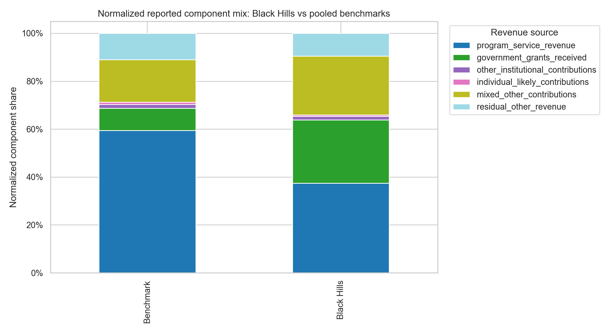

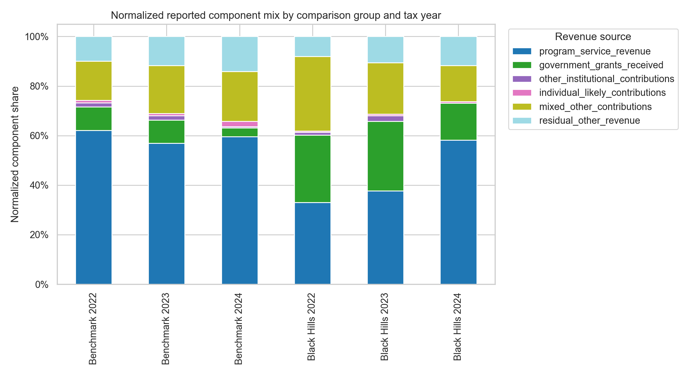

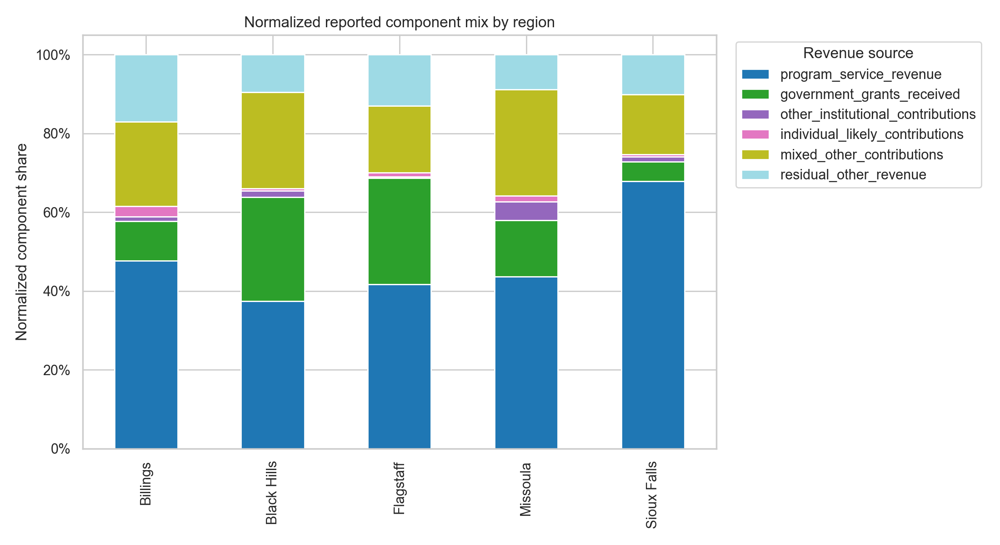

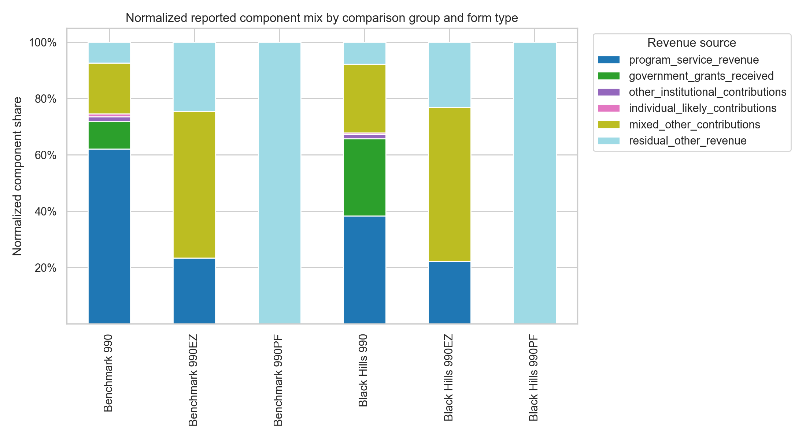

## Primary Statistical Tests (five regions, Welch ANOVA)

| Test | Variable | Statistic | P-value | FDR p-value | N |
| --- | --- | --- | --- | --- | --- |
| welch_anova | program_service_revenue_share | 2.95 | 0.01935 | 0.02428 | 2474 |
| welch_anova | government_grants_received_share | 9.887 | 6.59e-08 | 3.196e-07 | 4179 |
| welch_anova | other_institutional_contributions_share | 3.071 | 0.01557 | 0.02028 | 4179 |
| welch_anova | individual_likely_contributions_share | 5.588 | 0.0001809 | 0.0003467 | 4179 |
| welch_anova | mixed_other_contributions_share | 6.963 | 1.477e-05 | 3.514e-05 | 4179 |
| welch_anova | residual_other_revenue_share | 10.15 | 4.053e-08 | 2.797e-07 | 4179 |

## Black Hills vs pooled benchmarks (follow-up)

| Test | Variable | Statistic | P-value | FDR p-value | N |
| --- | --- | --- | --- | --- | --- |
| welch_anova | program_service_revenue_share | 3.338 | 0.06796 | 0.1116 | 2474 |
| permutation_mean_diff | program_service_revenue_share | -0.03338 | 0.09495 | 0.1369 | 2474 |
| welch_anova | government_grants_received_share | 26.38 | 3.211e-07 | 5.909e-06 | 4179 |
| permutation_mean_diff | government_grants_received_share | 0.04262 | 0.0004998 | 0.002554 | 4179 |
| welch_anova | other_institutional_contributions_share | 0.07263 | 0.7876 | 0.8678 | 4179 |
| permutation_mean_diff | other_institutional_contributions_share | -0.0007412 | 0.7766 | 0.8678 | 4179 |
| welch_anova | individual_likely_contributions_share | 4.794 | 0.02865 | 0.07321 | 4179 |
| permutation_mean_diff | individual_likely_contributions_share | -0.01057 | 0.07946 | 0.1253 | 4179 |
| welch_anova | mixed_other_contributions_share | 3.569 | 0.05901 | 0.1044 | 4179 |
| permutation_mean_diff | mixed_other_contributions_share | 0.03345 | 0.08196 | 0.1253 | 4179 |
| welch_anova | residual_other_revenue_share | 5.537 | 0.01873 | 0.05558 | 4179 |
| permutation_mean_diff | residual_other_revenue_share | -0.03108 | 0.02499 | 0.06761 | 4179 |

## Level-Variable Comparisons (five regions, Welch ANOVA on log1p)

The Section 3 Q9 plan lists Total revenue, Program service revenue, Total contributions, and Other contributions (foundation grants etc.) as variables of interest. The table below tests those variables on the level (log1p-transformed) in addition to the share comparisons above. Level differences reflect organization-size differences across regions; share differences reflect revenue-mix differences. Both views are needed for a complete answer.

| Test | Variable | Statistic | P-value | FDR p-value | N |
| --- | --- | --- | --- | --- | --- |
| welch_anova | log1p_total_revenue | 2.193 | 0.06752 | 0.07764 | 4179 |
| welch_anova | log1p_program_service_revenue | 1.568 | 0.1807 | 0.1918 | 2474 |
| welch_anova | log1p_total_contributions | 9.809 | 7.849e-08 | 3.196e-07 | 3463 |
| welch_anova | log1p_government_grants_received | 7.948 | 2.403e-06 | 6.908e-06 | 4179 |
| welch_anova | log1p_other_institutional_contributions | 3.364 | 0.009421 | 0.013 | 4179 |
| welch_anova | log1p_individual_likely_contributions | 8.137 | 1.694e-06 | 5.567e-06 | 4179 |
| welch_anova | log1p_mixed_other_contributions | 11.1 | 6.783e-09 | 7.882e-08 | 4179 |
| welch_anova | log1p_calculated_institutional_contributions_total | 4.857 | 0.0007691 | 0.001294 | 1040 |

## Independence Sensitivity (one row per EIN, most recent year)

Each EIN contributes at most three filings (2022-2024). The pooled tests above treat each org-year as an independent observation; this sensitivity restricts the analysis to one row per EIN (most recent reported year) so that the test's independence assumption is satisfied exactly. If the direction and significance of the share comparisons survive this restriction, repeated filings are not driving the headline result.

| Comparison | Test | Variable | Statistic | P-value | FDR p-value | N |
| --- | --- | --- | --- | --- | --- | --- |
| five_regions | welch_anova | program_service_revenue_share | 1.5 | 0.2009 | 0.2615 | 1244 |
| five_regions | welch_anova | government_grants_received_share | 3.537 | 0.007126 | 0.02497 | 2155 |
| five_regions | welch_anova | other_institutional_contributions_share | 1.086 | 0.3621 | 0.4096 | 2155 |
| five_regions | welch_anova | individual_likely_contributions_share | 2.113 | 0.07734 | 0.1284 | 2155 |
| five_regions | welch_anova | mixed_other_contributions_share | 3.751 | 0.004923 | 0.02123 | 2155 |
| five_regions | welch_anova | residual_other_revenue_share | 5.474 | 0.0002341 | 0.001711 | 2155 |
| bh_vs_benchmark | welch_anova | program_service_revenue_share | 0.04777 | 0.8271 | 0.9159 | 1244 |
| bh_vs_benchmark | permutation_mean_diff | program_service_revenue_share | -0.005941 | 0.8641 | 0.9159 | 1244 |
| bh_vs_benchmark | welch_anova | government_grants_received_share | 8.663 | 0.003354 | 0.03857 | 2155 |
| bh_vs_benchmark | permutation_mean_diff | government_grants_received_share | 0.03521 | 0.001499 | 0.02299 | 2155 |
| bh_vs_benchmark | welch_anova | other_institutional_contributions_share | 0.2529 | 0.6152 | 0.7944 | 2155 |
| bh_vs_benchmark | permutation_mean_diff | other_institutional_contributions_share | 0.002089 | 0.5732 | 0.7871 | 2155 |
| bh_vs_benchmark | welch_anova | individual_likely_contributions_share | 2.21 | 0.1375 | 0.372 | 2155 |
| bh_vs_benchmark | permutation_mean_diff | individual_likely_contributions_share | -0.008574 | 0.1649 | 0.4215 | 2155 |
| bh_vs_benchmark | welch_anova | mixed_other_contributions_share | 0.3386 | 0.5608 | 0.7871 | 2155 |
| bh_vs_benchmark | permutation_mean_diff | mixed_other_contributions_share | 0.01526 | 0.6482 | 0.7951 | 2155 |
| bh_vs_benchmark | welch_anova | residual_other_revenue_share | 1.305 | 0.2537 | 0.5428 | 2155 |
| bh_vs_benchmark | permutation_mean_diff | residual_other_revenue_share | -0.02202 | 0.2799 | 0.5722 | 2155 |

## Full-Universe Sensitivity (including hospitals, universities, and political orgs)

The primary results exclude hospitals, universities, and political organizations for client-peer comparability. This sensitivity reruns the main share tests on the full valid Form 990/990-EZ/990-PF universe so readers can see whether that comparability choice changes the substantive conclusion.

| Comparison | Test | Variable | Statistic | P-value | FDR p-value | N |
| --- | --- | --- | --- | --- | --- | --- |
| five_regions | welch_anova | program_service_revenue_share | 3.571 | 0.006679 | 0.008696 | 2518 |
| five_regions | welch_anova | government_grants_received_share | 10.25 | 3.348e-08 | 2.567e-07 | 4233 |
| five_regions | welch_anova | other_institutional_contributions_share | 3.102 | 0.01476 | 0.01852 | 4233 |
| five_regions | welch_anova | individual_likely_contributions_share | 5.442 | 0.0002354 | 0.0004274 | 4233 |
| five_regions | welch_anova | mixed_other_contributions_share | 7.659 | 4.105e-06 | 1.049e-05 | 4233 |
| five_regions | welch_anova | residual_other_revenue_share | 10.1 | 4.444e-08 | 3.066e-07 | 4233 |
| bh_vs_benchmark | welch_anova | program_service_revenue_share | 4.388 | 0.03642 | 0.0713 | 2518 |
| bh_vs_benchmark | permutation_mean_diff | program_service_revenue_share | -0.0381 | 0.05497 | 0.09442 | 2518 |
| bh_vs_benchmark | welch_anova | government_grants_received_share | 27.81 | 1.552e-07 | 3.822e-06 | 4233 |
| bh_vs_benchmark | permutation_mean_diff | government_grants_received_share | 0.04374 | 0.0004998 | 0.002554 | 4233 |
| bh_vs_benchmark | welch_anova | other_institutional_contributions_share | 0.07555 | 0.7835 | 0.822 | 4233 |
| bh_vs_benchmark | permutation_mean_diff | other_institutional_contributions_share | -0.0007508 | 0.7741 | 0.822 | 4233 |
| bh_vs_benchmark | welch_anova | individual_likely_contributions_share | 4.396 | 0.03611 | 0.0713 | 4233 |
| bh_vs_benchmark | permutation_mean_diff | individual_likely_contributions_share | -0.01004 | 0.09545 | 0.1388 | 4233 |
| bh_vs_benchmark | welch_anova | mixed_other_contributions_share | 3.883 | 0.04892 | 0.09344 | 4233 |
| bh_vs_benchmark | permutation_mean_diff | mixed_other_contributions_share | 0.03467 | 0.05997 | 0.09679 | 4233 |
| bh_vs_benchmark | welch_anova | residual_other_revenue_share | 5.175 | 0.02303 | 0.05884 | 4233 |
| bh_vs_benchmark | permutation_mean_diff | residual_other_revenue_share | -0.02989 | 0.03248 | 0.06875 | 4233 |

## Bootstrap Confidence Intervals (cluster-bootstrap by EIN)

These rows show Black Hills minus benchmark mean differences in organization-level revenue-source shares. The bootstrap resamples EINs (not org-years) so that within-EIN correlation is preserved; the resulting confidence intervals are wider than a row-level bootstrap and reflect the actual organization-level uncertainty.

| Variable | Mean difference | 95% CI lower | 95% CI upper |
| --- | --- | --- | --- |
| program_service_revenue_share | -3.3% | -8.1% | 1.5% |
| government_grants_received_share | 4.3% | 1.9% | 6.5% |
| other_institutional_contributions_share | -0.1% | -0.7% | 0.6% |
| individual_likely_contributions_share | -1.1% | -2.2% | 0.3% |
| mixed_other_contributions_share | 3.3% | -1.3% | 7.7% |
| residual_other_revenue_share | -3.1% | -6.4% | 0.4% |

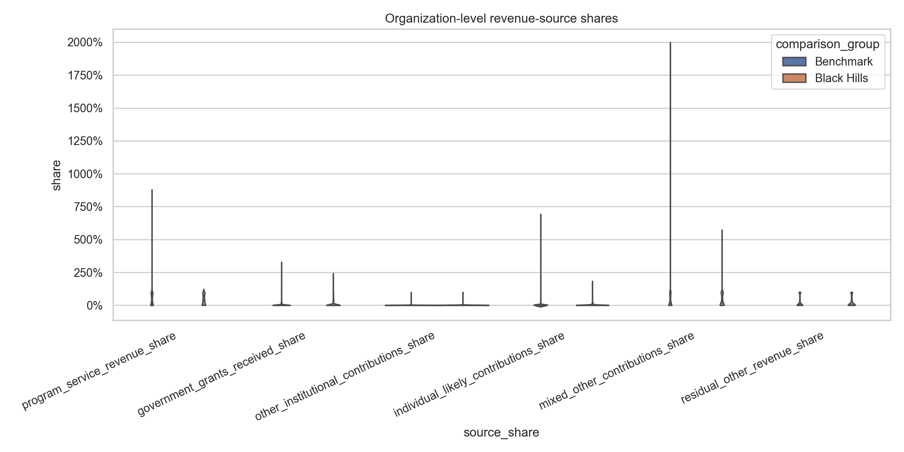

## Individual Contributions Focus (Form 990 only, share of total contributions)

This section answers the client question more directly: of the contributions a nonprofit reports, what fraction comes from likely-individual donors versus from other organizations? It is restricted to Form 990 filers (1,092 EINs in this run) because 990-EZ and 990-PF do not separately report Line 1 sub-channels, and to organization-years with positive total contributions so the denominator is meaningful. Shares are share of total contributions (not of total revenue), which removes program-service revenue as a confounder.

Channels:

- **institutional_clear** - Lines 1a + 1d + 1e (federated campaigns + related-org contributions + government grants). Unambiguously institutional.
- **individual_narrow** - Lines 1b + 1c (membership dues + fundraising-event contributions). A *strict lower bound* on individual giving.
- **line_1f_mixed** - Line 1f (`ALLOOTHECONT`). Mixes individuals with foundations, DAF distributions, corporate gifts, and bequests. Cannot be split further without Schedule B.
- **individual_broad** - `individual_narrow` + `line_1f_mixed`. An *upper bound* that treats Line 1f as if it were entirely individual giving. The truth lies between the two bounds.

### Aggregate channel mix (share of total contributions, Form 990 only)

| Group | Channel | Amount | Share of total contributions |
| --- | --- | --- | --- |
| Benchmark | institutional_clear | $1,008,895,347 | 37.5% |
| Benchmark | individual_narrow | $89,692,546 | 3.3% |
| Benchmark | line_1f_mixed | $1,593,073,564 | 59.2% |
| Black Hills | institutional_clear | $455,645,770 | 53.7% |
| Black Hills | individual_narrow | $9,272,565 | 1.1% |
| Black Hills | line_1f_mixed | $383,739,884 | 45.2% |

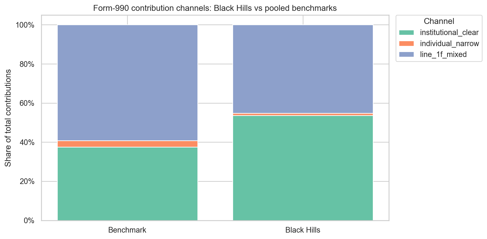

### Welch ANOVA on share-of-contribution metrics (Form 990 only)

| Comparison | Test | Variable | Statistic | P-value | FDR p-value | N |
| --- | --- | --- | --- | --- | --- | --- |
| five_regions | welch_anova | institutional_clear_share_of_contrib | 6.097 | 7.658e-05 | 0.0001532 | 2086 |
| five_regions | welch_anova | individual_narrow_share_of_contrib | 5.895 | 0.0001103 | 0.0001891 | 2086 |
| five_regions | welch_anova | individual_broad_share_of_contrib | 6.097 | 7.658e-05 | 0.0001532 | 2086 |
| five_regions | welch_anova | line_1f_mixed_share_of_contrib | 4.76 | 0.0008368 | 0.0009129 | 2086 |
| bh_vs_benchmark | welch_anova | institutional_clear_share_of_contrib | 20.23 | 7.846e-06 | 3.138e-05 | 2086 |
| bh_vs_benchmark | permutation_mean_diff | institutional_clear_share_of_contrib | 0.08882 | 0.0004998 | 0.0007269 | 2086 |
| bh_vs_benchmark | welch_anova | individual_narrow_share_of_contrib | 0.5766 | 0.4478 | 0.4899 | 2086 |
| bh_vs_benchmark | permutation_mean_diff | individual_narrow_share_of_contrib | -0.009747 | 0.4488 | 0.4899 | 2086 |
| bh_vs_benchmark | welch_anova | individual_broad_share_of_contrib | 20.23 | 7.846e-06 | 3.138e-05 | 2086 |
| bh_vs_benchmark | permutation_mean_diff | individual_broad_share_of_contrib | -0.08882 | 0.0004998 | 0.0007269 | 2086 |
| bh_vs_benchmark | welch_anova | line_1f_mixed_share_of_contrib | 14.07 | 0.0001882 | 0.0003765 | 2086 |
| bh_vs_benchmark | permutation_mean_diff | line_1f_mixed_share_of_contrib | -0.07907 | 0.0004998 | 0.0007269 | 2086 |

### EIN cluster-bootstrap CIs on Black Hills minus benchmark (Form 990 only)

| Variable | Mean difference | 95% CI lower | 95% CI upper |
| --- | --- | --- | --- |
| institutional_clear_share_of_contrib | 8.9% | 3.9% | 14.2% |
| individual_narrow_share_of_contrib | -1.0% | -4.6% | 2.5% |
| individual_broad_share_of_contrib | -8.9% | -14.2% | -3.9% |
| line_1f_mixed_share_of_contrib | -7.9% | -13.1% | -1.9% |

Interpretation guide. If the institutional-clear share differs significantly between BH and benchmarks but the individual_narrow and individual_broad shares do not, the individual-versus-institutional gap is being driven by institutional channels (e.g. government grants), not by individual giving. If the individual_broad bound differs but individual_narrow does not, the gap is concentrated in Line 1f, which is the bucket we cannot decompose without Schedule B and should be flagged for follow-up.

### Year-by-Year Focused Comparisons (Form 990 only, BH vs pooled benchmarks)

The pooled tests above can hide year-to-year changes. The Welch ANOVA below isolates Black Hills versus pooled benchmark for each share-of-contributions metric within each tax year, so a single year of unusual filings cannot drive a multi-year conclusion.

| Tax year | Variable | Welch statistic | P-value | FDR p-value | N |
| --- | --- | --- | --- | --- | --- |
| 2022 | institutional_clear_share_of_contrib | 4.153 | 0.04225 | 0.1127 | 960 |
| 2022 | individual_narrow_share_of_contrib | 0.6555 | 0.4186 | 0.4798 | 960 |
| 2022 | individual_broad_share_of_contrib | 4.153 | 0.04225 | 0.1127 | 960 |
| 2022 | line_1f_mixed_share_of_contrib | 2.138 | 0.1445 | 0.2102 | 960 |
| 2023 | institutional_clear_share_of_contrib | 9.255 | 0.002523 | 0.007996 | 918 |
| 2023 | individual_narrow_share_of_contrib | 0.7207 | 0.3964 | 0.4462 | 918 |
| 2023 | individual_broad_share_of_contrib | 9.255 | 0.002523 | 0.007996 | 918 |
| 2023 | line_1f_mixed_share_of_contrib | 5.456 | 0.02005 | 0.03198 | 918 |
| 2024 | institutional_clear_share_of_contrib | 14.52 | 0.0002529 | 0.0006743 | 208 |
| 2024 | individual_narrow_share_of_contrib | 0.3783 | 0.5398 | 0.5667 | 208 |
| 2024 | individual_broad_share_of_contrib | 14.52 | 0.0002529 | 0.0006743 | 208 |
| 2024 | line_1f_mixed_share_of_contrib | 14.94 | 0.0001953 | 0.0006743 | 208 |

Cluster-bootstrap 95% confidence intervals on Black Hills minus benchmark, by tax year:

| Tax year | Variable | Mean difference | 95% CI lower | 95% CI upper |
| --- | --- | --- | --- | --- |
| 2022 | institutional_clear_share_of_contrib | 6.1% | 0.1% | 11.9% |
| 2022 | individual_narrow_share_of_contrib | -1.5% | -4.8% | 2.3% |
| 2022 | individual_broad_share_of_contrib | -6.1% | -11.9% | -0.1% |
| 2022 | line_1f_mixed_share_of_contrib | -4.6% | -10.5% | 1.5% |
| 2023 | institutional_clear_share_of_contrib | 9.0% | 3.4% | 15.2% |
| 2023 | individual_narrow_share_of_contrib | -1.6% | -5.1% | 1.8% |
| 2023 | individual_broad_share_of_contrib | -9.0% | -15.2% | -3.4% |
| 2023 | line_1f_mixed_share_of_contrib | -7.4% | -13.7% | -1.4% |
| 2024 | institutional_clear_share_of_contrib | 21.4% | 9.9% | 33.0% |
| 2024 | individual_narrow_share_of_contrib | 2.8% | -5.7% | 11.7% |
| 2024 | individual_broad_share_of_contrib | -21.4% | -33.0% | -9.9% |
| 2024 | line_1f_mixed_share_of_contrib | -24.3% | -36.6% | -10.9% |

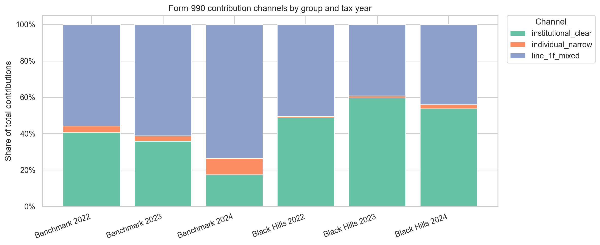

## Year-by-Year Comparisons

| Tax year | Variable | Welch statistic | P-value | FDR p-value | N |
| --- | --- | --- | --- | --- | --- |
| 2022 | program_service_revenue_share | 2.166 | 0.07176 | 0.1208 | 1096 |
| 2022 | government_grants_received_share | 6.096 | 7.969e-05 | 0.002749 | 1799 |
| 2022 | other_institutional_contributions_share | 3.338 | 0.01008 | 0.02781 | 1799 |
| 2022 | individual_likely_contributions_share | 3.056 | 0.0163 | 0.04326 | 1799 |
| 2022 | mixed_other_contributions_share | 3.829 | 0.004352 | 0.01581 | 1799 |
| 2022 | residual_other_revenue_share | 4.843 | 0.0007344 | 0.004223 | 1799 |
| 2023 | program_service_revenue_share | 2.027 | 0.08965 | 0.136 | 1068 |
| 2023 | government_grants_received_share | 3.363 | 0.009682 | 0.02088 | 1821 |
| 2023 | other_institutional_contributions_share | 3.339 | 0.01008 | 0.02109 | 1821 |
| 2023 | individual_likely_contributions_share | 2.117 | 0.07699 | 0.1265 | 1821 |
| 2023 | mixed_other_contributions_share | 4.73 | 0.0008992 | 0.004432 | 1821 |
| 2023 | residual_other_revenue_share | 4.619 | 0.001089 | 0.005011 | 1821 |
| 2024 | program_service_revenue_share | 1.36 | 0.2517 | 0.4565 | 310 |
| 2024 | government_grants_received_share | 5.673 | 0.0002238 | 0.004232 | 559 |
| 2024 | other_institutional_contributions_share | 1.632 | 0.168 | 0.3686 | 559 |
| 2024 | individual_likely_contributions_share | 1.84 | 0.1224 | 0.287 | 559 |
| 2024 | mixed_other_contributions_share | 0.7207 | 0.5786 | 0.6902 | 559 |
| 2024 | residual_other_revenue_share | 1.236 | 0.2964 | 0.4688 | 559 |

## Overall Revenue-Mix Tests

| Analysis frame | Test | Statistic | P-value | FDR p-value | N |
| --- | --- | --- | --- | --- | --- |
| primary_all_years | permanova_clr | 6.153 | 0.001 | 0.001 | 4179 |
| primary_all_years | manova_alr_pillai | 0.008787 | 6.547e-07 | 1.309e-06 | 4179 |
| year_2022 | permanova_clr | 3.609 | 0.011 | 0.011 | 1799 |
| year_2022 | manova_alr_pillai | 0.0084 | 0.009862 | 0.011 | 1799 |
| year_2023 | permanova_clr | 2.448 | 0.045 | 0.045 | 1821 |
| year_2023 | manova_alr_pillai | 0.008205 | 0.01058 | 0.02116 | 1821 |
| year_2024 | permanova_clr | 1.986 | 0.082 | 0.082 | 559 |
| year_2024 | manova_alr_pillai | 0.03989 | 0.0004219 | 0.0008438 | 559 |

## Regression Results

| Model | Outcome | Black Hills estimate | Std. error | P-value | FDR p-value | N |
| --- | --- | --- | --- | --- | --- | --- |
| ols_clustered_by_ein | program_service_revenue_share | -0.02997 | 0.02536 | 0.2372 | 0.5806 | 2474 |
| logistic_presence_clustered_by_ein | program_service_revenue_share_present | 0.1953 | 0.1891 | 0.3019 | 0.5806 | 2474 |
| ols_clustered_by_ein | government_grants_received_share | 0.04226 | 0.01081 | 9.234e-05 | 0.00201 | 4179 |
| logistic_presence_clustered_by_ein | government_grants_received_share_present | 0.5002 | 0.1362 | 0.0002412 | 0.00201 | 4179 |
| ols_clustered_by_ein | other_institutional_contributions_share | -0.0007866 | 0.003146 | 0.8026 | 0.8724 | 4179 |
| logistic_presence_clustered_by_ein | other_institutional_contributions_share_present | 0.08684 | 0.2154 | 0.6868 | 0.8177 | 4179 |
| ols_clustered_by_ein | individual_likely_contributions_share | -0.01094 | 0.006478 | 0.0913 | 0.3736 | 4179 |
| logistic_presence_clustered_by_ein | individual_likely_contributions_share_present | 0.06842 | 0.1488 | 0.6456 | 0.8177 | 4179 |
| ols_clustered_by_ein | mixed_other_contributions_share | 0.01855 | 0.02264 | 0.4126 | 0.695 | 4179 |
| logistic_presence_clustered_by_ein | mixed_other_contributions_share_present | 0.2044 | 0.1313 | 0.1195 | 0.3736 | 4179 |
| ols_clustered_by_ein | residual_other_revenue_share | -0.01054 | 0.01379 | 0.4449 | 0.6951 | 4179 |
| logistic_presence_clustered_by_ein | residual_other_revenue_share_present | 0.1519 | 0.1234 | 0.2185 | 0.5806 | 4179 |
| ols_clustered_by_ein | log1p_total_revenue | -0.163 | 0.08249 | 0.04823 | 0.2411 | 4179 |
| ols_clustered_by_ein | log1p_total_contributions | 0.05848 | 0.1416 | 0.6796 | 0.8177 | 3463 |
| logistic_presence_clustered_by_ein | log1p_total_contributions_present | 0.3843 | 0.3437 | 0.2636 | 0.5806 | 3463 |
| ols_clustered_by_ein | log1p_program_service_revenue | 0.0482 | 0.2934 | 0.8695 | 0.9057 | 2474 |
| logistic_presence_clustered_by_ein | log1p_program_service_revenue_present | 0.1953 | 0.1891 | 0.3019 | 0.5806 | 2474 |
| ols_clustered_by_ein | log1p_government_grants_received | 0.765 | 0.2338 | 0.00107 | 0.006687 | 4179 |
| logistic_presence_clustered_by_ein | log1p_government_grants_received_present | 0.5002 | 0.1362 | 0.0002412 | 0.00201 | 4179 |
| ols_clustered_by_ein | log1p_other_institutional_contributions | 0.006239 | 0.117 | 0.9575 | 0.9575 | 4179 |
| logistic_presence_clustered_by_ein | log1p_other_institutional_contributions_present | 0.08684 | 0.2154 | 0.6868 | 0.8177 | 4179 |
| ols_clustered_by_ein | log1p_individual_likely_contributions | -0.04765 | 0.1859 | 0.7977 | 0.8724 | 4179 |
| logistic_presence_clustered_by_ein | log1p_individual_likely_contributions_present | 0.06842 | 0.1488 | 0.6456 | 0.8177 | 4179 |
| ols_clustered_by_ein | log1p_mixed_other_contributions | 0.1898 | 0.2339 | 0.417 | 0.695 | 4179 |
| logistic_presence_clustered_by_ein | log1p_mixed_other_contributions_present | 0.2044 | 0.1313 | 0.1195 | 0.3736 | 4179 |

Auxiliary regression warnings captured: 0. These are retained in `tables/statistical_tests_regression.csv` and do not change the descriptive tables or univariate tests.

## Concentration Diagnostics

| Group | Organizations | Total revenue | Gini | HHI | Top 5 share |
| --- | --- | --- | --- | --- | --- |
| Benchmark | 1647 | $9,220,136,556 | 0.906 | 0.0591 | 39.2% |
| Black Hills | 509 | $1,625,442,931 | 0.876 | 0.0447 | 39.3% |

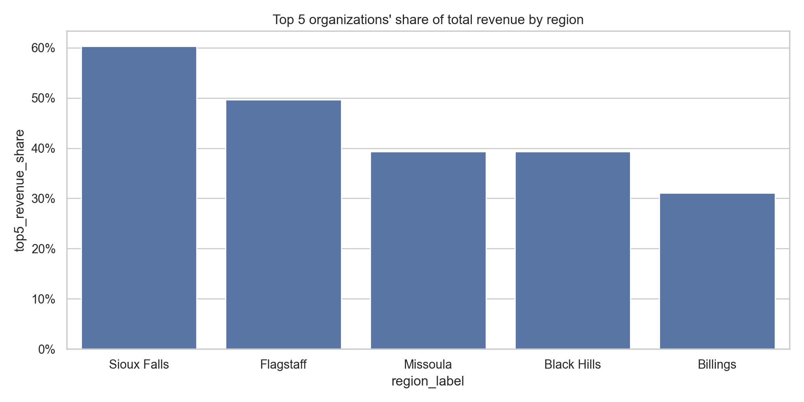

## Diagnostics

Residual other revenue is a derived category, so rows with negative residuals or shares above 100 percent are reported in `tables/negative_residual_diagnostics.csv`. These rows should be reviewed before using residual revenue as a substantive category. The summary below shows how common those overlap/reconciliation flags are by comparison group.

| Group | Rows | Negative residual rows | Negative residual rate | Over-100 rows | Over-100 rate | Mean source-share sum |
| --- | --- | --- | --- | --- | --- | --- |
| Benchmark | 3180 | 137 | 4.3% | 137 | 4.3% | 102.0% |
| Black Hills | 999 | 49 | 4.9% | 49 | 4.9% | 101.9% |

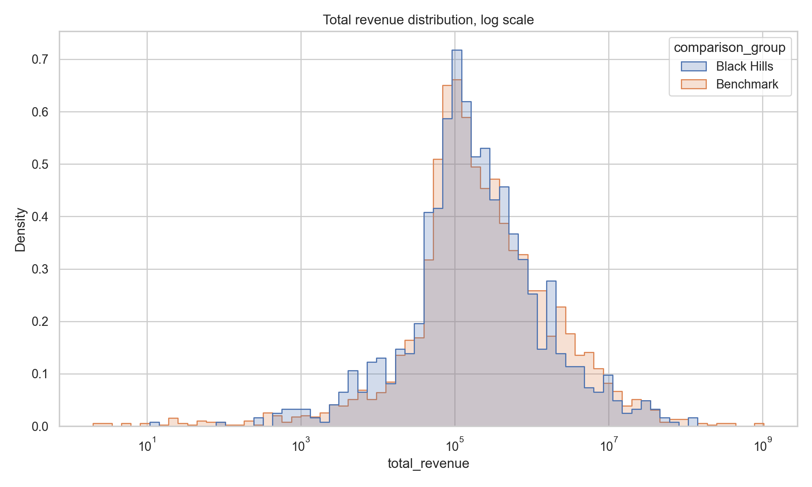

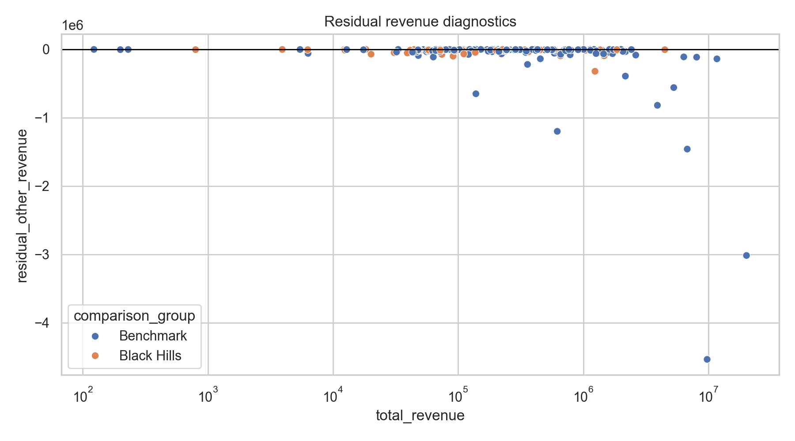

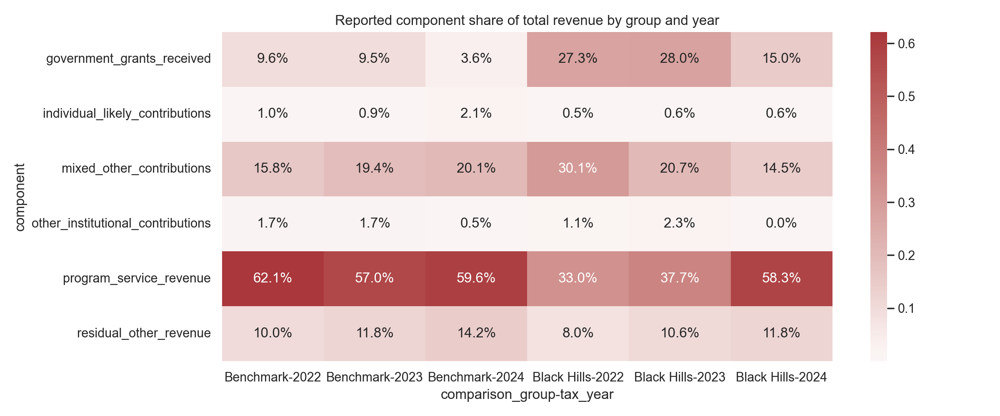

## Bottom Line

Review the five-region Welch ANOVA table and follow-up Black Hills versus benchmark tests. Aggregate dollar mixes and concentration charts provide complementary context when organization-level p-values are noisy.

## Key Files in This Results Folder

- `tables/mix_by_group.csv`: aggregate reported component mix by Black Hills versus benchmarks
- `tables/statistical_tests_univariate.csv`: pooled and sensitivity univariate tests
- `tables/statistical_tests_by_year_univariate.csv`: year-by-year hypothesis tests
- `tables/statistical_tests_multivariate.csv`: pooled compositional and multivariate tests
- `tables/concentration_by_group.csv`: Gini, HHI, and top-5 concentration metrics
- `tables/component_overlap_by_group.csv`: group-level reconciliation diagnostics for overlapping components
- `tables/negative_residual_diagnostics.csv`: rows needing residual/share diagnostics
